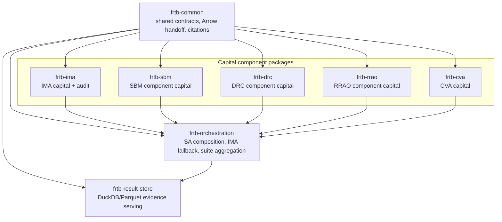

# frtb-capital architecture

## Suite overview

`frtb-capital` is a workspace of FRTB market-risk capital calculation packages.
The structure covers IMA, the three Standardised Approach components, CVA, a
suite-level aggregator, a result store, and a shared foundation package. Today,
`packages/frtb-ima` contains the migrated IMA implementation, `frtb-rrao`
contains an implemented canonical-input RRAO path, `frtb-drc` contains partial
runtime for cited NPR and Basel MAR22 DRC paths, `frtb-sbm` implements cited
BASEL_MAR21 delta, vega, and curvature across all seven SBM risk classes with
row, batch, and Arrow entrypoints, and `frtb-cva` has reduced/full BA-CVA plus
supported SA-CVA delta/vega and mixed carve-out paths implemented.
Orchestration composes SA arithmetic from shared component handoffs, prepares
IMA and CVA summaries, and aggregates `IMA + SA + CVA` through
`calculate_suite_capital` (ADR 0039). `frtb-result-store` persists completed
run evidence, drilldown graphs, artifacts, lineage, and attribution records.

The Standardised Approach is a composed regulatory approach, not a standalone
package. In this suite, `frtb-sbm`, `frtb-drc`, and `frtb-rrao` together produce
SA capital. `frtb-orchestration` owns SA aggregation and routes non-IMA-eligible
desks to that SA component stack for fallback capital.

For client onboarding and upstream system integration, start with
[`CLIENT_INTEGRATION.md`](CLIENT_INTEGRATION.md). It defines the recommended
Arrow/Parquet handoff tier, component ingress symbols, run-context fields,
lineage hashes, and rejection semantics.
Use [`CLIENT_REFERENCE_DATA.md`](CLIENT_REFERENCE_DATA.md) to decide which
canonical fields come from client feeds, package rule tables, or run-scoped
reference overlays.

## Time-series, shock, and surface metadata ownership

Canonical time-series, shock, scenario-vector, and surface metadata is owned by
`frtb-result-store` artifacts and read models. `frtb-common` provides stable ID
and coordinate primitives only. Component packages consume calculation-ready
arrays/scalars plus those stable IDs for provenance; they must not fetch
artifacts, source market data, infer surface axes, construct shock definitions,
or query `frtb-result-store` inside capital kernels.

`frtb-orchestration` may compose suite-level artifact evidence views over
completed component summaries and resolved artifact references. It does not own
the persisted artifact payloads. Navigator and other viewers consume
result-store metadata/detail endpoints and orchestration evidence read models,
and must render absent fixtures as explicit `NO_DATA` or `UNSUPPORTED` states
rather than fabricating UPL, CRIF, stress-vector, RFET, or volatility data.
The full ownership matrix and validation contract are in
[`ARTIFACT_METADATA_OWNERSHIP.md`](ARTIFACT_METADATA_OWNERSHIP.md).

## Dependency graph

**Allowed imports:** `frtb-*` capital components may import from `frtb-common`. `frtb-orchestration` is the only package allowed to depend on multiple capital components, but current runtime modules consume shared handoffs or structural summaries and must not import sibling package internals. `frtb-result-store` sits above orchestration and capital packages so future public adapters can serialize suite results, but capital packages and orchestration must not import storage. **No other cross-package imports are allowed.** The root `import-linter` layers contract (`make import-lint`, part of `make quality-control`) enforces this graph in CI, and orchestration tests add a stricter runtime import guard.

## Package responsibilities

### `frtb-common`

Shared primitives used by every capital component:

- `CapitalComponentMetadata`, `ImplementationStatus`, and `ValidationStatus`
  package-status primitives.
- `UnsupportedRegulatoryFeatureError` and
  `NotImplementedCapitalComponentError`.
- Arrow-backed normalized tabular handoff primitives in `frtb_common.arrow_table`,
  including column specs, adapter diagnostics, null/chunk/dictionary policies,
  accepted/rejected tables, row id validation, sorting helpers, and stable
  content/handoff hashes.
- Package-neutral CRIF-to-Arrow normalization in `frtb_common.crif`, with
  package-supplied RiskType mappings or callbacks.
- `ComponentCapitalSummary` — the shared standardised-component orchestration
  handoff contract (with `StandardisedComponent` and `ComponentSummaryError`).
  See [`decisions/0029-unified-standardised-component-handoff-contract.md`](decisions/0029-unified-standardised-component-handoff-contract.md).
- `jsonable` serialization for common domain values.
- Stable artifact identity primitives for time-series IDs, scenario IDs, shock
  IDs/directions, surface IDs, and surface coordinates. These primitives carry
  identity and validation only; they do not imply a market-data library.
- `assert_policy_has_regulatory_citations` and
  `MissingRegulatoryCitationsError` for package policy tests.

The `DeskAuditRecord` / `CapitalRunAuditLog` audit framework currently lives in
`frtb-ima` (`frtb_ima.audit`), not `frtb-common`. Promoting a suite-level audit
record home, rule-profile semantics, sign conventions, business calendars, or
calculation-context contracts requires a separate cross-cutting ADR.

Status: shared library. It provides shared status metadata, explicit
unsupported/unimplemented exception types, JSON-ready serialization, and
regulatory citation helpers. It performs no capital calculation and carries no
IMA, SBM, DRC, RRAO, or CVA regulatory semantics. The migrated IMA package still
holds calculation-specific abstractions inside `packages/frtb-ima`; its public
`frtb_ima.regimes.UnsupportedRegulatoryFeatureError` import path remains
available as a compatibility subclass of the shared
`frtb_common.UnsupportedRegulatoryFeatureError`.

### `frtb-ima` — Internal Models Approach

Capital from model-eligible trading desks. Inputs: 10-day scenario P&L vectors, RFET evidence, NMRF stress artifacts, PLA/backtesting vectors. Outputs: `CapitalComponents` per desk plus a `DeskEligibilityStatus` signal.

Migrated from `tomanizer/FRTB-IMA` with full history into
`packages/frtb-ima`.

Status: implemented public capital path with deterministic tests and validation
fixtures. Production regulatory use remains out of scope without independent
model validation and supervisory approval.

### `frtb-sbm` — Standardised Approach sensitivities-based method

Non-default standardised capital from delta, vega, and curvature sensitivities.
Inputs: canonical or CRIF-mapped sensitivities by risk class, bucket, tenor, and
risk measure. Outputs: SBM capital, risk-class totals, correlation-scenario
selection, and audit breakdowns.

Status: partial runtime. Cited BASEL_MAR21 delta, vega, and curvature paths are
implemented under audit for GIRR, FX, equity, commodity, CSR non-sec, CSR sec
non-CTP, and CSR sec CTP. Row-wise, package-owned batch, and Arrow batch
entrypoints exist for supported paths. `US_NPR_2_0` produces capital for GIRR
delta only; other comparison profiles fail closed until cited. Public entry
point: `calculate_sbm_capital`. Unsupported paths fail closed; no silent
zero-capital placeholders.

### `frtb-drc` — Default Risk Charge

Standardised default risk charge component. Jump-to-default capital for
non-securitisation, securitisation non-CTP, and correlation trading portfolio
positions. Inputs: issuer/tranche exposures, credit quality, seniority,
maturity, and JTD inputs. Outputs: DRC capital and issuer/tranche audit
breakdowns.

Status: partial runtime. The public API supports cited non-securitisation,
securitisation non-CTP, and CTP row paths with gross JTD, maturity scaling,
netting, bucket capital, reconciliation, and audit lineage, plus homogeneous
class-specific Arrow/batch fast paths. U.S. NPR 2.0 and Basel MAR22 cover all
three classes; EU CRR3 and PRA UK CRR fail closed until cited mappings land.
Securitisation non-CTP and CTP risk weights and replication/decomposition
evidence are run-scoped inputs; Basel MAR22 securitisation paths require typed
evidence under MAR22.34 or MAR22.42, and missing evidence fails closed.

### `frtb-rrao` — Residual Risk Add-On

Standardised residual risk add-on component. Inputs: positions with exotic or
other residual risk classification evidence and gross effective notionals.
Outputs: additive RRAO capital, exclusion records, and contribution breakdowns.

Status: implemented for supported canonical-input profiles, including cited
classification, exclusions, deterministic subtotals, allocation helpers, and
audit/replay controls. Unsupported profiles and unsupported input paths fail
closed.

### `frtb-cva` — Credit Valuation Adjustment

CVA capital under the Basic Approach or Standardized Approach. Inputs: counterparty exposures, credit spreads, hedge positions.

Status: partial runtime. Reduced and full BA-CVA run through the public API with
cited counterparty/netting-set inputs and eligible hedge treatment. Supported
SA-CVA delta and vega risk-class paths, qualified-index metadata, and mixed
SA-CVA plus BA-CVA carve-out assembly are implemented; unsupported SA-CVA paths
fail closed.

### `frtb-orchestration` — Suite aggregation

Combines IMA, SA component outputs, and CVA into firm-level capital figures.
For SA, it owns the composed `SBM + DRC + RRAO` total. For IMA fallback, it
routes non-IMA-eligible desks to the SA component stack. It also applies
cross-component floors and add-ons and produces consolidated audit records.

Status: orchestration implemented for SA composition, IMA and CVA summary
handoffs, and top-of-house aggregation. `compose_standardised_approach_capital`
validates shared `frtb_common.ComponentCapitalSummary` inputs for SBM, DRC, and
RRAO, enforces ADR 0022 jurisdiction-family consistency plus calculation-date
and base-currency consistency, then returns the additive SA result.
`calculate_suite_capital` aggregates `ImaCapitalSummary`,
`StandardisedApproachCapitalResult`, and `CvaCapitalSummary` with the same
run-context and jurisdiction-family guards (ADR 0039). Orchestration can record
non-IMA-eligible desks as routed to the SA fallback stack from structural
eligibility signals. Runtime source does not import sibling capital packages or
private batch internals. Manifest-driven end-to-end suite runs may still evolve
without changing the summary-handoff composition contract.

### `frtb-result-store` — Result storage and serving

Stores completed FRTB run evidence for analytics and reporting. Inputs are
public result contracts, capital graph nodes, scalar measures, artifact
references, lineage, and attribution rows. Outputs are DuckDB-queryable Parquet
tables and FRTB-specific query methods for run lists, capital trees, node
measures, drillthrough artifact references, lineage, and attribution.

Status: partial result-store backend. The first implementation is append-only
local DuckDB/Parquet. S3 Parquet and DuckLake are reserved backend modes. The
package does not calculate capital and must not be imported by capital kernels.

## Capital package runtime shape

Capital-producing packages are consolidating to a **canonical batch pipeline with
adapter ingress** ([ADR 0045](decisions/0045-canonical-batch-pipeline-with-adapter-ingress.md)).
Ingress (CRIF, Arrow, columns, rows) adapts into one package-owned regulatory
batch; validation, kernel, and assembly run in separate stage modules; mechanical
variation is table-driven rather than copy-pasted per risk class.

**Progress (2026-06):** `frtb-cva` split batch logic into `_batch_*` stage modules
with a thin `batch.py` public facade. `frtb-drc` has partial `adapters/`,
`kernel/`, and `assembly/` packages. `frtb-sbm` has an initial `registry.py`.
SBM, RRAO, and IMA monoliths remain the largest consolidation targets.

Phased execution: [`quality/CONSOLIDATION_ROADMAP.md`](quality/CONSOLIDATION_ROADMAP.md).

The suite is non-live; structural refactors may break and rename public
entrypoints without deprecation periods unless a change alters cited regulatory
outputs under ADR 0005.

## Why a monorepo

See [`decisions/0002-monorepo-structure.md`](decisions/0002-monorepo-structure.md). In short: one team, one product line, atomic cross-cutting changes, shared abstractions, consistent style. Per-package versioning and ADR-driven change control preserve SR 11-7 / PRA SS 1/23 model boundaries.

## Why SA components and CVA are separate packages

See [`decisions/0010-standardised-approach-component-taxonomy.md`](decisions/0010-standardised-approach-component-taxonomy.md).
`SA` is the regulatory composition label. `frtb-sbm`, `frtb-drc`, and
`frtb-rrao` are the implementation packages that together produce SA capital.
Each is a distinct model component under SR 11-7 with its own documentation
pack, but they share enough plumbing that a monorepo with separate packages is
the right factoring.

## Module documentation

Each capital component should have a suite-level documentation front door under
`docs/modules/<component>/`. For IMA, the formal model documentation pack lives
under [`docs/modules/frtb-ima/model_documentation/`](modules/frtb-ima/model_documentation/README.md)
and package-specific supporting evidence remains under `packages/frtb-ima/docs/`.
SBM and CVA have partial-runtime module documentation front doors. DRC has
partial-runtime planning and requirements documents, RRAO has a formal model
documentation pack, and orchestration/common have suite-support front doors. Formal model documentation
packs should be added or promoted when each capital package moves to an
implemented calculation maturity profile.

Model documentation packs cover:

- Intended use.
- Conceptual soundness.
- Derivation.
- Assumptions and limitations.
- Sensitivity analysis (validation-team deliverable).
- Monitoring plan.
- Change history.

Machine-readable package maturity and crosswalk status live in
[`docs/quality/PACKAGE_STATUS.md`](quality/PACKAGE_STATUS.md), generated from
[`package_maturity.toml`](quality/package_maturity.toml).

This structure supports independent SR 11-7 validation per component.

## Versioning

- Each package has its own `version` in its `pyproject.toml`.
- The workspace itself has a `version` for tooling identification only.
- Releases coordinate package versions; the suite-level `CHANGELOG.md` records the combined release.

## Development workflow

See [`CONTRIBUTING.md`](../CONTRIBUTING.md) for material-change policy, ADR requirements, and review standards.
