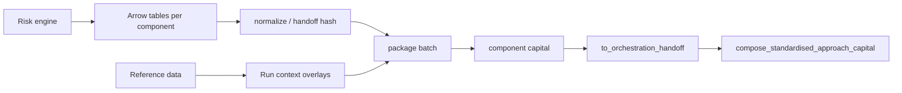

# Client integration guide

This guide is the suite-level entry point for upstream risk engines,
reference-data systems, and client ETL teams integrating with `frtb-capital`.
It describes what to deliver, which handoff contracts to target, and which
entrypoints to call before a capital run.

The suite is a transparent prototype for FRTB capital calculations. Outputs are
not final regulatory capital and are not a substitute for independent model
validation, legal review, or supervisory approval.

## Integration tiers

Tier 1 is the recommended production integration pattern. Tier 2 is a
convenience adapter path for CRIF or vendor-shaped rows. Tier 3 exists for
notebooks, tests, fixtures, and small books where constructing Python
dataclasses is acceptable.

| Tier | Client delivers | Library entrypoints | Use |
| --- | --- | --- | --- |
| 1 - Arrow/Parquet handoff | Column tables matching package `*_HANDOFF_COLUMN_SPECS` | `normalize_*_arrow_table` -> `build_*_batch_from_handoff` -> `calculate_*_from_batch` | Default production path. |
| 2 - CRIF/vendor rows | Iterable of mapping rows from CRIF or vendor extracts | `adapt_crif_records` / `adapt_*_records` -> Tier 1 or Tier 3 | Transitional adapter path where source systems already emit CRIF-like rows. |
| 3 - Canonical dataclasses | Tuples of package row dataclasses such as `SbmSensitivity` or `DrcPosition` | `calculate_*_capital` | Small books, tests, research, and notebook examples only. |

The Tier 1 runtime pattern follows
[ADR 0023](decisions/0023-arrow-tabular-handoff-boundary.md):

```text
external table / CRIF / file
  -> pyarrow-backed normalized handoff
  -> package-owned NumPy batch
  -> NumPy capital kernels
  -> frozen audit/result records
```

`pyarrow` is approved at the handoff boundary. Capital kernels must not import
`pyarrow`, `pandas`, or `polars`; see
[ADR 0011](decisions/0011-core-runtime-dependency-policy.md).

## Component ingress summary

| Component | Grain | Required handoff spec symbols | Primary Tier 1 functions | Supported profiles at time of writing | Performance notes |
| --- | --- | --- | --- | --- | --- |
| SBM | Sensitivity rows by risk class, measure, bucket, tenor, qualifier, and risk factor | Risk-class handoff specs such as `GIRR_DELTA_HANDOFF_COLUMN_SPECS`, `GIRR_VEGA_HANDOFF_COLUMN_SPECS`, `FX_DELTA_HANDOFF_COLUMN_SPECS`, `EQUITY_DELTA_HANDOFF_COLUMN_SPECS`, `COMMODITY_DELTA_HANDOFF_COLUMN_SPECS`, `CSR_NONSEC_DELTA_HANDOFF_COLUMN_SPECS` | `normalize_*_arrow_table` -> `build_*_batch_from_handoff` -> `calculate_sbm_capital_from_*_batch` or portfolio batch dispatcher | `BASEL_MAR21` paths implemented for supported delta, GIRR vega, non-GIRR vega, and row-wise curvature paths; unsupported profiles fail closed | [SBM Arrow batch report](performance/frtb-sbm-batch-arrow-report.md) |
| DRC | Position rows split by DRC class: non-securitisation, securitisation non-CTP, and CTP | `DRC_NONSEC_HANDOFF_COLUMN_SPECS`, `DRC_SECURITISATION_NON_CTP_HANDOFF_COLUMN_SPECS`, `DRC_CTP_HANDOFF_COLUMN_SPECS` | `normalize_drc_*_arrow_table` -> `build_drc_*_batch_from_handoff` -> `calculate_drc_capital_from_batch` | Supported cited Basel MAR22 / profile paths implemented by package contexts; missing reference evidence fails closed | [DRC Arrow batch triage](performance/frtb-drc-arrow-batch-triage.md) |
| RRAO | Residual-risk position rows with classification evidence and lineage | `RRAO_HANDOFF_COLUMN_SPECS` | `normalize_rrao_arrow_table` -> `build_rrao_batch_from_handoff` -> `calculate_rrao_capital_from_batch` | Supported canonical Basel MAR23, U.S. NPR 2.0 comparison, and EU CRR3 comparison inputs; unsupported input paths fail closed | [RRAO Arrow batch triage](performance/frtb-rrao-arrow-batch-triage.md) |
| CVA | Multi-table delivery: counterparties, netting sets, hedges, and SA-CVA sensitivities | `CVA_COUNTERPARTY_HANDOFF_COLUMN_SPECS`, `CVA_NETTING_SET_HANDOFF_COLUMN_SPECS`, `CVA_HEDGE_HANDOFF_COLUMN_SPECS`, `SA_CVA_SENSITIVITY_HANDOFF_COLUMN_SPECS` | `normalize_cva_*_arrow_table` -> `build_*_batch_from_handoff` -> BA-CVA or SA-CVA batch calculators | Reduced and full BA-CVA plus supported SA-CVA delta and vega risk-class paths; unsupported materiality and comparison paths fail closed | [CVA Arrow batch triage](performance/frtb-cva-arrow-batch-triage.md) |
| IMA | Dense scenario P&L cube plus tabular scenario metadata, RFET observations, and input manifest rows | `IMA_SCENARIO_METADATA_HANDOFF_COLUMN_SPECS`, `IMA_RFET_OBSERVATION_HANDOFF_COLUMN_SPECS`, `IMA_INPUT_MANIFEST_HANDOFF_COLUMN_SPECS` | Arrow tables normalize/build for metadata and RFET evidence; dense NumPy arrays feed ES, LHA, IMCC, and NMRF kernels | Implemented public IMA path for deterministic fixtures; unsupported profile behaviour remains explicit | [IMA Arrow handoff triage](performance/frtb-ima-arrow-handoff-triage.md) |

For per-package integration surfaces, see
[SBM PUBLIC_API.md](modules/frtb-sbm/PUBLIC_API.md) and
[RRAO PUBLIC_API.md](modules/frtb-rrao/PUBLIC_API.md). Additional package public
API docs are delivered by [#425](https://github.com/tomanizer/frtb-capital/issues/425),
[#426](https://github.com/tomanizer/frtb-capital/issues/426), and
[#427](https://github.com/tomanizer/frtb-capital/issues/427).

## Standardised Approach run flow



The suite treats SA as the arithmetic composition of SBM, DRC, and RRAO, not as
a standalone package. Component result handoffs flow to `frtb-orchestration`;
unsupported or incomplete aggregation paths raise explicit errors rather than
silently returning zero capital.

## Run context contract

Every client run must supply a stable run context. Package dataclasses own the
exact field names, but client orchestration should provide these values before
normalization or batch construction:

| Field | Client responsibility |
| --- | --- |
| `run_id` | Stable identifier for the run, replay, or submission-like batch. |
| `calculation_date` | Business date used for regulatory profile selection and reference-data attachments. |
| `profile_id` | Jurisdiction and rule profile, such as Basel MAR21/MAR22/MAR23 or package comparison profiles. Unsupported profiles fail closed. |
| `reporting_currency` / `base_currency` | Currency used for component aggregation and FX translation. |
| Desk and legal-entity scope | Stable desk, book, and legal-entity identifiers used in lineage, attribution, and downstream aggregation. |
| Sign conventions | Explicit convention for losses, gains, JTD, notional, and exposure fields before client ETL writes the handoff table. |

Relevant context types include `SbmCalculationContext`,
`DrcCalculationContext`, `RraoCalculationContext`, `CvaCalculationContext`, and
IMA run/manifest records under `frtb_ima`.

## Lineage and hashing

Clients must make replay identifiers stable before handing data to the package
adapters:

| Name | Meaning | Client expectation |
| --- | --- | --- |
| `source_row_id` | Original row identifier from the upstream feed after any client-side joins. | Stable across replays for the same economic input. |
| `source_hash` | Hash of the client-provided table or source payload before normalization. | Recompute only when source data changes. |
| `handoff_hash` | Hash of the normalized accepted handoff table plus relevant metadata. | Used to prove the package saw the same handoff during replay. |
| `input_hash` | Hash of the package-owned batch or canonical input object. | Used by package audit records and fixture parity tests. |

The shared handoff type is `NormalizedTabularHandoff` in
`frtb_common.handoff`. It carries accepted rows, rejected rows, diagnostics,
metadata, and source hash so adapters can preserve lineage without materializing
accepted rows as Python dataclasses on the hot path.

## Rejection semantics

Adapters must not silently drop rows. A validation-only run or capital run can
produce accepted rows, rejected rows, and `AdapterDiagnostic` records. Package
adapters also expose package-specific rejected-row records such as
`RraoRejectedRow` or `SbmRejectedRow` where supported.

The policy is:

- Accepted rows are normalized into the package handoff contract.
- Rejected rows remain visible with source-row identifiers and diagnostics.
- Error-severity diagnostics make the validation harness fail unless a caller
  explicitly chooses a more permissive policy outside the capital path.
- Missing required reference evidence, unsupported regulatory features, or
  mixed incompatible DRC classes fail closed.

## Wire formats

Supported interchange formats at the client boundary are:

- Apache Arrow `Table` objects.
- Parquet files read into Arrow tables through PyArrow in client ETL or helper
  scripts.
- Arrow IPC files for schema and validation workflows.
- CSV only as a client-side ingestion convenience before conversion into Arrow.

`pandas` and `polars` are allowed in client ETL, research, tests, and optional
adapters when they do not leak into the core runtime path. Package capital
kernels continue to use NumPy arrays and package-owned batches.

## Validate before calculate

The client validation harness is tracked in
[#428](https://github.com/tomanizer/frtb-capital/issues/428). Its default mode
normalizes handoffs and writes accepted rows, rejected rows, diagnostics, and a
summary with stable hashes without calling capital calculators.

Expected usage:

```bash
uv run python scripts/validate_client_handoff.py \
  --package frtb_drc \
  --handoff nonsec \
  --input path/to/drc_nonsec.parquet \
  --output-dir dist/client-validation/drc_nonsec/
```

## Reference data and manifests

Reference-data responsibilities are documented in the
[client reference-data attachment matrix](CLIENT_REFERENCE_DATA.md). Runtime
manifest ingress is tracked by
[#429](https://github.com/tomanizer/frtb-capital/issues/429). The intended
manifest convention is to name every table explicitly, for example
`drc.nonsec`, `drc.securitisation_non_ctp`, `drc.ctp`, `rrao.positions`,
`cva.counterparty`, and `sbm.girr_delta`.

## Non-goals

The suite integration boundary does not cover:

- Pricing or scenario generation.
- Issuer mastering or counterparty mastering.
- Market-data sourcing.
- Trade capture or product control.
- Regulatory submission packaging.
- Firm-level financial reporting outside the capital aggregation prototype.
