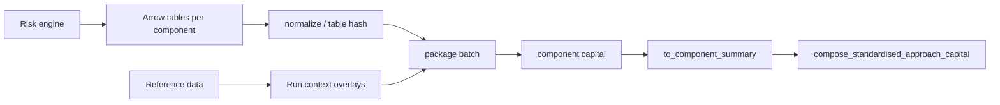

# Client integration guide

This guide is the suite-level entry point for upstream risk engines,
reference-data systems, and client ETL teams integrating with `frtb-capital`.
It describes what to deliver, which input table contracts to target, and which
entrypoints to call before a capital run.

The suite is a transparent prototype for FRTB capital calculations. Outputs are
not final regulatory capital and are not a substitute for independent model
validation, legal review, or supervisory approval.

## First-run path

Use this sequence when you are evaluating what your upstream systems must emit
and which public calls to wire first:

1. Run `make demo` from the repo root to execute every package
   `examples/run_demo.py` with synthetic inputs and concise output summaries.
2. Pick the component you are integrating and follow its package journey:
   [IMA](../packages/frtb-ima/docs/PACKAGE_JOURNEY.md),
   [SBM](../packages/frtb-sbm/docs/PACKAGE_JOURNEY.md),
   [DRC](../packages/frtb-drc/docs/PACKAGE_JOURNEY.md),
   [RRAO](../packages/frtb-rrao/docs/PACKAGE_JOURNEY.md),
   [CVA](../packages/frtb-cva/docs/PACKAGE_JOURNEY.md), or
   [orchestration](../packages/frtb-orchestration/docs/PACKAGE_JOURNEY.md).
3. Use the table below to map your raw Arrow/Parquet tables to public
   normalizers, batch builders, and capital entrypoints.
4. Run `make examples-check` before changing demos and `make notebooks-check`
   before changing notebook teaching material.

The package journeys and demos are teaching material only; the contract below
remains the integration source of truth for Tier 1 handoff, run context,
lineage, hashing, and rejection semantics.

## Integration tiers

Tier 1 is the recommended production integration pattern. Tier 2 is a
convenience adapter path for CRIF or vendor-shaped rows. Tier 3 exists for
notebooks, tests, fixtures, and small books where constructing Python
dataclasses is acceptable.

| Tier | Client delivers | Library entrypoints | Use |
| --- | --- | --- | --- |
| 1 - Arrow/Parquet input table | Column tables matching package `*_ARROW_COLUMN_SPECS` | `normalize_*_arrow_table` -> `build_*_batch_from_arrow` -> `calculate_*_from_batch` | Default production path. |
| 2 - CRIF/vendor rows | Iterable of mapping rows from CRIF or vendor extracts | `adapt_crif_records` / `adapt_*_records` -> Tier 1 or Tier 3 | Transitional adapter path where source systems already emit CRIF-like rows. |
| 3 - Canonical dataclasses | Tuples of package row dataclasses such as `SbmSensitivity` or `DrcPosition` | `calculate_*_capital` | Small books, tests, research, and notebook examples only. |

The Tier 1 runtime pattern follows
[ADR 0023](decisions/0023-arrow-tabular-handoff-boundary.md):

```text
external table / CRIF / file
  -> pyarrow-backed normalized input table
  -> package-owned NumPy batch
  -> NumPy capital kernels
  -> frozen audit/result records
```

`pyarrow` is approved at the input table boundary. Capital kernels must not import
`pyarrow`, `pandas`, or `polars`; see
[ADR 0011](decisions/0011-core-runtime-dependency-policy.md).

## Component ingress summary

| Component | Grain | Required input table spec symbols | Primary Tier 1 functions | Supported profiles at time of writing | Performance notes |
| --- | --- | --- | --- | --- | --- |
| SBM | Sensitivity rows by risk class, measure, bucket, tenor, qualifier, and risk factor | Risk-class input table specs such as `GIRR_DELTA_ARROW_COLUMN_SPECS`, `GIRR_VEGA_ARROW_COLUMN_SPECS`, `FX_DELTA_ARROW_COLUMN_SPECS`, `EQUITY_DELTA_ARROW_COLUMN_SPECS`, `COMMODITY_DELTA_ARROW_COLUMN_SPECS`, `CSR_NONSEC_DELTA_ARROW_COLUMN_SPECS` | `normalize_*_arrow_table` -> `build_*_batch_from_arrow` -> `calculate_sbm_capital_from_*_batch` or portfolio batch dispatcher | `BASEL_MAR21` paths implemented for supported delta, GIRR vega, non-GIRR vega, and row-wise curvature paths; unsupported profiles fail closed | [SBM Arrow batch report](performance/frtb-sbm-batch-arrow-report.md) |
| DRC | Position rows split by DRC class: non-securitisation, securitisation non-CTP, and CTP | `DRC_NONSEC_ARROW_COLUMN_SPECS`, `DRC_SECURITISATION_NON_CTP_ARROW_COLUMN_SPECS`, `DRC_CTP_ARROW_COLUMN_SPECS` | `normalize_drc_*_arrow_table` -> `build_drc_*_batch_from_arrow` -> `calculate_drc_capital_from_batch` | Supported cited Basel MAR22 / profile paths implemented by package contexts; missing reference evidence fails closed | [DRC Arrow batch triage](performance/frtb-drc-arrow-batch-triage.md) |
| RRAO | Residual-risk position rows with classification evidence and lineage | `RRAO_ARROW_COLUMN_SPECS` | `normalize_rrao_arrow_table` -> `build_rrao_batch_from_arrow` -> `calculate_rrao_capital_from_batch` | Supported canonical Basel MAR23, U.S. NPR 2.0 comparison, and EU CRR3 comparison inputs; unsupported input paths fail closed | [RRAO Arrow batch triage](performance/frtb-rrao-arrow-batch-triage.md) |
| CVA | Multi-table delivery: counterparties, netting sets, hedges, and SA-CVA sensitivities | `CVA_COUNTERPARTY_ARROW_COLUMN_SPECS`, `CVA_NETTING_SET_ARROW_COLUMN_SPECS`, `CVA_HEDGE_ARROW_COLUMN_SPECS`, `SA_CVA_SENSITIVITY_ARROW_COLUMN_SPECS` | `normalize_cva_*_arrow_table` -> `build_*_batch_from_arrow` -> BA-CVA or SA-CVA batch calculators | Reduced and full BA-CVA plus supported SA-CVA delta and vega risk-class paths; unsupported materiality and comparison paths fail closed | [CVA Arrow batch triage](performance/frtb-cva-arrow-batch-triage.md) |
| IMA | Dense scenario P&L cube plus tabular scenario metadata, RFET observations, and input manifest rows | `IMA_SCENARIO_METADATA_ARROW_COLUMN_SPECS`, `IMA_RFET_OBSERVATION_ARROW_COLUMN_SPECS`, `IMA_INPUT_MANIFEST_ARROW_COLUMN_SPECS` | Arrow tables normalize/build for metadata and RFET evidence; dense NumPy arrays feed ES, LHA, IMCC, and NMRF kernels | Implemented public IMA path for deterministic fixtures; unsupported profile behaviour remains explicit | [IMA Arrow triage](performance/frtb-ima-arrow-batch-triage.md) |

For per-package integration surfaces, see
[SBM PUBLIC_API.md](modules/frtb-sbm/PUBLIC_API.md),
[DRC PUBLIC_API.md](modules/frtb-drc/PUBLIC_API.md),
[CVA PUBLIC_API.md](modules/frtb-cva/PUBLIC_API.md),
[RRAO PUBLIC_API.md](modules/frtb-rrao/PUBLIC_API.md), and
[IMA CLIENT_DELIVERY.md](modules/frtb-ima/CLIENT_DELIVERY.md).

## Standardised Approach run flow



The suite treats SA as the arithmetic composition of SBM, DRC, and RRAO, not as
a standalone package. Component result summaries flow to `frtb-orchestration`;
unsupported or incomplete aggregation paths raise explicit errors rather than
silently returning zero capital.

## Run context contract

Every client run must supply a stable run context. Package dataclasses own the
exact field names, but client orchestration should provide these values before
normalization or batch construction:

| Field | Client responsibility |
| --- | --- |
| `run_id` | Stable identifier for the run, replay, or submission-like batch. |
| `calculation_date` | Business date used for regulatory profile selection and reference-data attachments. |
| `profile_id` | Jurisdiction and rule profile, such as Basel MAR21/MAR22/MAR23 or package comparison profiles. Unsupported profiles fail closed. |
| `reporting_currency` / `base_currency` | Currency used for component aggregation and FX translation. |
| Desk and legal-entity scope | Stable desk, book, and legal-entity identifiers used in lineage, attribution, and downstream aggregation. |
| Sign conventions | Explicit convention for losses, gains, JTD, notional, and exposure fields before client ETL writes the input table. |

Relevant context types include `SbmCalculationContext`,
`DrcCalculationContext`, `RraoCalculationContext`, `CvaCalculationContext`, and
IMA run/manifest records under `frtb_ima`.

## Lineage and hashing

Clients must make replay identifiers stable before handing data to the package
adapters:

| Name | Meaning | Client expectation |
| --- | --- | --- |
| `source_row_id` | Original row identifier from the upstream feed after any client-side joins. | Stable across replays for the same economic input. |
| `source_hash` | Hash of the client-provided table or source payload before normalization. | Recompute only when source data changes. |
| `input_table_hash` | Hash of the normalized accepted input table plus relevant metadata. | Used to prove the validation harness saw the same input table during replay. |
| `input_hash` | Hash of the package-owned batch or canonical input object. | Used by package audit records and fixture parity tests. |

The shared input table type is `NormalizedArrowTable` in
`frtb_common.arrow_table`. It carries accepted rows, rejected rows, diagnostics,
metadata, and source hash so adapters can preserve lineage without materializing
accepted rows as Python dataclasses on the hot path.

## Rejection semantics

Adapters must not silently drop rows. A validation-only run or capital run can
produce accepted rows, rejected rows, and `AdapterDiagnostic` records. Package
adapters also expose package-specific rejected-row records such as
`RraoRejectedRow` or `SbmRejectedRow` where supported.

The policy is:

- Accepted rows are normalized into the package input table contract.
- Rejected rows remain visible with source-row identifiers and diagnostics.
- Error-severity diagnostics make the validation harness fail unless a caller
  explicitly chooses a more permissive policy outside the capital path.
- Missing required reference evidence, unsupported regulatory features, or
  mixed incompatible DRC classes fail closed.

## Wire formats

Supported interchange formats at the client boundary are:

- Apache Arrow `Table` objects.
- Parquet files read into Arrow tables through PyArrow in client ETL or helper
  scripts.
- Arrow IPC files for schema and validation workflows.
- CSV only as a client-side ingestion convenience before conversion into Arrow.

`pandas` and `polars` are allowed in client ETL, research, tests, and optional
adapters when they do not leak into the core runtime path. Package capital
kernels continue to use NumPy arrays and package-owned batches.

## Input Table Schemas

Checked-in example JSON schemas live under
[`docs/schemas/input_table/`](schemas/input_table/). They are generated from public
`ColumnSpec` tuples and are intended for client ETL contract tests. Additional
schemas can be exported with:

```bash
uv run python scripts/export_arrow_schema.py \
  --package frtb_drc \
  --spec DRC_NONSEC_ARROW_COLUMN_SPECS \
  --format json-schema \
  --output dist/schemas/drc_nonsec.input_table.schema.json
```

## Validate before calculate

The client validation harness normalizes input tables and writes accepted rows,
rejected rows, diagnostics, and a summary with stable hashes without calling
capital calculators.

Expected usage:

```bash
uv run python scripts/validate_client_input_table.py \
  --package frtb_drc \
  --input-table nonsec \
  --input path/to/drc_nonsec.parquet \
  --output-dir dist/client-validation/drc_nonsec/
```

Outputs:

| File | Content |
| --- | --- |
| `accepted.parquet` | Canonical accepted input table rows. |
| `rejected.parquet` | Rejected input rows when any are present. |
| `diagnostics.json` | Sorted `AdapterDiagnostic.as_dict()` records or validation errors. |
| `summary.json` | Row counts, source hash, input_table hash, package/version, and UTC timestamp. |

Exit code is `0` when there are no error diagnostics and no rejected rows, and
non-zero otherwise.

## Reference data and manifests

Reference-data responsibilities are documented in the
[client reference-data attachment matrix](CLIENT_REFERENCE_DATA.md). Runtime
manifest ingress is exposed by `frtb_orchestration.CapitalRunManifest`.
The manifest convention is to name every table explicitly, using constants such
as `DRC_NONSEC_INPUT_TABLE`, `DRC_SECURITISATION_NON_CTP_INPUT_TABLE`,
`DRC_CTP_INPUT_TABLE`, `RRAO_POSITIONS_INPUT_TABLE`,
`CVA_COUNTERPARTY_INPUT_TABLE`, and `SBM_GIRR_DELTA_INPUT_TABLE`.

`validate_capital_run_manifest` returns a `ManifestValidationResult` with:

| Field | Client use |
| --- | --- |
| `input_tables` | Per-table accepted row count, rejected row count, diagnostics, source hash, and normalized input_table hash. |
| `missing_required_input_tables` | Required SA inputs absent from the manifest profile. |
| `jurisdiction_family` | ADR 0022 profile-family classification used before SA composition. |
| `errors` | Missing routes, missing route contexts, validation failures, or mixed jurisdiction-family inputs. |

`run_standardised_approach_from_manifest` performs the same validation, routes
available component input tables through registered public package APIs, and records
fail-closed aggregation status in `SaManifestRunResult.orchestration_error`.
For example, a DRC plus RRAO onboarding manifest can validate and produce
component summaries while still reporting that SBM is missing for final SA
composition.

Minimal route registration pattern:

```python
import frtb_drc
import frtb_rrao
from frtb_common import StandardisedComponent
from frtb_orchestration import (
    DRC_NONSEC_INPUT_TABLE,
    RRAO_POSITIONS_INPUT_TABLE,
    CapitalRunManifest,
    ManifestInputTableRoute,
    run_standardised_approach_from_manifest,
)

routes = {
    DRC_NONSEC_INPUT_TABLE: ManifestInputTableRoute(
        logical_name=DRC_NONSEC_INPUT_TABLE,
        component=StandardisedComponent.DRC,
        normalize=frtb_drc.normalize_drc_nonsec_arrow_table,
        build_batch=frtb_drc.build_drc_nonsec_batch_from_arrow,
        calculate_batch=frtb_drc.calculate_drc_capital_from_batch,
        to_component_summary=frtb_drc.to_component_summary,
        context_attr="drc_context",
    ),
    RRAO_POSITIONS_INPUT_TABLE: ManifestInputTableRoute(
        logical_name=RRAO_POSITIONS_INPUT_TABLE,
        component=StandardisedComponent.RRAO,
        normalize=frtb_rrao.normalize_rrao_arrow_table,
        build_batch=frtb_rrao.build_rrao_batch_from_arrow,
        calculate_batch=frtb_rrao.calculate_rrao_capital_from_batch,
        to_component_summary=frtb_rrao.to_component_summary,
        context_attr="rrao_context",
    ),
}

result = run_standardised_approach_from_manifest(
    CapitalRunManifest(
        run_id="client-sa-run-001",
        calculation_date=calculation_date,
        profile_id="US_NPR_2_0",
        base_currency="USD",
        input_tables={
            DRC_NONSEC_INPUT_TABLE: drc_nonsec_table,
            RRAO_POSITIONS_INPUT_TABLE: rrao_positions_table,
        },
        drc_context=drc_context,
        rrao_context=rrao_context,
    ),
    routes=routes,
)
```

Orchestration runtime modules remain decoupled from component packages. The
client application owns route registration so the manifest can use public
component APIs without importing private batch internals or forcing clients to
construct package dataclass rows.

## Non-goals

The suite integration boundary does not cover:

- Pricing or scenario generation.
- Issuer mastering or counterparty mastering.
- Market-data sourcing.
- Trade capture or product control.
- Regulatory submission packaging.
- Firm-level financial reporting outside the capital aggregation prototype.
