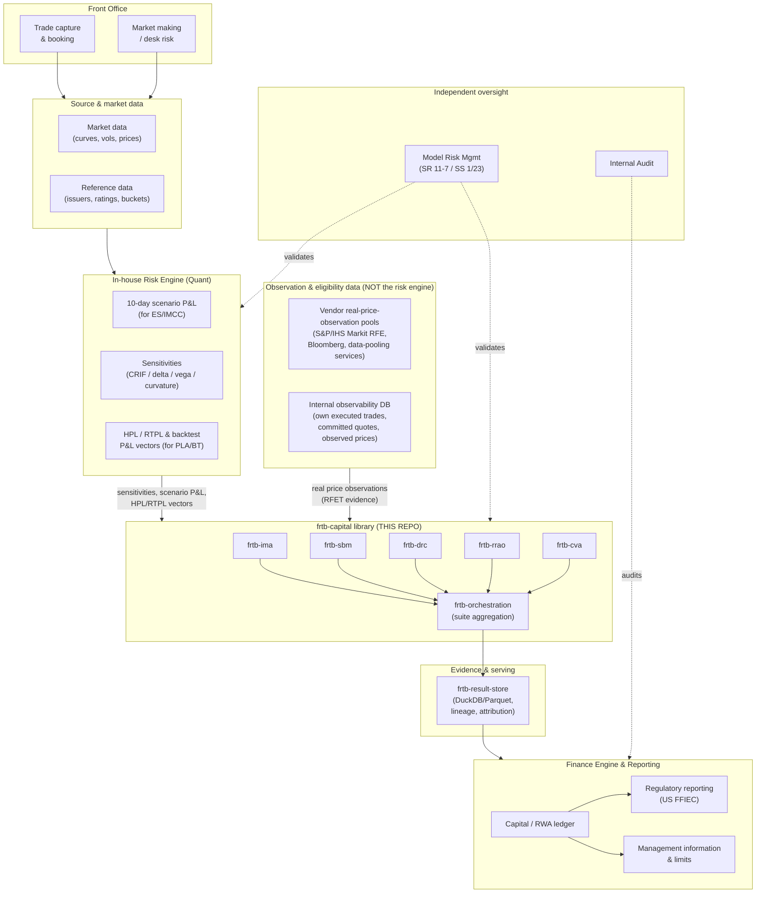
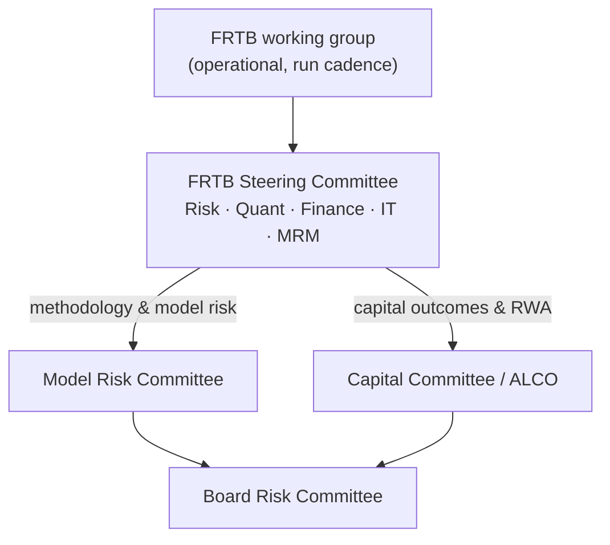
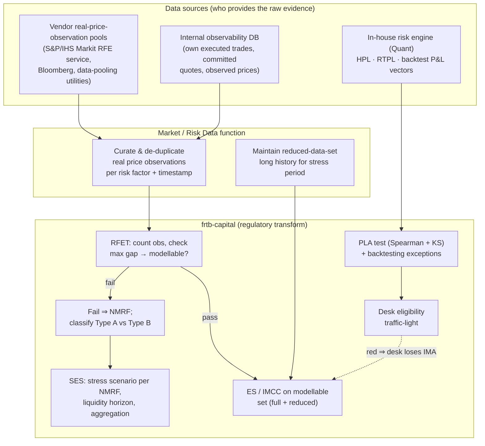
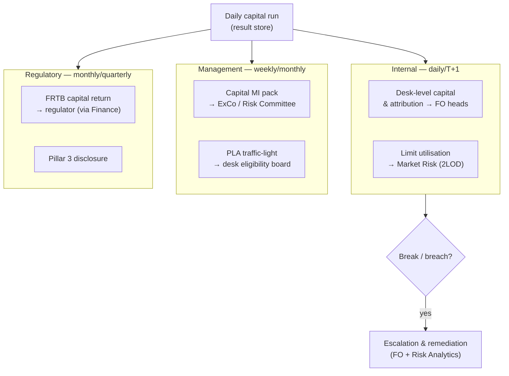
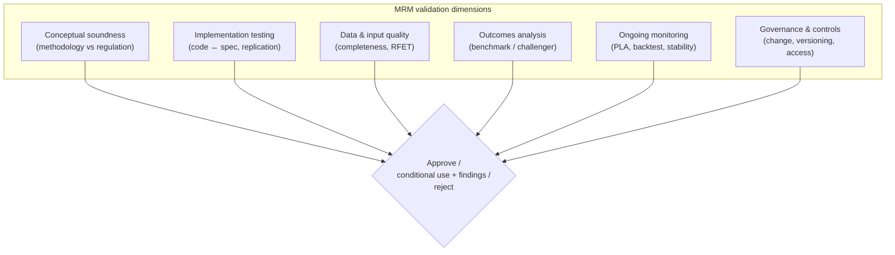
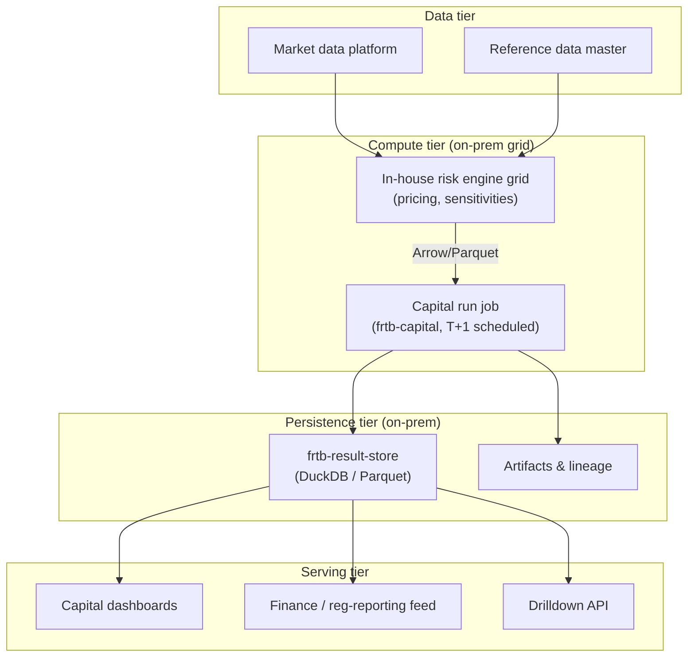

# FRTB Target Operating Model (TOM) — Draft v0.5

> **Status:** Fifth draft. Incorporates **30 stakeholder decisions** across three
> rounds (see §0). Round 3 adds the **US dual-stack capital model** (max() binds),
> **desk-boundary** policy, **reference-data** and **input-DQ** governance, the
> **limits stance**, a dedicated **FRTB Steering Committee**, **CVA data
> ownership**, **third-party (RFET vendor) governance**, **library-driven
> reduced-set** selection, and an interim **Basel MAR31** RFET calibration. Earlier
> rounds established the corrected IMA evidence provenance (§4.4), the
> plain-language responsibility matrix (§3), and the operational run/retention/
> access rules. Four items (O9-residual, O11–O13) remain open for round 4. This document describes a *target* operating model for
> running FRTB market-risk capital using the `frtb-capital` library as the
> calculation engine. It is an organisational / functional / technical design
> artifact, **not** a regulatory submission. The library itself remains a
> prototype: outputs are not final regulatory capital and require independent
> model validation and supervisory approval before production use.

---

## 0. Confirmed design decisions (round 1)

These ten decisions are baked into the model below. Anything not yet decided is
flagged inline as **[OPEN]**.

| # | Decision area | Choice | Primary impact |
| --- | --- | --- | --- |
| 1 | **Jurisdiction** | **US (NPR)** | `FED_NPR_2_0` (frtb-ima) / `US_NPR_2_0` (SA: frtb-sbm, frtb-drc) / `US_NPR20_VB` (frtb-cva) regime profiles; FFIEC-style return; US DRC bucket taxonomy (ADRs 0024–0028) authoritative |
| 2 | **IMA scope** | **IMA + SA from day one** | PLA, backtesting, NMRF/SES, stress periods, desk eligibility all in the go-live critical path |
| 3 | **Run cadence** | **Daily T+1 batch** | One official run on prior close; intraday is estimate-only |
| 4 | **Org topology** | **Centralised Risk Analytics** | Single team operates the run, owns reconciliation & attribution suite-wide |
| 5 | **Risk engine** | **In-house** | Tier 1 Arrow/Parquet contract; internal Quant owns pricing/sensitivity methodology |
| 6 | **Deployment** | **On-premise** | Internal grid/scheduler, on-prem storage co-located with risk engine |
| 7 | **Finance seam** | **Controlled file handover** | Risk Analytics produces a reviewed, signed-off extract; Finance ingests it |
| 8 | **MRM gating** | **Conditional use with findings** | Components go live with documented findings + remediation timelines tracked to closure |
| 9 | **Reporting line** | **2LOD under the CRO** | Capital production is independent of the front office |
| 10 | **Change mgmt** | **Scheduled release train (quarterly)** | Methodology/regime changes bundled quarterly with parallel-run; emergency patches exception-only |

### Round-2 decisions (operational detail)

| # | Decision area | Choice | Primary impact |
| --- | --- | --- | --- |
| 11 | **RFET thresholds** | **Configurable per regime** | Obs count, max gap, window, bucketing are `FED_NPR_2_0` (IMA) profile parameters; US/Basel/conservative variants coexist |
| 12 | **Observation sourcing** | **Internal-primary** | Internal observability DB is system-of-record for real price observations; vendor pools fill gaps |
| 13 | **Desk eligibility** | **Market Risk (2LOD) decides directly** | No separate board; eligibility called straight off the library traffic-light |
| 14 | **Run SLA / DR** | **Best-effort, no fallback** | Correctness over cadence; a late feed slips the run rather than substituting stale numbers |
| 15 | **Break / sign-off gate** | **Tiered RAG per component** | Green auto-pass, amber = Risk Analytics note, red blocks the Finance handover until Market Risk approves |
| 16 | **Parallel run** | **1 month** | Each release-train change runs one month vs incumbent before cutover |
| 17 | **Go-live sequencing** | **SA first, then IMA per desk** | TOM *designed* for full IMA+SA (decision 2); *capital-of-record* rolls out SA first, IMA switched on as evidence matures |
| 18 | **Retention** | **7-year WORM, full lineage** | Every capital-of-record run write-once for 7 years with input lineage + hashes |
| 19 | **Access / SoD** | **Role-based, environment-gated** | Prod config locked to release train; only the IT scheduler triggers official prod runs; humans read-only in prod |
| 20 | **Conditional-use cap** | **Time-boxed** | Conditional use granted for a fixed window; unclosed findings revert the component to a conservative SA fallback |

> **Regime-profile identifiers.** "US NPR" is the prose shorthand used throughout
> this document. The implemented profile **enum identifiers differ by package**:
> `frtb-ima` uses `RegulatoryRegime.FED_NPR_2_0` (with `ECB_CRR3` and `PRA_UK_CRR`
> for the EU/UK variants); the Standardised-Approach packages (`frtb-sbm`,
> `frtb-drc`) use `US_NPR_2_0` (with `BASEL_MAR21`); and `frtb-cva` uses a separate
> `CvaRegulatoryProfile` enum — `US_NPR20_VB` (with `BASEL_MAR50_2020`, `EU_CRR3_CVA`,
> `UK_PRA_CVA`). Where this document names a code identifier it uses the
> package-correct enum value.

### Round-3 decisions (scope, governance, data ownership)

| # | Decision area | Choice | Primary impact |
| --- | --- | --- | --- |
| 21 | **Capital stack** | **Dual-stack, max() binds** | Orchestration computes expanded *and* standardised total RWA; the larger is capital-of-record. Output floor scheduled as a sub-item (§7) |
| 22 | **Desk boundary** | **Inherit management desks 1:1** | Regulatory desks mirror management/booking desks; minimal separate governance. **Caveat:** MAR12 desk-granularity/qualitative-standards compliance risk (§3) |
| 23 | **Reference-data governance** | **Quant owns, release-train** | SBM/DRC/CVA rule tables treated as model parameters; change via the quarterly release train + MRM (decision 10) |
| 24 | **Input data quality** | **Source-system ownership** | Each feed (risk engine, observability DB, ref data) certifies its own DQ; Risk Analytics monitors certificates; library fail-closed is backstop |
| 25 | **Limits linkage** | **Capital is measurement-only** | FRTB capital is reported, not a binding desk limit; limits run off separate market-risk measures (VaR/sensitivities) |
| 26 | **Governance forum** | **Dedicated FRTB Steering Committee** | Risk + Quant + Finance + IT + MRM own methodology, change train, outcomes; escalate to Model Risk & Capital committees |
| 27 | **CVA data ownership** | **Risk Analytics consolidates** | RA sources counterparty exposure (CCR/SA-CCR engine) and eligible hedges, curates CVA inputs — one run-the-engine owner |
| 28 | **RFET vendor pool** | **Govern the slot, decide later** | TOM defines the third-party governance slot (MRM validation, coverage thresholds, SLA); specific pool chosen in procurement (vendor-neutral) |
| 29 | **Reduced data set** | **Library-driven selection** | Library selects the reduced set algorithmically each run to meet the captured-share floor; Quant reviews |
| 30 | **RFET interim stance** | **Basel MAR31 default** | `FED_NPR_2_0` seeded with Basel MAR31 thresholds pending confirmation of exact US figures (O9) |

---

## 1. Purpose and scope

This TOM answers five questions for an FRTB programme that uses `frtb-capital`:

1. **Who** runs **what**, and **when**? (organisational + functional model)
2. What is computed **upfront** (configuration, calibration, onboarding) vs **live**
   (daily/intraday capital) vs **periodically** (quarterly recalibration, annual
   review)?
3. What is **reported**, **to whom**, **when**, and **how**?
4. How does this **library** interact with the **risk engine**, the **finance
   engine**, and **capital reporting**?
5. What does **regulation** require, and what must **Model Risk Management (MRM)**
   independently check?

Scope: market-risk capital under FRTB — **IMA + Standardised Approach (SBM + DRC
+ RRAO) + CVA**, under the **US NPR** regime (decision 1). The operating model is
**designed for full IMA + SA from day one** (decision 2): every role, process, and
evidence flow below is present at go-live. **Capital-of-record, however, rolls out
SA first** (decision 17) — SBM + DRC + RRAO (+ CVA) become the official numbers
first, and **IMA is switched on desk-by-desk** as each desk's PLA / backtesting
evidence matures and Market Risk approves eligibility. Out of scope: counterparty
credit (SA-CCR/IMM), banking-book IRRBB, and non-market RWA.

---

## 2. System context — where this library sits

`frtb-capital` is a **calculation engine library**, not a platform. It consumes
risk-factor and sensitivity inputs, produces auditable capital results, and hands
them to downstream stores and reporting. It deliberately does **not** own market
data, P&L production, trade capture, or the regulatory return itself.



**Key boundary principle.** Three different upstream owners feed the library — do
not collapse them:

1. **The in-house risk engine** produces *quantitative vectors*: sensitivities /
   CRIF, 10-day scenario P&L, and the **HPL / RTPL** and backtest P&L series. It
   does **not** decide modellability or run the regulatory tests.
2. **Observation & eligibility data** (RFET evidence) comes from a *separate
   data-sourcing function* — vendor real-price-observation pools (e.g. the
   S&P/IHS Markit Risk Factor Eligibility service, Bloomberg, industry
   data-pooling utilities) plus the bank's **internal observability database** of
   its own executed trades, committed quotes, and observed prices. This is a
   market-/risk-data curation responsibility, not a risk-engine output.
3. **`frtb-capital`** owns the *regulatory transform*: it runs the RFET, derives
   NMRFs and SES, runs the PLA/backtesting tests on the vectors, and computes
   capital — with the audit trail.

Finance owns the *ledger, return, and disclosure*. The Arrow/Parquet handoff
([ADR 0023](decisions/0023-arrow-tabular-handoff-boundary.md)) is the contractual
seam for both the risk-engine feed and the observation-data feed. The provenance
of RFET / NMRF / PLA evidence is detailed in **§4.4**.

---

## 3. Organisational model — who owns what

Six functions interact across the FRTB lifecycle. The library is a shared asset;
ownership is about *the activity*, not the code.

| Function | Primary FRTB responsibility |
| --- | --- |
| **Front Office (FO)** | Accurate, timely trade booking; desk structure and desk-boundary proposals; first-line explanation of capital moves; remediation of booking/feed breaks. |
| **Quant (front-office or central modelling)** | Pricing models and the risk-factor/sensitivity production that feeds the library; the **HPL/RTPL and backtest P&L vectors**; NMRF classification methodology; methodology proposals (ADRs). |
| **Market / Risk Data function** | Sources and curates **RFET real-price-observation evidence** from vendor pools and the internal observability database; maintains the reduced-data-set history; owns observation data quality. |
| **Risk (2nd line — Market Risk)** | Owns the risk appetite, limits, desk IMA eligibility decisions, and sign-off that capital is fit for limit/decision use; challenges FO explanations. |
| **Risk Analytics** | **Centralised, sitting in 2LOD under the CRO** (decision 4, 9). Operates the capital production run suite-wide: configures regimes/profiles, executes the library, reconciles SA vs IMA, investigates breaks, produces attribution, and issues the signed-off capital extract to Finance. Day-to-day "run the engine" owner, structurally independent of the front office. |
| **Finance** | Owns capital/RWA in the ledger, the **US FFIEC regulatory return**, capital adequacy disclosure, and the reconciliation of risk-produced capital to the general ledger. |
| **IT / Platform Engineering** | Owns the runtime platform, data pipelines, scheduling, environment/version control, the result store, access control, and SDLC for the library deployment. |
| **Model Risk Management (MRM)** | Independent validation of each capital component as a model (SR 11-7); ongoing monitoring; approval and conditional-use gates. |

### Responsibility matrix (plain language — no RACI)

Each row reads as a sentence: **one role leads** (does the work and owns the
outcome), other roles **help** (provide inputs or expertise), **one role signs it
off** (the accountable approver), and some roles are simply **kept informed**. If
a role isn't listed in a row, it has no part in that activity.

| Activity | Leads (does the work) | Helps | Signs it off | Kept informed |
| --- | --- | --- | --- | --- |
| Desk structure / boundary (inherit mgmt desks, decision 22) | Front Office | Risk Analytics | Market Risk (2LOD) | Finance, MRM |
| Pricing, sensitivities & P&L/HPL/RTPL vectors | Quant | Risk Analytics | Quant head | Market Risk |
| RFET observation sourcing & curation | Market/Risk Data | Quant, vendors | Market Risk (2LOD) | Risk Analytics |
| Reference-data rule tables (buckets/weights/correlations) | Quant | Risk Analytics | Market Risk (2LOD) | Finance |
| Methodology / regime config (ADRs) | Quant | Risk Analytics, MRM | Market Risk (2LOD) | Finance |
| CVA exposure & eligible-hedge data | Risk Analytics | CCR / xVA | Risk Analytics head | MRM |
| Input data-quality certification | Source systems | Risk Analytics *(monitors)* | Source-system owners | Market Risk |
| Daily capital run execution | Risk Analytics | IT (platform) | Risk Analytics head | Market Risk |
| Dual-stack max() + binding-stack selection | Risk Analytics *(runs orchestration)* | — | Market Risk (2LOD) | Finance |
| RFET → NMRF → SES determination | Risk Analytics *(runs library)* | Quant *(classification)* | Market Risk (2LOD) | MRM |
| PLA / backtesting → desk eligibility | Risk Analytics *(runs library)* | Quant *(vectors)* | Market Risk (2LOD) | FO, MRM |
| Reconciliation (SA↔IMA, risk↔finance) | Risk Analytics | Finance | Risk Analytics head | Market Risk |
| Period capital sign-off | Risk Analytics | Finance | Market Risk (2LOD) | ExCo |
| Controlled handover to Finance | Risk Analytics | — | Finance | MRM |
| US FFIEC regulatory return | Finance | Risk Analytics | Finance head | Market Risk |
| Independent model validation | MRM | Quant, Risk Analytics | MRM head / CRO | Board Risk Cttee |
| Platform / version / access control | IT | Risk Analytics | IT head | MRM |

> **Note on the library's role.** Where a row says "Risk Analytics *(runs
> library)*", the **regulatory test itself is performed by `frtb-capital`** —
> Risk Analytics operates it and owns the result, but the RFET, the NMRF/SES
> derivation, and the PLA/backtesting metrics are computed by the library using
> the prescribed regulatory methodology, not hand-calculated. See §4.4.

> **Desk-boundary caveat (decision 22).** Regulatory desks inherit the existing
> management/booking desk structure 1:1 with minimal separate governance. This is
> the pragmatic choice, but it carries a **MAR12 compliance risk**: management
> desks may not satisfy the FRTB qualitative desk-definition and granularity
> standards (e.g. a single trader/head, a clear business strategy, desk-level risk
> management). Market Risk (2LOD) must confirm the inherited structure meets MAR12
> at onboarding and re-confirm on reorganisation; flagged for MRM review.

### Governance forums (decision 26)

A **dedicated FRTB Steering Committee** owns the operating model end-to-end rather
than spreading it across unrelated standing forums.



| Forum | Owns | Cadence |
| --- | --- | --- |
| FRTB Steering Committee | Methodology, the release train, run outcomes, cross-function escalation | Aligned to the quarterly release train + ad hoc |
| Model Risk Committee | Model approvals, conditional-use findings, validation outcomes | Per MRM cycle |
| Capital Committee / ALCO | Capital/RWA outcomes, dual-stack binding result, disclosure | Monthly/quarterly |

---

## 4. Functional model — upfront vs live vs periodic

FRTB has three distinct cadences. The library supports all three but is invoked
differently in each.

```mermaid
flowchart LR
    subgraph UP["UPFRONT (onboarding / change)"]
        U1["Desk boundary &<br/>IMA eligibility setup"]
        U2["Regime / jurisdiction<br/>profile config"]
        U3["Reference data &<br/>bucket calibration"]
        U4["Stress-period &<br/>NMRF spec selection"]
        U5["Input contract<br/>(Arrow specs) onboarding"]
    end

    subgraph LIVE["LIVE (daily / T+1)"]
        L1["Ingest sensitivities<br/>& P&L vectors"]
        L2["Run SBM/DRC/RRAO<br/>+ IMA + CVA"]
        L3["Orchestrate suite<br/>capital + fallback"]
        L4["Reconcile & attribute"]
        L5["Persist to result store"]
    end

    subgraph PER["PERIODIC"]
        P1["Quarterly stress-period<br/>recalibration"]
        P2["PLA / backtesting<br/>desk eligibility (quarterly)"]
        P3["Annual model review<br/>(MRM)"]
        P4["Regulatory return<br/>(monthly/quarterly)"]
    end

    UP --> LIVE
    LIVE --> PER
    PER -.feeds back config.-> UP
```



### 4.1 Upfront (run once per onboarding or per change)

| Activity | Owner | Library touchpoint |
| --- | --- | --- |
| Desk boundary & IMA-eligibility policy | Risk + FO | `DeskEligibilityStatus`, two-state guard (ADR 0009) |
| Jurisdiction/regime profile selection (`FED_NPR_2_0`/`ECB_CRR3`/`PRA_UK_CRR` in frtb-ima; `US_NPR_2_0`/`BASEL_MAR21` in frtb-sbm & frtb-drc; `US_NPR20_VB`/`BASEL_MAR50_2020` in frtb-cva) | Quant + Risk | `regimes.py` per package; profile guards (ADR 0022) |
| Reference data load (buckets, weights, correlations) | Risk Analytics | package `*_reference_data.py` rule tables |
| RFET observation-feed onboarding (vendor pools + internal observability DB) | Market/Risk Data + IT | RFET evidence input specs (see §4.4) |
| Reduced-data-set selection (modellable factors w/ stress history) | Quant + Market/Risk Data | ES stress-scaling inputs |
| Stress-period & NMRF stress spec; Type A/B classification rules | Quant | `frtb_ima.stress_periods`, `frtb_ima.nmrf_stress_spec`; Type A/B via `frtb_ima.nmrf.route_nmrf_classifications_for_capital` + `NMRFTaxonomyMode` |
| Input contract onboarding (column specs, hashing) | IT + Risk Analytics | `*_ARROW_COLUMN_SPECS`, CRIF normalization |

### 4.2 Live (daily, typically T+1 batch)

The daily run is the heart of the operating model:

```mermaid
sequenceDiagram
    autonumber
    participant RE as Risk Engine
    participant OBS as Obs/Eligibility Data
    participant LIB as frtb-capital
    participant ORCH as Orchestration
    participant RS as Result Store
    participant RA as Risk Analytics
    participant FIN as Finance

    RE->>LIB: sensitivities, scenario P&L, HPL/RTPL vectors
    OBS->>LIB: curated real price observations (RFET evidence)
    Note over LIB: normalize → batch → kernels → frozen result records
    Note over LIB: RFET → NMRF/SES; PLA + backtest → eligibility (§4.4)
    LIB->>LIB: SBM + DRC + RRAO (SA components)
    LIB->>LIB: IMA (model-eligible desks)
    LIB->>LIB: CVA
    LIB->>ORCH: ComponentCapitalSummary handoffs
    ORCH->>ORCH: SA arithmetic + IMA fallback routing (ADR 0032)
    ORCH->>ORCH: calculate_suite_capital = IMA + SA + CVA (ADR 0039)
    ORCH->>RS: persist run, lineage, attribution
    RS->>RA: drilldown + reconciliation views
    RA->>RA: SA↔IMA reconciliation, break investigation
    RA->>FIN: controlled file handover — reviewed, signed-off extract
    FIN->>FIN: ingest, post to capital ledger / RWA, assemble FFIEC return
```

### 4.3 Periodic

| Activity | Cadence | Owner |
| --- | --- | --- |
| Stress-period recalibration | Quarterly (or on trigger) | Quant |
| PLA traffic-light + backtesting exceptions → desk eligibility | Quarterly | **Market Risk (2LOD)** decides directly off library output (decision 13) |
| Capital impact attribution / methodology change validation | Per change | Risk Analytics + MRM |
| Annual model validation & periodic review | Annual | MRM |
| **Methodology / regime release train** (bundled ADRs, parallel-run, cutover) | **Quarterly** (emergency patches exception-only) | Risk Analytics + Quant + MRM |
| US FRTB regulatory return (FFIEC) | Monthly / quarterly | Finance |

> **Change management (decisions 10, 16).** Methodology and regime-profile changes
> (new ADRs, weight/correlation updates, US-NPR profile changes) are bundled
> onto a **quarterly scheduled release train**. Each change runs **one month in
> parallel against the incumbent** before cutover so the capital impact is
> attributable (ADR 0012 / 0038) and reviewable by MRM and Finance. Regulatory-
> mandated fixes and defect patches may take an exception fast track outside the
> train.

### 4.4 IMA evidence provenance — RFET → NMRF → SES, and PLA / backtesting

This is the most commonly misunderstood part of the operating model, so it is set
out explicitly. **The risk engine is not the source of eligibility evidence.**
Two different things flow into the library and the library — not the upstream
systems — performs the regulatory determinations.



**Step-by-step, with the owner of each step:**

| Step | What happens | Raw data from | Decision / computation owner |
| --- | --- | --- | --- |
| 1. Observation sourcing | Real price observations gathered per risk factor (date, price, source). Vendors supply pooled industry observations; the internal observability DB supplies the bank's own executed trades and committed quotes. | **Vendor RPO pools + internal observability DB** (not the risk engine) | **Market/Risk Data function** curates; quality-owned in 2LOD |
| 2. RFET (modellability) | Count observations over the window and check the maximum gap against the US-NPR criteria; a risk factor (or bucket) passes or fails. | Curated observations | **`frtb-capital`** (`frtb_ima.rfet_evidence`) runs the test; Risk Analytics operates it |
| 3. NMRF derivation | Every risk factor that **fails** RFET is non-modellable ⇒ an NMRF. This follows *mechanically* from RFET — there is no separate "is it an NMRF" decision. | RFET output | **`frtb-capital`** derives the set automatically |
| 4. NMRF classification (Type A vs B) | *This* is where judgment enters. Idiosyncratic credit/equity NMRFs that meet the criteria are **Type A** (aggregated assuming **zero correlation**, ADR 0006); all others are **Type B** (prescribed correlation). | Risk-factor taxonomy + idiosyncratic-eligibility flags | **Quant** sets the classification methodology; **`frtb-capital`** applies it (`frtb_ima.nmrf.route_nmrf_classifications_for_capital`, `NMRFTaxonomyMode`) |
| 5. SES | Each NMRF gets a stress-scenario shock, a liquidity horizon, and is aggregated into the Stressed Expected Shortfall add-on. | Stress-period calibration spec | **`frtb-capital`** — calibration via `frtb_ima.nmrf_stress_spec` / `stress_periods`, SES aggregation via `frtb_ima.nmrf.calculate_nmrf_capital_for_policy` / `aggregate_ses_breakdown_for_policy`; **Quant** owns the calibration |
| 6. Reduced data set | The ES stress scaling (`ES = ES_{R,S} · ES_{F,C} / ES_{R,C}`) needs a **reduced set of modellable risk factors** with long enough history for the stress period (must capture ≥ the regulatory share of full ES). This is a *data-availability selection among modellable factors* — related to, but distinct from, RFET. **Library-driven (decision 29):** the library selects the reduced set algorithmically each run to satisfy the captured-share floor; Quant reviews. | Long-history market data | **Market/Risk Data** maintains the history; **`frtb-capital`** selects the set and computes the ratios; **Quant** reviews the selection |
| 7. PLA | The risk engine supplies **HPL** (hypothetical, full-reval P&L) and **RTPL** (risk-theoretical P&L). The library runs the **regulatory PLA test** — Spearman correlation and the KS statistic — and assigns the green/amber/red zone. | **Risk engine HPL/RTPL vectors** | **`frtb-capital`** (`frtb_ima.pla`) runs the test using regulator methodology; Quant owns the vectors |
| 8. Backtesting & eligibility | Backtesting exceptions are counted from the P&L-vs-VaR vectors; combined with the PLA zone they drive **desk IMA eligibility**. A red desk falls back to SA (ADR 0009, 0032). | Risk engine P&L vectors | **`frtb-capital`** (`frtb_ima.backtesting`) computes; **Market Risk (2LOD)** owns the eligibility decision |

**Three corrections this section bakes in:**

1. **RFET evidence is not a risk-engine output.** It is curated observation data
   from **vendor pools + an internal observability database**, owned by a
   **Market/Risk Data** function. The risk engine never asserts modellability.
2. **NMRF follows directly from RFET** (fail ⇒ NMRF) — the *only* judgment is the
   **Type A vs Type B classification** and the SES stress calibration, both owned
   by Quant and applied by the library. The **reduced data set** is a separate
   stress-history selection among *modellable* factors, not an RFET output.
3. **PLA evidence is not a risk-engine verdict.** The risk engine provides **HPL
   and RTPL vectors**; **the library runs the PLA test** (Spearman + KS) and the
   backtesting count using the prescribed regulatory methodology.

**Sourcing model (decision 12 — internal-primary).** The **internal observability
database is the system of record** for real price observations: the bank captures
its own executed trades, committed quotes, and observed prices as the primary
modellability evidence, and **vendor pools fill the gaps** where the bank lacks
its own flow. This maximises the modellable set where the bank is a major
participant, at the cost of a substantial internal observation-capture build —
the curation, completeness, and vendor-gap reconciliation are owned by the
**Market/Risk Data** function in 2LOD.

**Vendor governance (decision 28 — govern the slot, decide later).** The
supplementary external pool is **not fixed in this TOM**. Instead the TOM defines
the governance *slot*: the pool is an **SR 11-7 third-party data dependency**
requiring MRM validation, documented coverage/quality thresholds, and a delivery
SLA; the specific vendor (e.g. an industry RFE service) is selected in
procurement against those criteria. This keeps the model vendor-neutral and the
control story explicit.

**Thresholds (decision 11 — configurable per regime; decision 30 — interim
stance).** The RFET observation count, maximum gap, observation window, and
bucketing approach are **parameters of the regime profile**, not hard-coded. Until
the exact US figures are confirmed, the `FED_NPR_2_0` profile is **seeded with the
Basel MAR31 thresholds as the working baseline** (≥24 obs/year with a ≤1-month max
gap, or ≥100 obs over 12 months; bucketing approach permitted). The exact US-NPR
threshold values and the Type A/B idiosyncratic-NMRF criteria still need to be
pinned against the rule text — tracked as O9 below — at which point the parameters
are updated through the release train.

---

## 5. Reporting — to whom, when, how



| Report | Audience | Frequency | Channel / format |
| --- | --- | --- | --- |
| Desk capital + attribution drilldown | FO desk heads | Daily (T+1) | Result-store views / dashboard |
| SA↔IMA reconciliation & breaks | Risk Analytics, Market Risk | Daily | Reconciliation report |
| Capital consumption (measurement, not a limit) | Market Risk (2LOD) | Daily | Result-store views |
| Capital MI pack | ExCo, Risk Committee | Weekly/Monthly | Finance MI |
| PLA traffic-light + backtest exceptions | Market Risk (2LOD), MRM | Quarterly | Eligibility report |
| FRTB regulatory return | Regulator | Monthly/Quarterly | US FFIEC via Finance |
| Model performance & validation findings | Board Risk Committee | Annual + ad hoc | MRM report |

> **Limits stance (decision 25).** FRTB capital is **measurement, not a binding
> desk limit**. Day-to-day desk limits run off separate market-risk measures
> (VaR / sensitivities / desk risk appetite); capital consumption is reported and
> informs strategy and the MI pack but does not itself gate trading. This keeps
> the limit framework decoupled from the T+1 capital cadence.

**How (mechanism):** every reported number traces to an immutable run in
`frtb-result-store` with a content/handoff hash, so any figure in a board pack or
a regulatory return can be drilled back to the inputs, the regime profile, and the
library version that produced it.

---

## 6. Library ↔ risk engine ↔ finance engine ↔ capital reporting

```mermaid
flowchart LR
    subgraph RISK["RISK ENGINE (upstream)"]
        direction TB
        R1["Pricing / revaluation"]
        R2["Sensitivity & CRIF<br/>production"]
        R3["10-day P&L scenario<br/>vectors"]
        R4["RFET / NMRF / PLA<br/>evidence"]
    end

    subgraph CAPLIB["frtb-capital (calculation)"]
        direction TB
        C1["Normalize & validate<br/>(fail-closed)"]
        C2["Capital kernels<br/>(NumPy, frozen results)"]
        C3["Orchestration &<br/>attribution"]
    end

    subgraph FINENG["FINANCE ENGINE (downstream)"]
        direction TB
        F1["Capital / RWA ledger"]
        F2["Recon risk↔GL"]
        F3["Regulatory return<br/>assembly"]
    end

    subgraph REP["CAPITAL REPORTING"]
        direction TB
        P1["Regulatory submission"]
        P2["Pillar 3 / disclosure"]
        P3["Management MI"]
    end

    RISK -->|"Arrow/Parquet<br/>contract"| CAPLIB
    CAPLIB -->|"frozen result<br/>records + lineage"| FINENG
    FINENG --> REP
    CAPLIB -.->|"drilldown / attribution"| REP
```



| Seam | Contract | Owner of contract |
| --- | --- | --- |
| Risk engine → library | Arrow column specs for sensitivities, scenario P&L, HPL/RTPL vectors + run context + content hash (ADR 0023, 0033) | Risk Analytics + IT |
| Observation data → library | Arrow column specs for curated real price observations (RFET evidence) | Market/Risk Data + IT |
| CCR/SA-CCR engine → library | Counterparty exposure profiles + eligible-hedge data for CVA | Risk Analytics + IT |
| Every feed → run | **DQ certificate** (completeness, staleness, mapping coverage) attached per feed (decision 24) | Source-system owners; Risk Analytics monitors |
| Library internal | `ComponentCapitalSummary` handoff (ADR 0029) | Library maintainers |
| Library → finance | **Controlled file handover**: reviewed, signed-off extract derived from frozen result records + `CapitalRunAuditLog` + lineage hash | Risk Analytics (produces) → Finance (ingests) |
| Finance → reporting | Ledger postings + US FFIEC return mapping | Finance |

> **Handover control (decisions 7, 15).** The risk↔finance boundary is a
> deliberate human gate, not a silent feed. Before sign-off, breaks (SA↔IMA,
> day-on-day moves, risk↔GL) are scored against **per-component RAG thresholds**:
> **green** passes automatically, **amber** requires a Risk Analytics explanatory
> note, and **red blocks the handover** until Market Risk (2LOD) approves. Risk
> Analytics then signs off the extract; Finance ingests it and owns the number
> from that point. The signed extract carries the run's content/handoff hash so
> Finance can always re-derive the lineage back to inputs, regime profile, and
> library version.

---

## 7. What the regulation requires (high level)

This TOM targets the **US NPR** as the binding regime (decision 1); the Basel MAR
references below are the conceptual lineage, but the authoritative numbers come
from the US final rule and the library's `US_NPR_2_0` profiles (DRC bucket taxonomy
and risk weights per ADRs 0024–0028).

| Requirement | Source (Basel lineage → US NPR) | Where it lands in this TOM |
| --- | --- | --- |
| Desk-level capital, desk boundary discipline | MAR (Basel), CRR3 (EU), US NPR | §3 desk structure; ADR 0009 |
| SA as floor / fallback for all desks | MAR20–22 | Orchestration SA fallback (ADR 0032) |
| IMA only for eligible desks (PLA + backtesting) | MAR32–33 | §4.3 quarterly eligibility |
| Expected Shortfall + liquidity horizons | MAR33 | `frtb-ima` ES, nested LH (ADR 0008) |
| NMRF capitalised via SES | MAR33 | `frtb_ima.nmrf`, SES (ADR 0006) |
| DRC for default risk | MAR22 | `frtb-drc` |
| RRAO for residual risks | MAR23 | `frtb-rrao` |
| CVA capital (BA-CVA / SA-CVA) | MAR50 | `frtb-cva` |
| Dual-stack: expanded vs standardised total RWA, **larger binds** | US NPR | Orchestration max() (decision 21) |
| Output floor on standardised RWA | US NPR transitional | **[OPEN]** floor schedule to encode (§10) |
| Full audit trail / reproducibility | SR 11-7, SS 1/23 | result store, hashing, ADR log |

> **Capital stack (decision 21).** Under US NPR the firm computes two total-RWA
> stacks — the **expanded** measure (IMA where eligible + SA where not) and the
> **standardised** measure (SA for all desks) — and the **larger is
> capital-of-record**. `frtb-orchestration` owns this comparison
> (`calculate_suite_capital`, ADR 0039) and records both stacks plus the binding
> selection in the run evidence. The transitional **output floor** applied to the
> standardised stack is a known gap to schedule (O11, §10): the floor percentage
> and its phase-in must be encoded as profile parameters before the floor can bind.

> Specific paragraph citations live in `docs/regulatory/` and each package's
> `REGULATORY_TRACEABILITY.md`. This table is a navigational map, not the
> authoritative citation source.

---

## 8. What Model Risk Management must check

MRM validates each component as an independent model under **SR 11-7** (the
binding US standard for this jurisdiction). Under decision 8, components may enter
**conditional production use with documented findings** and agreed remediation
timelines, which MRM tracks to closure rather than hard-gating every component
before first use.

**Conditional-use guardrail (decision 20 — time-boxed).** Conditional use is
granted for a **fixed window** (e.g. two quarters). If the findings are not closed
within the window, the component **reverts to a conservative fallback** — for a
market-risk component that means dropping the affected desk/scope back to the
**Standardised Approach** (consistent with the IMA→SA fallback in ADRs 0009 /
0032). This forces closure and bounds how long capital can rely on a model with
open findings, without needing a separate capital-overlay mechanism.



| Dimension | What MRM checks in this suite |
| --- | --- |
| Conceptual soundness | Regime profiles match cited regulation; ADRs justify every numerical choice |
| Implementation | Frozen-dataclass results, vectorised kernels, deterministic fixtures, replay tests |
| Data quality | Fail-closed validation, RFET evidence, NMRF identification completeness |
| Outcomes | Challenger-model reconciliation (`docs/validation/challenger_models.yml`) |
| Monitoring | PLA traffic-light, backtesting exceptions, capital attribution stability |
| Governance | Versioning, changelog fragments (ADR 0015), import-linter boundaries, result-store immutability |

---

## 9. Technical / deployment architecture (target)

**On-premise** (decision 6): compute runs on the bank's internal grid/scheduler,
co-located with the in-house risk engine, and the result store is on-prem storage.
No cloud dependency in the capital-of-record path.



**Non-functional targets:** deterministic & reproducible runs (content hashing),
immutable run evidence, version-pinned library deployment, fail-closed on missing
reference data, separation of environments (dev/UAT/prod), and least-privilege
access to the result store.

**Run SLA & resilience (decision 14 — best-effort, no fallback).** The official
T+1 run executes when inputs are complete. If the risk-engine feed or the
observation-data feed is late or fails, the run **slips rather than substituting
stale or prior-day numbers** — correctness is prioritised over cadence. The
binding operational risk is therefore *feed reliability*; upstream feed SLAs and
monitoring (with alerting to Risk Analytics + IT) are the primary control, since
on-prem deployment offers no cloud elasticity to absorb a late batch.

**Retention & immutability (decision 18).** Every capital-of-record run is
retained **write-once (WORM) for 7 years** with full input lineage and content
hashes, supporting examiner drilldown back to inputs, regime profile, and library
version.

**Access & segregation of duties (decision 19 — role-based, environment-gated).**
Three role families — *methodology-config*, *run-execution*, *read* — are enforced
**per environment**. In production: regime/methodology config is **locked to the
release-train process** (no ad-hoc prod config), only the **IT scheduler triggers
official prod runs**, and all human users (Quant, Risk Analytics, FO, Finance,
MRM) are **read-only in prod**. This makes the 2LOD independence (decision 9)
technically enforced, not just organisational.

---

## 10. Decisions resolved and questions still open

Round-1 decisions are in §0; round-2 decisions resolved the operational questions
that round-1 raised. Status of the round-2 register:

| # | Question | Status |
| --- | --- | --- |
| O1 | T+1 run SLA & recovery path | **Resolved** → decision 14 (best-effort, no fallback; §9) |
| O2 | Desk IMA-eligibility governance | **Resolved** → decision 13 (Market Risk 2LOD decides; §4.3) |
| O3 | Break / sign-off thresholds | **Resolved** → decision 15 (tiered RAG per component; §6) |
| O4 | Parallel-run rules | **Resolved** → decision 16 (1 month parallel; §4.3) |
| O5 | Go-live sequencing | **Resolved** → decision 17 (SA first, then IMA per desk; §1) |
| O6 | Retention & immutability | **Resolved** → decision 18 (7-year WORM; §9) |
| O7 | Access & segregation of duties | **Resolved** → decision 19 (role-based, env-gated; §9) |
| O8 | Conditional-use cap | **Resolved** → decision 20 (time-boxed, reverts to SA; §8) |
| O9 | US-NPR RFET & NMRF specifics | **Interim resolved** → decision 30 (Basel MAR31 default seeds `FED_NPR_2_0`); exact US figures still to pin (see O9-residual below). |
| O10 | RFET observation-data sourcing | **Resolved** → decision 12 (internal-primary) + decision 28 (vendor slot governed, selected in procurement). |

Round-3 decisions (21–30) resolved the scope, governance, and data-ownership gaps
that the round-2 model left implicit. Status of the round-3 register:

| # | Question | Status |
| --- | --- | --- |
| Capital stack | dual-stack / which binds | **Resolved** → decision 21 (max() binds; §7) |
| Desk boundary | definition & re-approval | **Resolved** → decision 22 (inherit mgmt desks; §3) — *MAR12 caveat tracked O12* |
| Reference-data governance | rule-table ownership | **Resolved** → decision 23 (Quant, release-train; §3/§4.3) |
| Input data quality | pre-run gate ownership | **Resolved** → decision 24 (source-system certificates; §6) |
| Limits linkage | capital vs limits | **Resolved** → decision 25 (measurement-only; §5) |
| Governance forum | committee map | **Resolved** → decision 26 (FRTB Steering Committee; §3) |
| CVA data ownership | exposure/hedge provenance | **Resolved** → decision 27 (Risk Analytics consolidates; §3/§6) |
| RFET vendor | third-party governance | **Resolved** → decision 28 (govern the slot; §4.4) |
| Reduced data set | selection & refresh | **Resolved** → decision 29 (library-driven; §4.4) |

### Genuinely-open items for round 4

1. **O9-residual — US-NPR numeric calibration.** Pin the exact `FED_NPR_2_0` RFET
   thresholds and the Type A/B idiosyncratic-NMRF criteria against the final-rule
   text, replacing the Basel MAR31 interim (decision 30). Regulatory-sourcing task
   (Quant + regulatory traceability + MRM).
2. **O11 — Output-floor schedule.** Encode the US-NPR transitional output-floor
   percentage and phase-in as profile parameters so it can bind on the
   standardised stack (decision 21; §7).
3. **O12 — MAR12 desk-compliance confirmation.** Market Risk + MRM must confirm the
   inherited management-desk structure (decision 22) meets the FRTB qualitative
   desk-definition/granularity standards, and define the remediation path if not.
4. **O13 — Observation-capture build & CCR interface detail.** The internal
   trade/quote-capture design, vendor-gap reconciliation, and the precise
   CCR/SA-CCR → CVA exposure interface (decisions 12, 27).

### Still not modelled (candidate round-4 scope)

Prudent valuation / IPV interaction, BCBS 239 data-aggregation lineage attestation,
and a full DR/BCP plan beyond the run SLA are acknowledged gaps not yet in the
decision register.

---

*Draft v0.5 — round-1/2/3 decisions (1–30) incorporated and threaded through
§§1, 3, 4.3, 4.4, 5, 6, 7, 8, 9. Four items (O9-residual, O11–O13) plus three
not-yet-modelled topics remain for round 4.*
