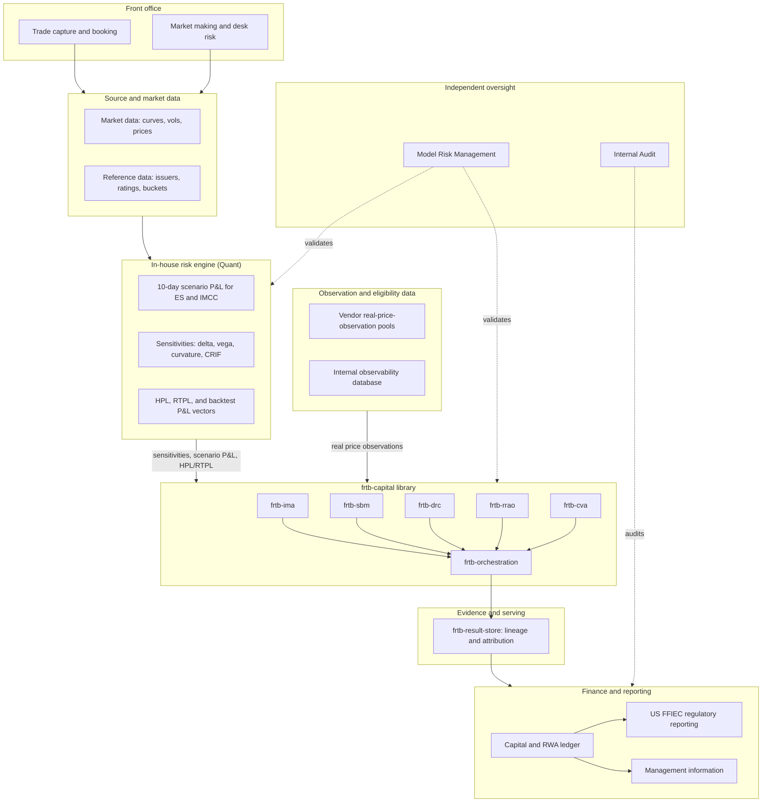
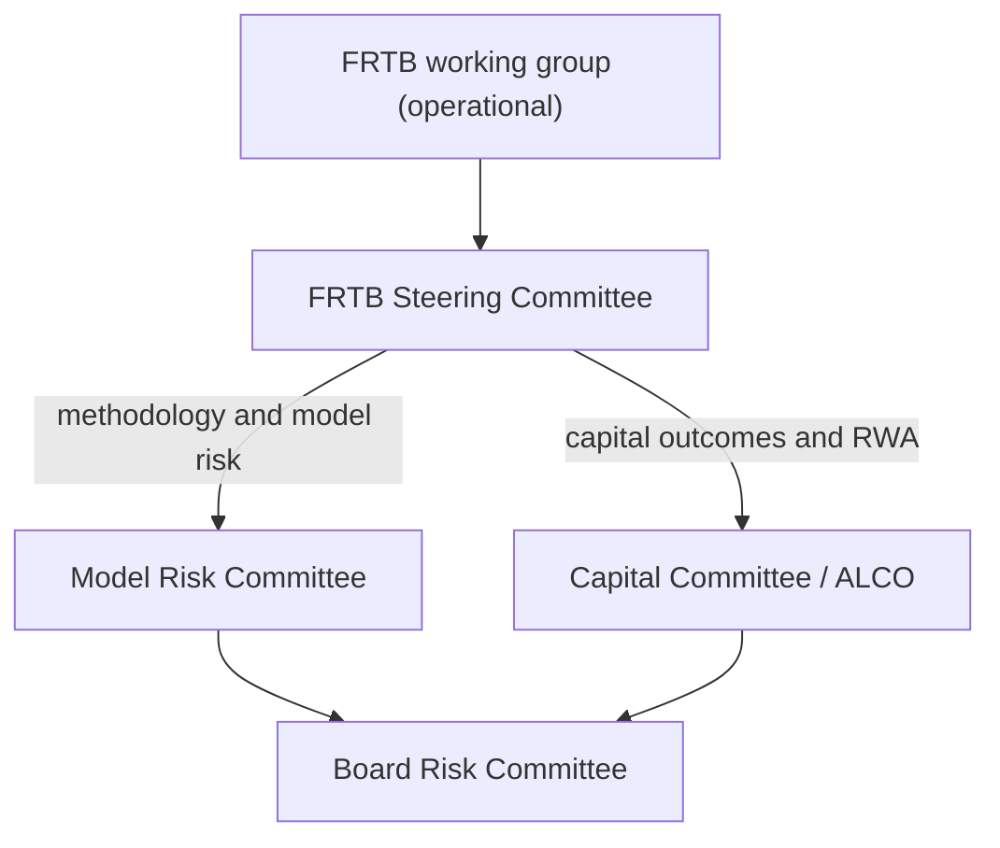
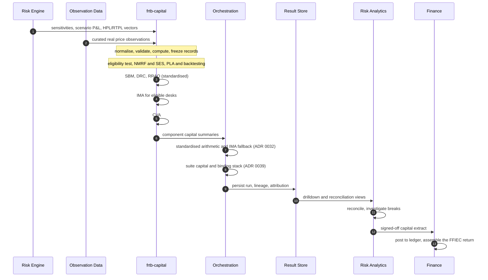
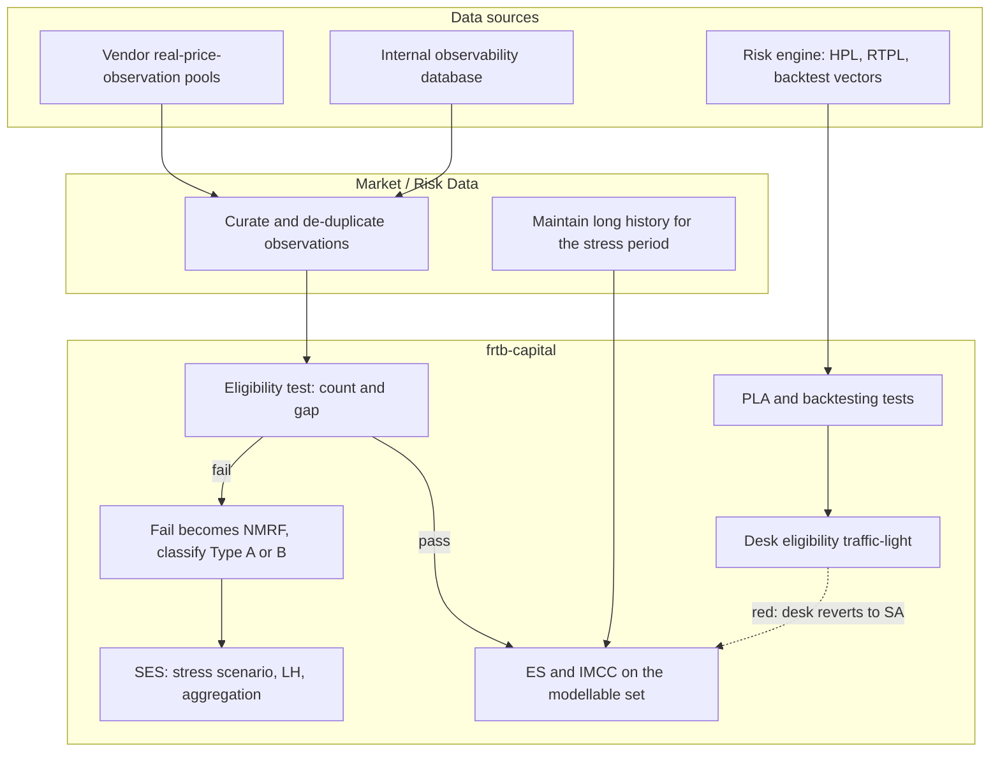
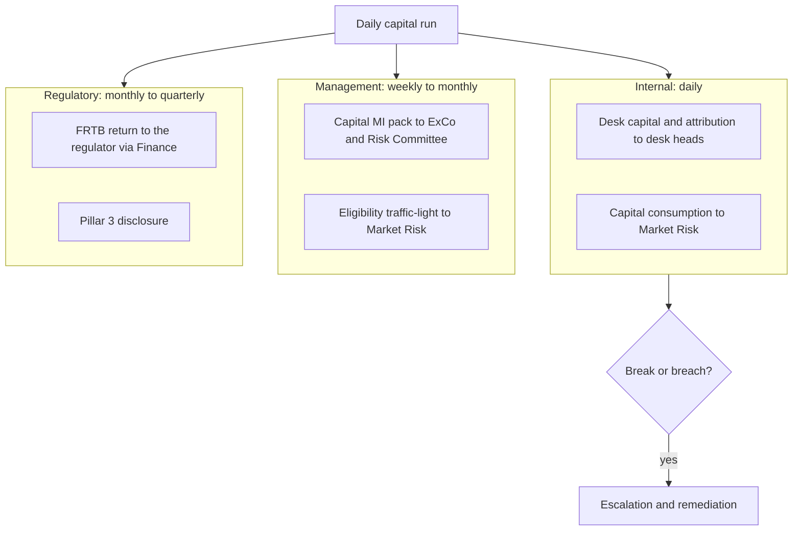
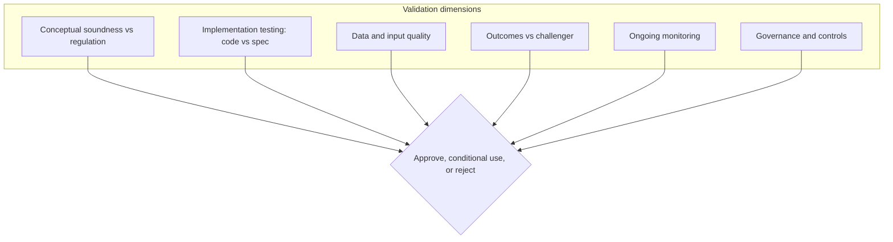
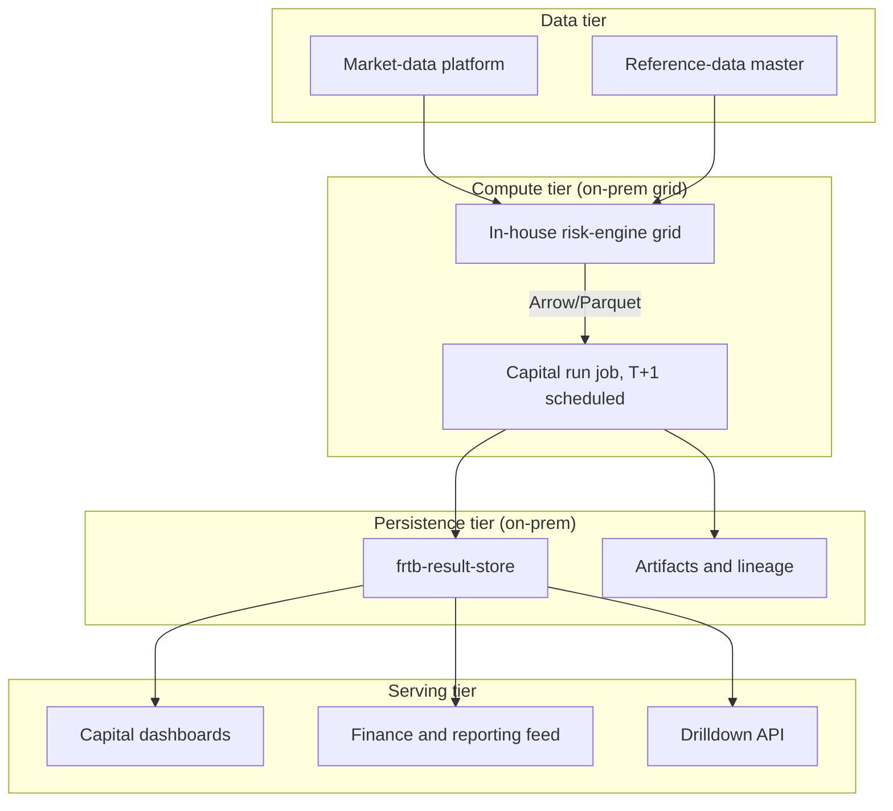

# FRTB Target Operating Model

This document describes a target operating model for producing FRTB market-risk
capital with the `frtb-capital` library as the calculation engine. It covers the
organisational, functional, and technical design: who does what and when, what is
prepared upfront versus computed daily, how the numbers are reported, and how the
library fits between the risk engine, the finance ledger, and regulatory
reporting.

It is a design artifact, not a regulatory submission. The library remains a
prototype: its outputs are not final regulatory capital and require independent
model validation and supervisory approval before any production use.

The design has been shaped by thirty decisions taken across three review rounds.
Those decisions, the regime-identifier reference, and the register of open
questions are recorded separately in the
[**Decision Log**](FRTB_TOM_DECISION_LOG.md) so that this document can read as a
coherent narrative. The target jurisdiction is the **US NPR**; the model is
designed for full IMA and Standardised Approach coverage, with capital-of-record
rolling out the Standardised Approach first and IMA enabled desk by desk as each
desk's evidence matures.

---

## 1. Purpose and scope

The operating model answers five questions for an FRTB programme built on
`frtb-capital`:

1. Who runs what, and when?
2. What is prepared upfront, what is computed daily, and what happens on a
   periodic cycle?
3. What is reported, to whom, when, and how?
4. How does the library interact with the risk engine, the finance engine, and
   capital reporting?
5. What does the regulation require, and what must Model Risk Management
   independently check?

In scope is market-risk capital under FRTB: the Internal Models Approach (IMA),
the Standardised Approach (SBM, DRC, and RRAO), and CVA capital. Out of scope are
counterparty credit (SA-CCR and IMM), banking-book interest-rate risk, and
non-market risk-weighted assets.

---

## 2. Where the library sits

`frtb-capital` is a calculation engine, not a platform. It consumes risk-factor
and sensitivity inputs, produces auditable capital results, and hands them to a
result store and onward to reporting. It does not own market data, P&L
production, trade capture, or the regulatory return.

Three distinct upstream owners feed the library, and they should not be conflated.
The in-house risk engine produces the quantitative vectors: sensitivities and
CRIF, 10-day scenario P&L, and the hypothetical, risk-theoretical, and backtest
P&L series. It does not decide modellability or run the regulatory tests.
Observation and eligibility evidence comes from a separate data-sourcing function,
combining vendor real-price-observation pools with the bank's own internal
observability database. The library itself owns the regulatory transform: it runs
the eligibility test, derives non-modellable risk factors and their stressed
capital, runs the P&L-attribution and backtesting tests, and computes capital,
with a full audit trail. Finance owns the ledger, the return, and disclosure.

The Arrow/Parquet handoff
([ADR 0023](decisions/0023-arrow-tabular-handoff-boundary.md)) is the contractual
seam for both the risk-engine feed and the observation-data feed. The provenance
of eligibility and P&L-attribution evidence is the subject of
[section 4.4](#44-evidence-provenance-eligibility-nmrf-and-pl-attribution).

---

## 3. Organisation: who owns what

Seven functions interact across the FRTB lifecycle. The library is a shared asset;
ownership here is about the activity, not the code.

| Function | FRTB responsibility |
| --- | --- |
| Front office | Accurate, timely booking; the desk structure; first-line explanation of capital moves; remediation of booking and feed breaks. |
| Quant | Pricing models and the sensitivity and P&L vectors that feed the library; NMRF classification methodology; methodology proposals. |
| Market / Risk Data | Sources and curates the real-price-observation evidence from vendor pools and the internal observability database; owns observation data quality. |
| Market Risk (2nd line) | Risk appetite and limits; the desk IMA-eligibility decision; sign-off that capital is fit for use; challenge of front-office explanations. |
| Risk Analytics | Operates the capital run suite-wide: configures profiles, executes the library, reconciles, investigates breaks, produces attribution, and hands the signed extract to Finance. Sits in the second line under the CRO, independent of the front office. |
| Finance | Owns capital and RWA in the ledger, the US FFIEC return, disclosure, and the reconciliation of risk-produced capital to the general ledger. |
| IT / Platform | Owns the runtime platform, data pipelines, scheduling, environments, the result store, access control, and the deployment lifecycle. |
| Model Risk Management | Independent validation of each component under SR 11-7; ongoing monitoring; approval and conditional-use gates. |

The matrix below reads as a sentence per activity: one function leads and owns the
outcome, others help, one signs off, and some are kept informed. A function absent
from a row has no part in that activity.

| Activity | Leads | Helps | Signs off | Informed |
| --- | --- | --- | --- | --- |
| Desk structure and boundary | Front office | Risk Analytics | Market Risk | Finance, MRM |
| Sensitivity and P&L/HPL/RTPL production | Quant | Risk Analytics | Quant head | Market Risk |
| Observation sourcing and curation | Market / Risk Data | Quant, vendors | Market Risk | Risk Analytics |
| Reference-data rule tables | Quant | Risk Analytics | Market Risk | Finance |
| Methodology and regime configuration | Quant | Risk Analytics, MRM | Market Risk | Finance |
| CVA exposure and hedge data | Risk Analytics | Counterparty Risk | Risk Analytics head | MRM |
| Input data-quality certification | Source systems | Risk Analytics | Source-system owners | Market Risk |
| Daily capital run | Risk Analytics | IT | Risk Analytics head | Market Risk |
| Dual-stack comparison and binding selection | Risk Analytics | — | Market Risk | Finance |
| Eligibility-test and NMRF/SES results | Risk Analytics | Quant | Market Risk | MRM |
| P&L attribution, backtesting, and eligibility | Risk Analytics | Quant | Market Risk | Front office, MRM |
| Reconciliation | Risk Analytics | Finance | Risk Analytics head | Market Risk |
| Period capital sign-off | Risk Analytics | Finance | Market Risk | ExCo |
| Handover to Finance | Risk Analytics | — | Finance | MRM |
| US FFIEC return | Finance | Risk Analytics | Finance head | Market Risk |
| Independent model validation | MRM | Quant, Risk Analytics | MRM head / CRO | Board Risk Committee |
| Platform, versioning, and access | IT | Risk Analytics | IT head | MRM |

Where Risk Analytics leads a row that involves an eligibility or attribution test,
it operates the test and owns the result, but the calculation itself is performed
by the library using the prescribed regulatory methodology rather than
hand-computed. Section 4.4 sets this out in detail.

A note on the desk structure: regulatory desks inherit the existing
management and booking desks one-for-one, with minimal separate governance. This
is a pragmatic choice that carries a compliance risk, because management desks may
not satisfy the FRTB qualitative desk-definition and granularity standards — a
clear single head, a defined business strategy, and desk-level risk management.
Market Risk confirms that the inherited structure meets those standards at
onboarding and again on any reorganisation, and the point is flagged for MRM
review.

### Governance forums

A dedicated FRTB Steering Committee owns the operating model end to end, rather
than spreading it across unrelated standing forums. It draws on Risk, Quant,
Finance, IT, and MRM, and escalates into the established Model Risk and Capital
committees.

| Forum | Owns | Cadence |
| --- | --- | --- |
| FRTB Steering Committee | Methodology, the release train, run outcomes, and cross-function escalation | Aligned to the quarterly release train, plus ad hoc |
| Model Risk Committee | Model approvals, conditional-use findings, validation outcomes | Per MRM cycle |
| Capital Committee / ALCO | Capital and RWA outcomes, the binding stack, disclosure | Monthly to quarterly |

---

## 4. The functional model: upfront, live, and periodic

FRTB runs at three cadences, and the library is invoked differently in each:
configuration prepared once at onboarding or on change, the daily capital run, and
the periodic recalibration and review cycle.

```mermaid
flowchart LR
    subgraph UP["Upfront: onboarding and change"]
        U1["Desk boundary and eligibility setup"]
        U2["Regime profile configuration"]
        U3["Reference data and bucket calibration"]
        U4["Stress-period and NMRF specification"]
        U5["Input-contract onboarding"]
    end

    subgraph LIVE["Live: daily T+1"]
        L1["Ingest sensitivities and P&L"]
        L2["Run SBM, DRC, RRAO, IMA, CVA"]
        L3["Orchestrate suite capital"]
        L4["Reconcile and attribute"]
        L5["Persist to the result store"]
    end

    subgraph PER["Periodic"]
        P1["Quarterly stress-period recalibration"]
        P2["Quarterly desk eligibility"]
        P3["Annual model review"]
        P4["Regulatory return"]
    end

    UP --> LIVE
    LIVE --> PER
    PER -.feeds back configuration.-> UP
```

### 4.1 Upfront

Set up once when a desk or book is onboarded, and revisited only on change:

| Activity | Owner | Library touchpoint |
| --- | --- | --- |
| Desk boundary and IMA-eligibility policy | Risk and front office | `DeskEligibilityStatus`, two-state guard (ADR 0009) |
| Regime profile selection | Quant and Risk | `regimes.py` per package; profile guards (ADR 0022) |
| Reference-data load: buckets, weights, correlations | Risk Analytics | package reference-data rule tables |
| Observation-feed onboarding | Market / Risk Data and IT | eligibility-evidence input specifications |
| Reduced-set scope: modellable factors with stress history | Quant and Market / Risk Data | ES stress-scaling inputs |
| Stress-period, NMRF specification, and Type A/B rules | Quant | `frtb_ima.stress_periods`, `nmrf_stress_spec`, and `nmrf.route_nmrf_classifications_for_capital` |
| Input-contract onboarding: column specs and hashing | IT and Risk Analytics | Arrow column specs and CRIF normalisation |

### 4.2 The daily run

The daily T+1 batch is the centre of the operating model. The risk engine and the
observation-data feed deliver inputs; the library normalises, validates, and
computes; orchestration combines the components and selects the binding capital
stack; the result store captures the run; Risk Analytics reconciles and hands a
signed extract to Finance.

### 4.3 The periodic cycle

| Activity | Cadence | Owner |
| --- | --- | --- |
| Stress-period recalibration | Quarterly, or on trigger | Quant |
| Desk eligibility from PLA and backtesting | Quarterly | Market Risk, off the library output |
| Capital-impact attribution and change validation | Per change | Risk Analytics and MRM |
| Model validation and periodic review | Annual | MRM |
| Methodology and regime release train | Quarterly | Risk Analytics, Quant, MRM |
| US FFIEC regulatory return | Monthly to quarterly | Finance |

Methodology and regime-profile changes — new weights, correlations, or profile
updates — are bundled onto a quarterly release train. Each change runs for a month
in parallel against the incumbent before cutover, so its capital impact is
attributable and reviewable by MRM and Finance. Regulatory-mandated fixes and
defect patches may take an exception fast track outside the train.

### 4.4 Evidence provenance: eligibility, NMRF, and P&L attribution

This is the most commonly misunderstood part of the model, so it is set out
explicitly. The risk engine is not the source of eligibility evidence. Two
different things flow into the library, and the library — not the upstream
systems — performs the regulatory determinations.

The chain runs as follows, with the owner of each step.

| Step | What happens | Source | Owner |
| --- | --- | --- | --- |
| Observation sourcing | Real price observations are gathered per risk factor: date, price, source. Vendors supply pooled industry observations; the internal database supplies the bank's own trades and committed quotes. | Vendor pools and the internal database, not the risk engine | Market / Risk Data curates; quality owned in the second line |
| Eligibility test | The observation count and the maximum gap are checked against the regime criteria; each risk factor or bucket passes or fails. | Curated observations | The library runs the test (`frtb_ima.rfet_evidence`); Risk Analytics operates it |
| NMRF derivation | Every risk factor that fails is non-modellable and therefore an NMRF. This follows mechanically; there is no separate judgment. | Test output | The library derives the set |
| NMRF classification | Judgment enters here. Idiosyncratic credit and equity NMRFs that meet the criteria are Type A, aggregated assuming zero correlation (ADR 0006); all others are Type B, at the prescribed correlation. | Risk-factor taxonomy and idiosyncratic-eligibility flags | Quant sets the methodology; the library applies it (`route_nmrf_classifications_for_capital`) |
| SES | Each NMRF takes a stress-scenario shock and a liquidity horizon and is aggregated into the stressed expected-shortfall add-on. | Stress-period calibration | The library computes it (`nmrf_stress_spec`, `stress_periods`, `calculate_nmrf_capital_for_policy`); Quant owns the calibration |
| Reduced data set | The ES stress scaling needs a reduced set of modellable factors with enough history to span the stress period, capturing at least the required share of full ES. The library selects this set each run to meet the floor; Quant reviews. | Long-history market data | The library selects and computes; Quant reviews; Market / Risk Data maintains the history |
| P&L attribution | The risk engine supplies hypothetical and risk-theoretical P&L; the library runs the regulatory test — the Spearman correlation and the Kolmogorov–Smirnov statistic — and assigns a traffic-light zone. | Risk-engine HPL and RTPL vectors | The library runs the test (`frtb_ima.pla`); Quant owns the vectors |
| Backtesting and eligibility | Exceptions are counted from the P&L-versus-VaR series and combined with the attribution zone to drive desk eligibility. A red desk reverts to the Standardised Approach (ADR 0009, 0032). | Risk-engine P&L vectors | The library computes (`frtb_ima.backtesting`); Market Risk owns the eligibility decision |

Three points are worth stating plainly. First, eligibility evidence is not a
risk-engine output: it is curated observation data from vendor pools and the
internal database, owned by the Market / Risk Data function, and the risk engine
never asserts modellability. Second, the NMRF set follows directly from the
eligibility test; the only judgment is the Type A versus Type B classification and
the stress calibration, both owned by Quant and applied by the library. The
reduced data set is a separate selection among modellable factors, not an
eligibility output. Third, the P&L-attribution result is the library's, not the
risk engine's: the risk engine provides the P&L vectors, and the library runs the
prescribed test on them.

On sourcing, the internal observability database is the system of record. The bank
captures its own executed trades, committed quotes, and observed prices as the
primary modellability evidence, and vendor pools fill the gaps where the bank
lacks its own flow. This maximises the modellable set where the bank is a major
participant, at the cost of a substantial internal capture build; curation,
completeness, and vendor-gap reconciliation are owned by Market / Risk Data in the
second line. The supplementary vendor pool is not fixed by this model. It is a
third-party data dependency under SR 11-7, requiring MRM validation, documented
coverage and quality thresholds, and a delivery SLA; the specific pool is chosen
in procurement against those criteria, keeping the model vendor-neutral.

The eligibility thresholds — observation count, maximum gap, window, and bucketing
approach — are profile parameters rather than hard-coded values. Until the exact
US figures are confirmed, the US profile is seeded with the Basel MAR31 baseline:
at least twenty-four observations a year with no gap wider than a month, or at
least one hundred observations over twelve months, with the bucketing approach
permitted. The exact US figures and the Type A/B criteria are still to be pinned
against the rule text and will be updated through the release train.

---

## 5. Reporting

Every reported number traces to an immutable run in the result store, identified
by a content hash, so any figure in a board pack or a regulatory return can be
drilled back to its inputs, its regime profile, and the library version that
produced it.

| Report | Audience | Frequency | Channel |
| --- | --- | --- | --- |
| Desk capital and attribution drilldown | Desk heads | Daily | Result-store views |
| Reconciliation and breaks | Risk Analytics, Market Risk | Daily | Reconciliation report |
| Capital consumption | Market Risk | Daily | Result-store views |
| Capital MI pack | ExCo, Risk Committee | Weekly to monthly | Finance MI |
| Eligibility traffic-light and backtest exceptions | Market Risk, MRM | Quarterly | Eligibility report |
| FRTB regulatory return | Regulator | Monthly to quarterly | US FFIEC via Finance |
| Model performance and validation findings | Board Risk Committee | Annual, plus ad hoc | MRM report |

FRTB capital is treated as a measurement rather than a binding desk limit.
Day-to-day limits run off separate market-risk measures — value-at-risk,
sensitivities, and desk risk appetite — and capital consumption informs strategy
and the MI pack without gating trading. This keeps the limit framework decoupled
from the T+1 capital cadence.

---

## 6. Integration: library, risk engine, finance, and reporting

```mermaid
flowchart LR
    subgraph RISK["Risk engine (upstream)"]
        direction TB
        R1["Pricing and revaluation"]
        R2["Sensitivity and CRIF production"]
        R3["10-day P&L scenario vectors"]
        R4["Observation and P&L evidence"]
    end

    subgraph CAPLIB["frtb-capital"]
        direction TB
        C1["Normalise and validate, fail-closed"]
        C2["Capital kernels, frozen results"]
        C3["Orchestration and attribution"]
    end

    subgraph FINENG["Finance engine (downstream)"]
        direction TB
        F1["Capital and RWA ledger"]
        F2["Reconcile risk to GL"]
        F3["Regulatory return assembly"]
    end

    subgraph REP["Capital reporting"]
        direction TB
        P1["Regulatory submission"]
        P2["Pillar 3 and disclosure"]
        P3["Management MI"]
    end

    RISK -->|"Arrow/Parquet contract"| CAPLIB
    CAPLIB -->|"frozen records and lineage"| FINENG
    FINENG --> REP
    CAPLIB -.->|"drilldown and attribution"| REP
```

| Seam | Contract | Owner |
| --- | --- | --- |
| Risk engine to library | Arrow column specs for sensitivities, scenario P&L, and HPL/RTPL, with run context and content hash (ADR 0023, 0033) | Risk Analytics and IT |
| Observation data to library | Arrow column specs for curated real price observations | Market / Risk Data and IT |
| CCR engine to library | Counterparty exposure profiles and eligible-hedge data for CVA | Risk Analytics and IT |
| Every feed to a run | A data-quality certificate — completeness, staleness, mapping coverage — attached per feed | Source-system owners; Risk Analytics monitors |
| Within the library | The component capital summary handoff (ADR 0029) | Library maintainers |
| Library to Finance | A reviewed, signed-off extract derived from the frozen result records, audit log, and lineage hash | Risk Analytics produces, Finance ingests |
| Finance to reporting | Ledger postings and the US FFIEC mapping | Finance |

The boundary between risk and finance is a deliberate human gate, not a silent
feed. Before sign-off, breaks — between the standardised and IMA stacks, day on
day, or against the general ledger — are scored against per-component thresholds:
green passes automatically, amber needs an explanatory note from Risk Analytics,
and red blocks the handover until Market Risk approves. Risk Analytics then signs
off the extract, and Finance owns the number from that point. The signed extract
carries the run's content hash, so Finance can always re-derive the lineage back
to the inputs, the regime profile, and the library version.

Each feed also certifies its own data quality. The source system attaches a
certificate covering completeness, staleness, and mapping coverage; Risk Analytics
monitors the certificates; and the library's fail-closed behaviour on missing or
invalid data is the backstop.

---

## 7. What the regulation requires

The binding regime is the US NPR. The Basel references below are the conceptual
lineage; the authoritative numbers come from the US final rule and the library's
US profiles, including the DRC bucket taxonomy and risk weights (ADRs 0024–0028).

| Requirement | Basel lineage | Where it lands |
| --- | --- | --- |
| Desk-level capital and desk-boundary discipline | MAR, with US NPR specifics | Section 3; ADR 0009 |
| The Standardised Approach as a floor and fallback | MAR20–22 | Orchestration fallback (ADR 0032) |
| IMA only for eligible desks | MAR32–33 | Quarterly eligibility, section 4.3 |
| Expected shortfall with liquidity horizons | MAR33 | `frtb-ima` ES, nested LH (ADR 0008) |
| Non-modellable factors via SES | MAR33 | `frtb_ima.nmrf`, SES (ADR 0006) |
| Default risk charge | MAR22 | `frtb-drc` |
| Residual risk add-on | MAR23 | `frtb-rrao` |
| CVA capital | MAR50 | `frtb-cva` |
| Dual-stack: the larger of expanded and standardised RWA binds | US NPR | Orchestration (ADR 0039) |
| Transitional output floor (EU and UK variants) | Basel III, CRR3, PRA | Open item, section 10 |
| Audit trail and reproducibility | SR 11-7 | Result store, hashing, ADR log |

Under the US NPR the firm computes two total-RWA stacks — an expanded measure that
uses IMA where a desk is eligible and the Standardised Approach elsewhere, and a
standardised measure that uses the Standardised Approach throughout — and the
larger of the two is capital-of-record. Orchestration owns this comparison and
records both stacks and the binding selection in the run evidence. In the US NPR
this greater-of test is itself the output-floor mechanism: the standardised stack
acts as an effective 100% floor on the expanded stack, so there is no separate
transitional schedule. The Basel-style transitional output floor that phases
toward 72.5% is an EU and UK feature; there it floors the expanded stack at a
percentage of the standardised stack, never the standardised stack itself.
Encoding that percentage and its phase-in for the EU and UK profiles is the
remaining work captured as an open item.

Precise paragraph citations live in `docs/regulatory/` and each package's
traceability document. The table above is a map, not the authoritative citation
source.

---

## 8. What Model Risk Management checks

MRM validates each component as an independent model under SR 11-7. Components may
enter conditional production use with documented findings and agreed remediation
timelines, which MRM tracks to closure rather than hard-gating every component
before first use. Conditional use is time-boxed: if findings are not closed within
the agreed window, the component reverts to a standardised fallback, dropping the
affected scope back to the Standardised Approach (ADR 0009, 0032). This bounds how
long capital can rely on a model with open findings, without a separate
capital-overlay mechanism.

| Dimension | What MRM checks |
| --- | --- |
| Conceptual soundness | Regime profiles match the cited regulation; every numerical choice has an ADR |
| Implementation | Frozen-dataclass results, vectorised kernels, deterministic fixtures, replay tests |
| Data quality | Fail-closed validation, eligibility evidence, NMRF completeness |
| Outcomes | Challenger-model reconciliation |
| Monitoring | Attribution traffic-light, backtesting exceptions, capital stability |
| Governance | Versioning, package boundaries, result-store immutability |

---

## 9. Technical and deployment architecture

The capital run is deployed on-premise: compute runs on the bank's internal grid
and scheduler, co-located with the in-house risk engine, and the result store is
on-premise storage. There is no cloud dependency in the capital-of-record path.

The non-functional targets are deterministic, reproducible runs through content
hashing; immutable run evidence; a version-pinned library deployment; fail-closed
behaviour on missing reference data; separate development, test, and production
environments; and least-privilege access to the result store.

The run follows a best-effort SLA without a stale fallback. The official T+1 run
executes once its inputs are complete; if the risk-engine or observation feed is
late or fails, the run slips rather than substituting stale or prior-day numbers.
Correctness is prioritised over cadence, which makes feed reliability the binding
operational risk: upstream feed SLAs and monitoring, with alerting to Risk
Analytics and IT, are the primary control, because on-premise deployment offers no
cloud elasticity to absorb a late batch.

Every capital-of-record run is retained write-once for seven years with full input
lineage and content hashes, supporting examiner drilldown back to the inputs, the
regime profile, and the library version.

Access is role-based and enforced per environment. Three role families —
methodology configuration, run execution, and read — are kept distinct, and in
production the controls are strict: regime and methodology configuration is locked
to the release-train process, only the scheduler triggers official runs, and all
human users are read-only. The second-line independence of Risk Analytics is
therefore enforced technically, not merely on the organisation chart.

---

## 10. Roadmap and open items

Thirty design decisions across three rounds are recorded in the
[Decision Log](FRTB_TOM_DECISION_LOG.md), together with the full open-items
register and the regime-identifier reference. Four items remain open and are the
natural agenda for the next round:

- **US numeric calibration.** Pin the exact US eligibility thresholds and the Type
  A/B idiosyncratic-NMRF criteria against the final-rule text, replacing the Basel
  MAR31 interim. This is a regulatory-sourcing task for Quant, regulatory
  traceability, and MRM.
- **Output-floor schedule for the EU and UK profiles.** Encode the transitional
  output-floor percentage and its phase-in toward 72.5%. The US needs no separate
  schedule, since its dual-stack greater-of test is the floor.
- **MAR12 desk-compliance confirmation.** Confirm that the inherited
  management-desk structure meets the qualitative desk-definition and granularity
  standards, and define the remediation path if it does not.
- **Observation-capture and CVA-exposure build.** Detail the internal capture
  design, the vendor-gap reconciliation, and the interface from the counterparty
  engine to CVA exposure.

Three topics are acknowledged but not yet modelled: the interaction with prudent
valuation and independent price verification, BCBS 239 data-aggregation lineage
attestation, and a full disaster-recovery and business-continuity plan beyond the
run SLA.
