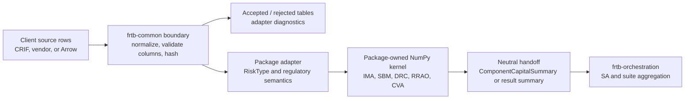

# frtb-common

`frtb-common` is the shared foundation package for package-neutral mechanics in
the `frtb-capital` workspace.

## Package Status

- Package directory: `packages/frtb-common`
- Import name: `frtb_common`
- Implementation status: shared primitives
- Validation status: unit-tested shared handoff and CRIF normalization helpers

Current runtime contents are deliberately small and package-neutral:

- package status metadata plus explicit unsupported/unimplemented exception
  types;
- `ComponentCapitalSummary`, `StandardisedComponent`, and
  `ComponentSummaryError` for the SA component-to-orchestration contract
  accepted in
  [ADR 0029](../../decisions/0029-unified-standardised-component-handoff-contract.md);
- Arrow-backed tabular handoff primitives for column declarations,
  null/chunk/dictionary policies, accepted/rejected tables, adapter
  diagnostics, row id checks, deterministic sorting, and content/handoff
  hashes;
- CRIF-to-Arrow normalization for source-column discovery, alias normalization,
  primitive coercion, accepted/rejected partitioning, diagnostics, metadata,
  source hashes, and package-supplied RiskType mapping. The public
  `frtb_common.crif` import path remains stable while the implementation is
  physically split across CRIF type contracts, normalization orchestration, and
  vectorized Arrow static-mapping modules;
- `jsonable` serialization for common domain values;
- regulatory citation test helpers for package policy objects.

## Shared Boundary Flow

Capital packages still own RiskType meaning, regulatory validation, typed input
batches, NumPy kernels, audit records, and package-specific policy objects.
`frtb-common` does not encode IMA, SBM, DRC, RRAO, or CVA regulatory semantics.

`frtb-common` must not import from capital component packages.

`pyarrow` is allowed here only for tabular handoff and CRIF normalization under
[ADR 0023](../../decisions/0023-arrow-tabular-handoff-boundary.md). The
dependency policy in
[ADR 0011](../../decisions/0011-core-runtime-dependency-policy.md) keeps
capital kernels NumPy-native and keeps dataframe libraries outside required
runtime kernels. Performance evidence for the shared CRIF vectorized static
RiskType path is recorded in
[docs/performance/frtb-common-crif-normalizer-report.md](../../performance/frtb-common-crif-normalizer-report.md).
