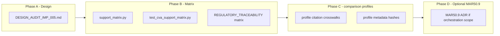

# AUDIT-IMP-005 — CVA profile and method coverage design

**Parent backlog:** [#501](https://github.com/tomanizer/frtb-capital/issues/501)  
**Source audit:** [#495](https://github.com/tomanizer/frtb-capital/issues/495)  
**Package scope:** `packages/frtb-cva`, `docs/modules/frtb-cva`, package-local tests only (no orchestration ADR unless MAR50.9 scope expands).

This document is the implementation design for expanding CVA profile/method coverage,
producing a current support matrix, and recording an explicit MAR50.9 decision. It
supersedes informal gap lists in audit comments once merged.

Companion artefacts after implementation:

- `packages/frtb-cva/src/frtb_cva/support_matrix.py` (new)
- `packages/frtb-cva/tests/test_cva_support_matrix.py` (new)
- `packages/frtb-cva/docs/REGULATORY_TRACEABILITY.md` (expanded matrix section)
- `docs/modules/frtb-cva/DECISIONS_AND_PLAN.md` (CVA-DEC-012 for MAR50.9)

Issue #568 extends this design by making `US_NPR20_VB`, `EU_CRR3_CVA`, and
`UK_PRA_CVA` capital-producing comparison profiles under audit with
profile-owned citations and hashes. References to those profiles failing closed
below describe the pre-#568 baseline.

Issue #630 supersedes this design's maturity boundary by promoting the
package-owned CVA calculation scope to `implemented` maturity with
`ValidationStatus.AVAILABLE`. Production regulatory capital claims remain out
of scope.

---

## 1. Problem statement

The CVA audit ([#495](https://github.com/tomanizer/frtb-capital/issues/495)) found
substantial Basel MAR50 coverage, but at that point the package remained
`partial_runtime` because:

1. **Comparison profiles** (`US_NPR20_VB`, `EU_CRR3_CVA`, `UK_PRA_CVA`) needed
   profile-owned citations, reference payloads, support-matrix rows, and
   deterministic fixtures before becoming capital-producing under audit.
2. **MAR50.9** materiality-threshold 100% CCR alternative is gated but not documented as
   a formal suite decision with blocker taxonomy.
3. **No machine-checked support matrix** ties profile × method × SA risk-class/measure ×
   hedge policy to tests and traceability (unlike `frtb-sbm`).

Existing BA-CVA and SA-CVA Basel paths, fixtures (`ba_cva_reduced_v1`, `sa_cva_girr_delta_v1`),
and replay hashes must remain unchanged.

---

## 2. Goals and non-goals

### Goals

| ID | Goal | Acceptance signal |
| --- | --- | --- |
| G1 | Inventory every profile/method cell with status and blocker | Matrix rows in traceability + `support_matrix.py` |
| G2 | Explicit MAR50.9 decision with tests | CVA-DEC-012 + unchanged fail-closed tests |
| G3 | Non-Basel profile gap closed without silent Basel citation fallback | Issue #568 tests and profile hashes |
| G4 | No silent Basel calibration on U.S./EU/UK profiles | Profile-specific `reference_data` or fail closed |
| G5 | `make quality-control` and all CVA tests pass | CI green |

### Non-goals (this historical epic)

- Production regulatory capital claims. Clearing `validation_status` from
  `PENDING` was out of scope for AUDIT-IMP-005 and was handled later by #630.
- Claiming final U.S./EU/UK regulatory capital beyond cited comparison-profile evidence.
- CCR capital engine inside `frtb-cva` (MAR50.9 depends on external CCR totals).
- Orchestration-level SA composition changes (`frtb-orchestration` stays out of scope unless ADR).
- CCS vega capital (regulatory absence, not a profile gap).

---

## 3. Current runtime inventory

### 3.1 Regulatory profiles

| Profile ID | Runtime | Capital-producing | Fail-closed mechanism | Primary blocker |
| --- | --- | --- | --- | --- |
| `BASEL_MAR50_2020` | Supported | Yes (partial) | — | July 2020 calibration only; MAR50.9 excluded |
| `US_NPR20_VB` | Supported comparison profile | Yes (partial) | MAR50.9/simplified alternatives only | Proposed-rule section V.B; not final U.S. capital |
| `EU_CRR3_CVA` | Supported comparison profile | Yes (partial) | Simplified CCR-substitution alternatives only | ECB shorthand routes here; no separate ECB profile |
| `UK_PRA_CVA` | Supported comparison profile | Yes (partial) | Alternative approach / CCR boundary only | PRA effective-date metadata is 1 January 2027 |

Profile resolution flow after issue #568:

```text
calculate_cva_capital
  → validate_calculation_context (materiality → UnsupportedRegulatoryFeatureError)
  → get_cva_rule_profile → resolve_cva_profile
       → SUPPORTED_PROFILE_METADATA → profile_reference_payload(profile)
       → profile-owned citation ids and content hash
```

### 3.2 CVA methods (`CvaMethod`)

| Method | Basel anchor | `BASEL_MAR50_2020` | Notes |
| --- | --- | --- | --- |
| `BA_CVA_REDUCED` | MAR50.14–MAR50.16 | Implemented | Fixture `ba_cva_reduced_v1`; no hedge recognition |
| `BA_CVA_FULL` | MAR50.17–MAR50.26 | Implemented | SNH/IH/HMA/beta floor |
| `SA_CVA` | MAR50.42–MAR50.77 | Implemented | Requires `sa_cva_approved=True` |
| `MIXED_CARVE_OUT` | MAR50.8 | Implemented | Carve-out evidence on netting sets and SA sensitivity slice evidence |
| MAR50.9 100% CCR alternative | MAR50.9 | **Unsupported** | `materiality_threshold_elected=True` |

**Runtime vs profile metadata:** `capital.py` and `scope.py` already produce capital for
`BA_CVA_FULL` and `MIXED_CARVE_OUT` (see `test_cva_ba_cva_full.py`,
`test_cva_mixed_method.py`). `CvaRuleProfile.supported_methods` on
`get_cva_rule_profile()` is **stale**: `regimes._BASEL_SUPPORTED_METHODS` still lists only
`BA_CVA_REDUCED` and `SA_CVA`. Phase B aligns profile metadata with the support matrix;
this design PR does not change `regimes.py` or profile content hashes.

### 3.3 SA-CVA risk-class × measure cells (`BASEL_MAR50_2020`)

Source of truth in code: `_SUPPORTED_PATHS` in `sa_cva.py`.

| Risk class | Delta | Vega | Status / blocker |
| --- | --- | --- | --- |
| GIRR | Yes | Yes | Implemented; `volatility_input` required for vega |
| FX | Yes | Yes | Implemented |
| Counterparty credit spread (CCS) | Yes | **No** | Vega: regulatory absence (MAR50.45, MAR50.63) — `CvaInputError` |
| Reference credit spread (RCS) | Yes | Yes | Implemented; qualified-index via MAR50.50 |
| Equity | Yes | Yes | Implemented; qualified-index |
| Commodity | Yes | Yes | Implemented |

### 3.4 Hedge and attribution cells (Basel)

| Cell | BA-CVA reduced | BA-CVA full | SA-CVA | Blocker if unsupported |
| --- | --- | --- | --- | --- |
| Eligible external hedge benefit | No (MAR50.13(2)) | Yes | Yes (MAR50.37–MAR50.39) | Explicit ineligibility records |
| Internal hedge / transfer routing | N/A | Partial metadata | Partial metadata | NPR V.A.6.c deferred to U.S. profile |
| MAR50.9 hedge recognition | N/A | **Disallowed** | **Disallowed** | Method unsupported |
| Exact Euler for nonlinear branches | N/A | Unsupported/residual projection | Unsupported/residual projection | ADR 0012 residual branches |

### 3.5 Documentation and metadata drift to fix

| Item | Location | Issue | Status in PR #527 |
| --- | --- | --- | --- |
| Crosswalk test refs | `docs/regulatory/crosswalk/frtb-cva.yml` | Wrong unsupported-features test path | **Fixed** in this PR |
| `supported_methods` metadata | `regimes.py` | Omits `BA_CVA_FULL`, `MIXED_CARVE_OUT` despite runtime support | Phase B (`support_matrix.py`) |
| Dual materiality gates | `validation.py` + `scope.py` | `CvaInputError` vs `UnsupportedRegulatoryFeatureError` | Phase B; see §5.5 |
| Package maturity | `package_maturity.toml` | No `support-matrix` required test yet | Phase B |

---

## 4. Target support matrix architecture

Mirror the `frtb-sbm` pattern: **code registry → tests → markdown traceability**.

### 4.1 New module: `support_matrix.py`

Responsibilities:

```python
# Conceptual API (to be implemented)

def cva_capital_supported_methods(profile: str) -> frozenset[CvaMethod]: ...

def cva_sa_cva_supported_paths(profile: str) -> frozenset[tuple[SaCvaRiskClass, SaCvaRiskMeasure]]: ...

def cva_profile_support_status(profile: str) -> ProfileSupportStatus: ...
    # capital_producing | comparison_fail_closed | unknown

def ensure_cva_profile_method_supported(profile, method) -> None: ...
    # raises UnsupportedRegulatoryFeatureError

def ensure_cva_sa_cva_path_supported(profile, risk_class, risk_measure) -> None: ...
    # raises UnsupportedRegulatoryFeatureError or CvaInputError for regulatory absence
```

Design rules:

- **`BASEL_MAR50_2020`:** capital-producing methods are those resolved by `scope.py` /
  `capital.py` today: `{BA_CVA_REDUCED, BA_CVA_FULL, SA_CVA, MIXED_CARVE_OUT}`. The matrix
  module imports this set from runtime dispatch (not from stale `regimes._BASEL_SUPPORTED_METHODS`).
  SA paths = `_SUPPORTED_PATHS` from `sa_cva.py` (import, do not duplicate literals).
- **Comparison profiles:** methods and SA paths = empty frozensets; `ensure_*` raises `UnsupportedRegulatoryFeatureError` with the same message family as `UNSUPPORTED_PROFILE_REASONS`.
- **MAR50.9:** not a `CvaMethod` enum value; matrix row `method_policy = MATERIALITY_THRESHOLD_CCR` with status `unsupported` and blocker `CCR_INPUT_BOUNDARY`.

### 4.2 Matrix row schema (documentation)

Each row in `REGULATORY_TRACEABILITY.md` and the YAML fragment below:

| Column | Description |
| --- | --- |
| `profile` | `CvaRegulatoryProfile` value |
| `method` | `CvaMethod` or policy label (`MAR50.9`) |
| `risk_class` / `risk_measure` | SA-CVA only; `—` otherwise |
| `status` | `implemented_under_audit` \| `unsupported_fail_closed` \| `regulatory_absence` \| `out_of_scope` |
| `citation` | Primary paragraph(s) |
| `blocker` | `none` \| `citation_blocker` \| `fixture_blocker` \| `ccr_boundary` \| `comparison_profile` |
| `tests` | pytest paths proving status |

### 4.3 Traceability placement

Add section **"Profile × method × SA-CVA support matrix"** to
`packages/frtb-cva/docs/REGULATORY_TRACEABILITY.md` after the module table, linked from:

- `docs/modules/frtb-cva/README.md` (Planning Documents list)
- `docs/modules/frtb-cva/DECISIONS_AND_PLAN.md` (reference this design)
- `docs/regulatory/crosswalk/frtb-cva.yml` (add `support_matrix` code/test refs)

### 4.4 Requirements registry

Add requirement `CVA-MATRIX-001` to `packages/frtb-cva/docs/requirements/BASEL_FRTB_CVA.yml`:

```yaml
- id: CVA-MATRIX-001
  title: CVA profile/method support matrix
  status: implemented  # after code lands
  modules: [src/frtb_cva/support_matrix.py]
  tests: [tests/test_cva_support_matrix.py]
```

---

## 5. MAR50.9 decision (CVA-DEC-012)

### 5.1 Regulatory summary

Basel MAR50.9 allows banks whose aggregate notional amount of non-centrally-cleared
derivatives is **≤ EUR 100 billion** to apply **100% of CCR capital** in place of BA-CVA
and SA-CVA, with **no CVA hedge recognition**.

### 5.2 Decision

**Do not implement MAR50.9 capital in AUDIT-IMP-005 or the immediate follow-on slice.**

Record **CVA-DEC-012: MAR50.9 remains explicitly unsupported (fail closed)**.

| Criterion | Assessment |
| --- | --- |
| Package boundary | CCR capital is not computed in `frtb-cva`; MAR50.9 output is CCR substitution, not a variant of BA/SA-CVA formulas |
| Orchestration | Top-of-house method election may belong in `frtb-orchestration`; needs ADR before cross-package contract |
| Input contract | Requires validated `aggregate_notional_eur` and `ccr_capital_total` with audit lineage |
| Hedge policy | Explicit zero hedge benefit — must not reuse BA/SA hedge kernels |
| Fixture evidence | No Basel QIS vector in repo; synthetic fixture must cite MAR50.9 only |

### 5.3 Required behaviour (unchanged, hardened)

| Layer | Behaviour |
| --- | --- |
| `CvaCalculationContext.materiality_threshold_elected` | Reject before capital math |
| Public API | `calculate_cva_capital` never returns capital when flag is true |
| Audit | Result record must not label MAR50.9 branches as reconciled SA/BA contributions |

### 5.4 Test contract

Keep and extend:

- `test_cva_unsupported_features.py::test_materiality_threshold_fails_at_public_api`
- `test_cva_scope.py::test_materiality_threshold_fails_closed`
- `test_cva_validation.py` (context validation)
- New: `test_cva_support_matrix.py::test_mar50_9_materiality_policy_unsupported`

### 5.5 Consolidation (implementation note)

Use **`UnsupportedRegulatoryFeatureError`** for `materiality_threshold_elected` at the
public boundary (regulatory feature), not `CvaInputError`. Update `validation.py` to
delegate to the same message as `scope.py`, or remove the duplicate gate in validation
after scope/profile resolution order is fixed. Tests must be updated once in the same PR.

### 5.6 Future implementation trigger

Revisit MAR50.9 only when **all** are true:

1. ADR for orchestration handoff of CCR capital into CVA method election (or new `frtb-ccr` package with cited API).
2. Cited fixture with deterministic CCR total and notional threshold edge cases.
3. Explicit `CvaMethod` or parallel result branch that cannot be confused with BA/SA paths in attribution.

---

## 6. Comparison profile design (U.S. / EU / UK)

### 6.1 Principle

**Never alias comparison profiles to `BASEL_MAR50_2020` reference tables.** Each profile
must have its own `profile_reference_payload()` slice and citation ids, even when numeric
calibrations match Basel.

### 6.2 Profile implementation pattern

For each comparison profile, deliver in order:

```text
1. regulatory_sources.yml + crosswalk rows (citation_blocker clearance)
2. SUPPORTED_PROFILE_METADATA entry OR deliberate remain in UNSUPPORTED with mapped blocker
3. reference_data.py tables keyed by profile id
4. regimes.get_cva_rule_profile() content_hash includes profile-specific payload
5. Fail-closed tests (profile resolves but capital path rejects) OR capital fixtures
```

### 6.3 U.S. NPR 2.0 (`US_NPR20_VB`) - delivered by #568

| Work item | Deliverable |
| --- | --- |
| Citation map | `packages/frtb-cva/docs/regulatory_sources.yml`, `docs/regulatory/crosswalk/frtb-cva.yml`, and `frtb_cva._profile_citations` |
| Section V.B.2–V.B.3 | Map method election, CVA segment, hedging to existing `scope.py` hooks |
| Reference data | Only where NPR text differs from July 2020 Basel (document sameness explicitly) |
| Tests | `test_cva_regimes.py`: profile metadata hash; `test_cva_unsupported_features`: NPR-labelled SA-CVA and BA-CVA public API runs |
| Fixture evidence | NPR-labelled synthetic rows prove profile hash and citations differ from Basel even when numeric calibration matches |

### 6.4 EU CRR3 (`EU_CRR3_CVA`)

| Item | Detail |
| --- | --- |
| Citation | Articles 381-386 and inserted Articles 383a-383z (Regulation (EU) 2024/1623) |
| Fixture | EBA RTS on CVA for SFTs where material |
| Status | Capital-producing comparison profile under audit; ECB shorthand routes here |

### 6.5 UK PRA (`UK_PRA_CVA`)

| Item | Detail |
| --- | --- |
| Citation | PRA PS1/26 and PRA Rulebook CVA Risk Part; CP16/22 retained as historical context |
| Status | Capital-producing comparison profile under audit |

---

## 7. First implementation candidate (Phase B)

**Recommended first closed gap: support matrix machinery + traceability (no new capital paths).**

Rationale:

- Satisfies audit inventory and linked matrix without risking Basel fixture regression.
- Unblocks parallel work on U.S./EU/UK profiles with explicit blocker columns.
- Aligns maturity gate with `frtb-sbm` (`support-matrix` required test).

**Comparison-profile delivery (Phase C): U.S. NPR, EU CRR3, and UK PRA profile
metadata and citation crosswalks** - completed by issue #568 with profile-owned
citations, hashes, and public API synthetic runs.

**Defer:** MAR50.9 implementation (§5), final-rule jurisdiction-specific numeric
divergence, CCS vega (regulatory absence).

---

## 8. Delivery phases



| Phase | Scope | Closes audit item |
| --- | --- | --- |
| **A** | This design doc + CVA-DEC-012 draft | Design review |
| **B** | Matrix module, tests, traceability, crosswalk fix, `CVA-MATRIX-001`, maturity test id | G1, G2 (docs), G5 |
| **C** | `US_NPR20_VB`, `EU_CRR3_CVA`, and `UK_PRA_CVA` citation maps + profile metadata + public API fixtures | G3 (closed by #568) |
| **D** | MAR50.9 only with ADR and upstream CCR/orchestration input design | Remaining long-term scope |

---

## 9. Test and quality strategy

### 9.1 New tests (`test_cva_support_matrix.py`)

| Test | Assertion |
| --- | --- |
| `test_basel_methods_match_supported_set` | Four methods for `BASEL_MAR50_2020` |
| `test_basel_sa_paths_match_sa_cva_module` | 11 paths; CCS vega absent |
| `test_non_basel_profiles_support_basel_aligned_methods_and_paths` | US/EU/UK → supported method/path sets with CCS vega still absent |
| `test_traceability_lists_all_basel_sa_rows` | Markdown sync |
| `test_mar50_9_policy_unsupported` | Matrix status + API fail closed |

### 9.2 Regression guards

- Re-run `test_cva_replay.py` and fixture workflows; hashes unchanged.
- `make quality-control` including import-linter and kernel boundary checks.
- No new runtime deps (numpy only in kernels).

### 9.3 Package maturity

Add to `docs/quality/package_maturity.toml`:

```toml
[[packages.required_tests]]
id = "support-matrix"
path = "packages/frtb-cva/tests/test_cva_support_matrix.py"
```

---

## 10. Data model and API changes

### 10.1 Delivered API changes

- Support-matrix helpers are exported from `frtb_cva.__init__` for public
  profile-status introspection and maturity evidence.
- No change to `CvaCapitalResult` shape for fail-closed paths.

### 10.2 Optional context fields (Phase D / MAR50.9 only)

If MAR50.9 is ever implemented:

```python
@dataclass(frozen=True)
class CvaCalculationContext:
    ...
    aggregate_notional_eur: float | None = None  # required when materiality elected
    ccr_capital_total: float | None = None       # upstream CCR engine
```

These fields are **not** added in Phase B.

---

## 11. Attribution and impact

- Unsupported profile/method cells and MAR50.9 must not appear as **reconciled**
  Euler branches in `attribution.py`.
- `impact.py` comparisons must fail closed when baseline or candidate uses unsupported
  profile/method cells.
- Matrix rows with `status=unsupported_fail_closed` map to explicit residual metadata per
  ADR 0012.

---

## 12. ADR and governance triggers

| Change | ADR required? |
| --- | --- |
| Support matrix docs + tests only | No |
| MAR50.9 capital with CCR input from orchestration | **Yes** — suite scope |
| Numeric change to Basel BA/SA calibration | Yes + package changelog fragment |
| Moving `CvaRegulatoryProfile` to `frtb-common` | Yes — cross-package type |

---

## 13. Acceptance checklist (AUDIT-IMP-005)

- [x] CVA profile/method support matrix is current and linked from CVA docs
- [x] MAR50.9 has CVA-DEC-012 and corresponding tests
- [x] U.S. NPR, EU CRR3, and UK PRA comparison profiles are implemented under audit with profile-owned citations and hashes
- [x] Unsupported cells fail closed (no Basel silent fallback for US/EU/UK)
- [x] `make quality-control` and all CVA tests pass
- [x] `ba_cva_reduced_v1` and `sa_cva_girr_delta_v1` fixture workflows pass

---

## 14. Issue split (recommended)

| Issue | Title | Phase | Status |
| --- | --- | --- | --- |
| #501 (parent) | AUDIT-IMP-005 umbrella | A-D | Historical umbrella |
| Child A | CVA support matrix module + traceability + maturity gate | B | Delivered |
| Child B | CVA-DEC-012 MAR50.9 consolidation + matrix row | B | Delivered as fail-closed decision |
| #568 | US NPR 2.0, EU CRR3, and UK PRA CVA profile citation crosswalks | C | Delivered on this branch |

---

## 15. References

- [`DECISIONS_AND_PLAN.md`](DECISIONS_AND_PLAN.md) — CVA-DEC-001 through CVA-DEC-011
- [`ARCHITECTURE_AND_DATA_DESIGN.md`](ARCHITECTURE_AND_DATA_DESIGN.md)
- [`BASEL_FRTB_CVA.yml`](../../../packages/frtb-cva/docs/requirements/BASEL_FRTB_CVA.yml)
- [`packages/frtb-cva/docs/REGULATORY_TRACEABILITY.md`](../../../packages/frtb-cva/docs/REGULATORY_TRACEABILITY.md)
- [`packages/frtb-sbm/tests/test_sbm_support_matrix.py`](../../../packages/frtb-sbm/tests/test_sbm_support_matrix.py) — pattern reference
- Basel MAR50.8–MAR50.9, MAR50.14–MAR50.26, MAR50.42–MAR50.77
- U.S. NPR 2.0 91 FR 14952 section V.B (proposed rule; comparison only)
