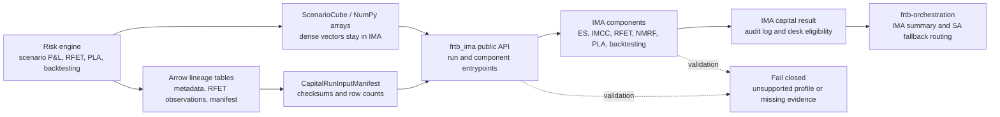

# FRTB-IMA Module

`frtb-ima` is the Internal Models Approach package for model-eligible trading
desks. It is one capital approach with internal calculation, eligibility, and
governance components.

The implemented package lives under
[`packages/frtb-ima`](../../../packages/frtb-ima/). Suite-level model
documentation lives here so IMA is navigated consistently with the planned
and implemented sibling component modules: `frtb-sbm`, `frtb-drc`,
`frtb-rrao`, and `frtb-cva`.

## Boundary Flow

The module boundary stays summary-contract centric: dense scenario vectors feed
IMA kernels directly, Arrow carries tabular lineage and manifest evidence, and
orchestration consumes the final IMA result plus desk eligibility signal rather
than coordinating internal IMA stages.

## Documentation

| Document | Purpose |
| --- | --- |
| [Public API](PUBLIC_API.md) | Stable top-level import surface and client integration tiers. |
| [Regulatory requirements](REGULATORY_REQUIREMENTS.md) | Suite-level pointer to the package-local IMA regulatory evidence. |
| [PRD](PRD.md) | Product requirements and maintainability boundary for the implemented IMA package. |
| [Model documentation pack](model_documentation/README.md) | Intended use, conceptual soundness, derivation, limitations, sensitivity analysis, monitoring, and change history. |
| [IMA component map](components/README.md) | Internal IMA component boundaries and orchestration order. |
| [Workable requirements](requirements/README.md) | Location and ownership of the machine-readable package requirement registry. |
| [Package regulatory traceability](../../../packages/frtb-ima/docs/REGULATORY_TRACEABILITY.md) | Code-to-regulation and regulation-to-code evidence. |
| [Package requirement registry](../../../packages/frtb-ima/docs/requirements/NPR_2_0_MARKET_RISK.yml) | Machine-readable NPR 2.0 requirement inventory and implementation status. |
| [Package assumptions](../../../packages/frtb-ima/docs/REGULATORY_ASSUMPTIONS.md) | Modelling boundaries, exclusions, and regulatory-basis notes. |
| [Package validation pack](../../../packages/frtb-ima/docs/VALIDATION_PACK.md) | Deterministic notebook-backed validation evidence. |
| [Dataset contract](../../../packages/frtb-ima/docs/DATASET_CONTRACT.md) | Synthetic fixture schema, sign conventions, and golden-output controls. |

## Internal Components

IMA remains a single package. These internal components are documented and
tested separately, but they are not separate workspace packages:

- [RFET](components/rfet.md)
- [Stress-period selection](components/stress-period.md)
- [Expected shortfall and IMCC](components/expected-shortfall-imcc.md)
- [NMRF and SES](components/nmrf-ses.md)
- [PLA](components/pla.md)
- [Backtesting](components/backtesting.md)
- [Capital assembly](components/capital-assembly.md)

`frtb-orchestration` should consume the final IMA capital result and the desk
eligibility signal. It should not orchestrate the internal IMA steps directly
unless a future ADR promotes one of those components to a shared package.

## Arrow Boundary

IMA accepts Arrow at tabular lineage boundaries, currently the capital-run input
manifest artifact table. The scenario cube and related scenario vectors remain
NumPy-native because their shape and performance requirements are array/cube
oriented rather than row-tabular. Arrow should be used to hand off manifests,
audit/input tables, and similar high-volume tabular evidence; it should not be
introduced into ES, LHA, IMCC, NMRF, PLA, or backtesting inner scenario kernels.
