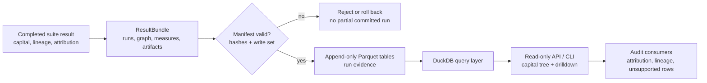

# frtb-result-store

`frtb-result-store` persists FRTB calculation evidence for analytics and
reporting. It is a storage and query package, not a capital calculation package.

See [DETAILED_DESIGN.md](DETAILED_DESIGN.md) for implementation-level storage,
schema, API, and backend details. See [STORAGE_CONTRACT.md](STORAGE_CONTRACT.md)
for manifest-gated write semantics, rollback behavior, orphan handling, and
evidence boundaries. See [ARTIFACT_METADATA.md](ARTIFACT_METADATA.md) for the
time-series, shock, scenario-vector, and surface metadata read model. See
[PUBLIC_API.md](PUBLIC_API.md) for domain objects, the DuckDB/Parquet store, the
read-only API factory, and the admin CLI. See
[BACKEND_ACCEPTANCE_CRITERIA.md](BACKEND_ACCEPTANCE_CRITERIA.md) before enabling a
non-test object-store backend. Historical issue sequencing remains in
[ISSUE_BREAKDOWN.md](ISSUE_BREAKDOWN.md); earlier target design notes remain in
[FIRST_PASS_DESIGN.md](FIRST_PASS_DESIGN.md).

For a runnable user-facing handoff, run
[`packages/frtb-result-store/examples/run_demo.py`](../../../packages/frtb-result-store/examples/run_demo.py).
It writes a synthetic suite `ResultBundle`, commits it through
`DuckDbParquetResultStore`, and reads back total capital, component breakdown,
attribution records, and lineage.

## Evidence Flow

The first implementation uses DuckDB over local Parquet files. A stored run is
append-only and contains:

- `CalculationRun` identity and lineage metadata;
- capital graph `CapitalNode` and `CapitalEdge` records;
- scalar `CapitalMeasure` rows for capital and intermediate values;
- `ArtifactRef` rows for drillthrough tables and vectors;
- `CapitalAttributionRecord` rows for Euler, residual, and unsupported
  attribution methods;
- `LineageRef` rows tying stored results to inputs, policies, and hashes.

The model is intentionally FRTB-specific: nodes carry component, desk,
portfolio, risk-class, bucket, issuer, counterparty, calculation-branch, and
regulatory-rule dimensions. Large numerical vectors are referenced by URI
rather than embedded in dashboard query rows.

The store persists completed calculation evidence only. It does not calculate
capital, decide whether a run is official for submission, or transform
component unsupported/residual attribution branches into exact decomposition.
Those semantics remain owned by the capital packages and orchestration.

Metadata artifact families for RFET timelines, PLA/backtesting vectors, shock
definitions, scenario-vector metadata, and surface-grid inspection are
documented in [ARTIFACT_METADATA.md](ARTIFACT_METADATA.md). They are run-scoped
evidence contracts, not market-data, shock-generation, or interpolation
services.
