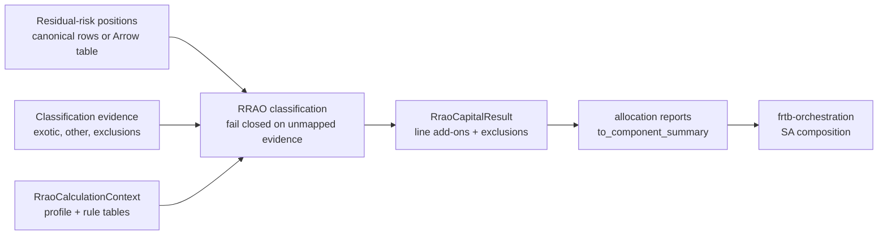

# frtb-rrao

`frtb-rrao` is the Standardised Approach residual risk add-on package.

## Package Status

- Package directory: `packages/frtb-rrao`
- Import name: `frtb_rrao`
- Implementation status: implemented for scoped v1 canonical-input mechanics
- Validation status: available for deterministic fixture, comparator,
  property, mutation, reconciliation, and performance evidence

The package is importable and exposes `calculate_rrao_capital` for supported
Basel MAR23, U.S. NPR 2.0, and EU CRR3 comparison-profile canonical inputs.
Unsupported profiles and unsupported evidence paths fail closed.

## Boundary Flow

## Integration journey

End-to-end client flow (Arrow handoff, batch capital, allocation reports,
`to_component_summary`, and SA orchestration boundaries) is documented in
[`packages/frtb-rrao/docs/PACKAGE_JOURNEY.md`](../../../packages/frtb-rrao/docs/PACKAGE_JOURNEY.md).

## Planning Documents

- [Product requirements](PRD.md)
- [Model documentation](MODEL_DOCUMENTATION.md)
- [Regulatory requirements](REGULATORY_REQUIREMENTS.md)
- [Detailed requirements](DETAILED_REQUIREMENTS.md)
- [Architecture and data design](ARCHITECTURE_AND_DATA_DESIGN.md)
- [Decisions and implementation plan](DECISIONS_AND_PLAN.md)
- [Workable issue breakdown](ISSUE_BREAKDOWN.md)
- [Workable requirements](../../../packages/frtb-rrao/docs/requirements/BASEL_FRTB_RRAO.yml)
- [Stable public API](PUBLIC_API.md)
- [IMA-style model documentation pack](model_documentation/README.md)

Package-local traceability documents live under `packages/frtb-rrao/docs`:

- [Regulatory traceability](../../../packages/frtb-rrao/docs/REGULATORY_TRACEABILITY.md)
- [Regulatory assumptions](../../../packages/frtb-rrao/docs/REGULATORY_ASSUMPTIONS.md)
- [Regulatory sources](../../../packages/frtb-rrao/docs/regulatory_sources.yml)
- [Requirement registry](../../../packages/frtb-rrao/docs/requirements/BASEL_FRTB_RRAO.yml)
- [Dataset contract](../../../packages/frtb-rrao/docs/DATASET_CONTRACT.md)
- [Performance benchmark](../../../packages/frtb-rrao/docs/PERFORMANCE.md)
- [Allocation explain views](../../../packages/frtb-rrao/docs/ALLOCATION.md)

## v1 Target

The v1 target is a U.S. NPR 2.0 proposed section `__.211`, Basel MAR23, and EU
CRR3 comparison-profile canonical-input RRAO slice. The package now calculates
cited 1.0% exotic and 0.1% other residual-risk line add-ons, preserves explicit
exclusions and EU Article 3 non-presumptive cases as zero-capital audit lines,
and fails closed for PRA or unmapped feature gaps until separately mapped and
tested.
