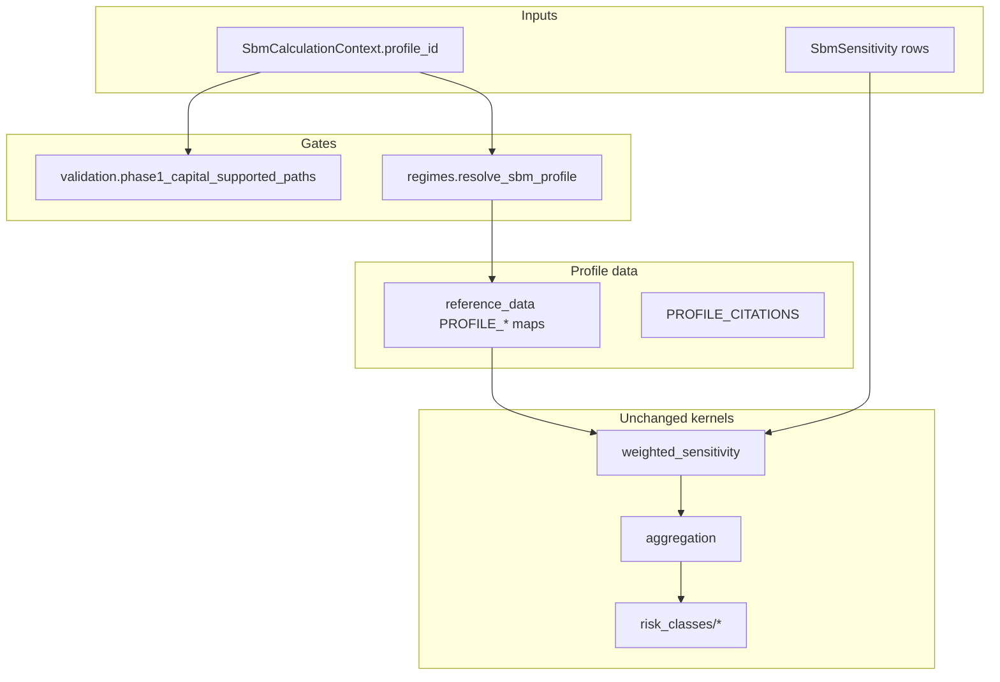

# SBM non-Basel profile expansion — design

Parent backlog: [#501](https://github.com/tomanizer/frtb-capital/issues/501)  
Source audit: [#492](https://github.com/tomanizer/frtb-capital/issues/492)  
Detailed requirements: [NON_BASEL_PROFILE_REQUIREMENTS.md](NON_BASEL_PROFILE_REQUIREMENTS.md)

## Problem statement

`frtb-sbm` implements cited **BASEL_MAR21** delta, vega, and curvature capital
for all seven SBM risk classes (21 profile/risk-class/measure cells). The
comparison profiles `US_NPR_2_0`, `EU_CRR3`, and `PRA_UK_CRR` are recognised at
the type level. Issue #504 implements the first comparison-profile cell,
`US_NPR_2_0` GIRR delta, #1031 adds `US_NPR_2_0` GIRR vega, #1030 adds
`US_NPR_2_0` GIRR curvature, and #1033 adds `US_NPR_2_0` reporting-currency
FX delta, with cited profile-owned reference data and fixture evidence. All
other non-Basel cells still fail closed before capital
calculation until cited reference data and deterministic fixtures exist.

This design records research on the current boundary, defines a normative
support matrix, and sequences implementation without changing public API
semantics or Basel fixture hashes.

## Research summary (current codebase)

### What is implemented today

| Layer | BASEL_MAR21 | Non-Basel profiles |
| --- | --- | --- |
| `SbmRegulatoryProfile` enum | `BASEL_MAR21` | `US_NPR_2_0`, `EU_CRR3`, `PRA_UK_CRR` |
| `phase1_capital_supported_paths()` | 21 cells (7×3) | `US_NPR_2_0` GIRR delta, vega, curvature, and FX delta; `PRA_UK_CRR` GIRR delta; EU empty frozenset |
| `resolve_sbm_profile()` / `get_sbm_rule_profile()` | Supported | `US_NPR_2_0` supported for GIRR delta/vega/curvature/FX delta and `PRA_UK_CRR` supported for GIRR delta; EU fails closed via `UNSUPPORTED_PROFILE_REASONS` |
| `PROFILE_*` reference-data maps in `reference_data.py` | Populated | NPR GIRR delta/vega/curvature/FX delta and PRA GIRR delta populated; other non-Basel lookup paths fail closed |
| Fixture packs under `tests/fixtures/` | 7 packs (`*_v1`) | `girr_delta_us_npr_v1`, `girr_vega_us_npr_v1`, `girr_curvature_us_npr_v1`, `fx_delta_us_npr_v1`, `girr_delta_pra_uk_crr_v1` |
| `REGULATORY_TRACEABILITY.md` | Full 7×3 matrix | `US_NPR_2_0` and `PRA_UK_CRR` partial; EU unsupported fail-closed |
| Enforcement tests | `test_sbm_support_matrix.py`, `test_sbm_unsupported_features.py` | NPR/PRA supported-cell coverage + fail-closed tests for remaining cells |

Authoritative runtime gates:

- `packages/frtb-sbm/src/frtb_sbm/validation/context.py` — `_PHASE1_SUPPORTED`
- `packages/frtb-sbm/src/frtb_sbm/regimes.py` — `UNSUPPORTED_PROFILE_REASONS`, `PROFILE_SUPPORTED_MEASURES`
- `packages/frtb-sbm/docs/REGULATORY_TRACEABILITY.md` — documentation source for tests

### Basel sub-features still unsupported (within BASEL_MAR21)

These are **not** non-Basel gaps; they are explicit fail-closed cells inside the
Basel profile and must remain documented separately so implementers do not
conflate them with profile expansion:

| Cell / feature | Status | Notes |
| --- | --- | --- |
| Equity `REPO` vega | Unsupported fail-closed | `weighted_sensitivity.py`, `test_sbm_non_girr_vega.py` |
| Equity `REPO` curvature | Unsupported fail-closed | `test_curvature.py`, CRIF rejects |
| Other unmapped qualifiers / risk factors | Unsupported fail-closed | Per risk-class validation |

### Sibling package precedent (`frtb-drc`)

`frtb-drc` already implements a **partial multi-profile** model:

- **US_NPR_2_0** — capital-producing for non-sec, sec non-CTP, CTP (proposed-rule citations, e.g. `US_NPR_210_B_1_IV`).
- **BASEL_MAR22** — partial (non-sec row/batch).
- **EU_CRR3** — fail closed until cited tables exist.
- **PRA_UK_CRR** — partial; GIRR delta is capital-producing with PRA-owned
  citations and `girr_delta_pra_uk_crr_v1`, while other PRA cells fail closed.

SBM should mirror this pattern: profile-owned reference data, deterministic
profile hash, per-cell support flags, and no silent fallback to Basel tables when
a non-Basel profile is selected.

### Regulatory source mapping (link-only in repo)

| Profile | Primary source | Section hints already in `regulatory_sources.yml` |
| --- | --- | --- |
| `US_NPR_2_0` | [91 FR 14952](https://www.govinfo.gov/app/details/FR-2026-03-27/2026-05959) | Section V.A.7.a; pages ~91 FR 15037 (six-step SBM process) |
| `EU_CRR3` | [Regulation (EU) 2024/1623](https://eur-lex.europa.eu/eli/reg/2024/1623/oj/eng) | Articles 325e–325az (market-risk / SA) |
| `PRA_UK_CRR` | [PRA PS1/26 Appendix 1](https://www.bankofengland.co.uk/-/media/boe/files/prudential-regulation/policy-statement/2026/january/ps126app1.pdf), Market Risk: Advanced Standardised Approach (CRR) Part | Articles 325c-325ay are source-mapped. GIRR delta uses Articles 325c, 325h, and 325ae-325ag; remaining runtime cells still fail closed until exact-cell citations, reference data, and fixtures land. |

U.S. NPR 2.0 material is **proposed-rule comparison only**; outputs must not be
described as final regulatory capital.

## Normative support matrix

Status labels match `REGULATORY_TRACEABILITY.md`:

| Status | Meaning |
| --- | --- |
| **Implemented under audit** | Cited runtime path + synthetic fixture; `ValidationStatus.PENDING` |
| **Unsupported fail-closed** | Explicit `UnsupportedRegulatoryFeatureError` or `SbmInputError` |
| **Planned** | Issue-backed; source mapped; no capital yet |
| **Blocked** | Cannot implement until prerequisite source or policy mapping is agreed |
| **Out of scope** | Belongs outside `frtb-sbm` (e.g. SA composition in orchestration) |

### Profile × risk-class × measure (21 cells per profile)

| Profile | Cells | Runtime today |
| --- | ---: | --- |
| `BASEL_MAR21` | 21 / 21 | 21 implemented under audit |
| `US_NPR_2_0` | 4 / 21 | GIRR delta, vega, curvature, and FX delta implemented under audit; 17 unsupported fail-closed |
| `EU_CRR3` | 0 / 21 | 21 unsupported fail-closed |
| `PRA_UK_CRR` | 1 / 21 | GIRR delta implemented under audit; 20 unsupported fail-closed |

Per-class detail for non-Basel profiles (all measures share the same status until a cell lands):

| Risk class | `US_NPR_2_0` | `EU_CRR3` | `PRA_UK_CRR` |
| --- | --- | --- | --- |
| GIRR | Delta, vega, and curvature implemented under audit | Planned | Delta implemented under audit; vega/curvature unsupported fail-closed |
| FX | Delta implemented under audit; vega/curvature unsupported fail-closed | Planned | Planned after PS1/26 source map; runtime fail-closed |
| Equity | Planned | Planned | Planned after PS1/26 source map; runtime fail-closed |
| Commodity | Planned | Planned | Planned after PS1/26 source map; runtime fail-closed |
| CSR non-sec | Planned | Planned | Planned after PS1/26 source map; runtime fail-closed |
| CSR sec non-CTP | Planned | Planned | Planned after PS1/26 source map; runtime fail-closed |
| CSR sec CTP | Planned | Planned | Planned after PS1/26 source map; runtime fail-closed |

### U.S. NPR FX currency-basis policy

The first `US_NPR_2_0` FX implementation slice supports **reporting-currency
FX risk factors only**. Federal Register 91 FR 15020 section V.A.7.a is the
source anchor for the reporting-currency and base-currency policy citations in
`reference_citations_us_npr.py`.

Base-currency FX treatment remains unsupported fail-closed until a later issue
models all of the following evidence explicitly:

- prior supervisory approval identifier(s);
- the single approved base currency;
- translation-risk treatment for the base-currency calculation;
- profile-owned FX bucket, risk-weight, correlation, and scenario citations;
- deterministic fixtures proving the approved base-currency path.

The run-control fields are `SbmRunControls.fx_risk_factor_basis` and
`SbmRunControls.fx_base_currency_approval_ids`. The only accepted basis today is
`REPORTING_CURRENCY`; `BASE_CURRENCY_APPROVED` raises
`UnsupportedRegulatoryFeatureError` even when approval ids are supplied. This
prevents future FX delta work from silently treating `base_currency` metadata as
supervisory approval evidence.

### First implementation cell

**`US_NPR_2_0` × GIRR × DELTA**

| Criterion | Rationale |
| --- | --- |
| Reuse | Same aggregation engine as `girr_delta_v1`; only reference-data and citation ids change |
| Suite alignment | DRC already uses U.S. NPR citation naming; SBM can adopt `US_NPR_V_A_7_a_*` (or harmonised `US_NPR_SBM_*`) ids |
| Risk | Lowest-dimensional slice (delta only); vega/curvature add liquidity-horizon and shock contracts later |
| Audit | New fixture pack `girr_delta_us_npr_v1` without touching `girr_delta_v1` hashes |

**`US_NPR_2_0` × GIRR × VEGA**

| Criterion | Rationale |
| --- | --- |
| Reuse | Same GIRR vega row, batch, and Arrow engines as `girr_vega_v1`; only profile-owned reference data and citation ids change |
| Suite alignment | Keeps the U.S. NPR profile expansion within GIRR before opening FX or non-GIRR classes |
| Risk | Opens only one additional cell; GIRR curvature and all non-GIRR NPR cells remain fail-closed |
| Audit | New fixture pack `girr_vega_us_npr_v1` proves deterministic capital and no Basel citation ids in the NPR result path |

**Explicit non-goals for the first slice:** Do not implement EU/PRA cells in the
same PR; do not map NPR inputs to Basel buckets/weights; do not change
`BASEL_MAR21` expected outputs.

## Architecture design

### Design principles

1. **Profile-owned parameters** — All weights, buckets, tenors, correlations,
   and scenario multipliers are keyed by `SbmRegulatoryProfile`; kernels stay
   profile-agnostic (existing `SBM-DEC-003`).
2. **Fail closed** — Missing profile data or unmapped NPR/CRR articles raise
   `UnsupportedRegulatoryFeatureError`; never default to Basel MAR21.
3. **Citation granularity** — U.S. cells cite Federal Register section/page or
   proposed paragraph ids; EU cells cite CRR3 articles; no framework-only labels.
4. **Deterministic evidence** — Each newly supported cell gets a versioned
   fixture pack with SHA256 manifest hashes (existing fixture workflow).
5. **Stable public API** — `calculate_sbm_capital`, context shape, and result
   types unchanged; profile selection remains `SbmCalculationContext.profile_id`.
6. **Package boundary** — No sibling imports; no orchestration of SA totals.

### Module changes (by delivery phase)

| Module | Change |
| --- | --- |
| `reference_data.py` | Add `US_NPR_*` bucket/weight/correlation tables; extend `PROFILE_*` dicts |
| `regimes.py` | Move `US_NPR_2_0` from `UNSUPPORTED_PROFILE_REASONS` to `SUPPORTED_PROFILE_METADATA` when first cell ships; extend `PROFILE_SUPPORTED_MEASURES` incrementally |
| `validation/context.py` | Extend `_PHASE1_SUPPORTED[US_NPR_2_0]` one cell at a time |
| `regulatory_sources.yml` | Add NPR table-level `section_hint` entries per implemented cell |
| `REGULATORY_TRACEABILITY.md` | Expand non-Basel section from single profile row to 7×3 matrix |
| `tests/fixtures/girr_delta_us_npr_v1/` | New fixture pack; leave `girr_delta_v1` untouched |
| `tests/test_sbm_support_matrix.py` | Assert doc/code parity for each newly supported cell |

### Citation id convention (proposed)

Align with DRC’s `US_NPR_210_*` style but keep SBM-specific namespaces to avoid
collisions:

| Pattern | Example | Use |
| --- | --- | --- |
| `US_NPR_SBM_<section>_<table>` | `US_NPR_SBM_V_A_7_a_GIRR_RW` | U.S. SBM risk weights |
| `basel_mar21_*` | (existing) | Basel only |
| `EU_CRR3_ART_325*` | `EU_CRR3_ART_325r` | EU bucket/weight articles |
| `PRA_UK_CRR_*` | `PRA_UK_CRR_ART_325*_...` | Use PS1/26 Appendix 1 / PRA2026/1 article ids; only GIRR delta is open today, and later cells remain fail-closed until exact-cell citations and fixtures land |

### Data flow for first slice

1. Caller sets `profile_id=US_NPR_2_0`, `risk_class=GIRR`, `risk_measure=DELTA`.
2. `ensure_sbm_capital_paths_supported` allows only registered cells.
3. `resolve_sbm_profile` returns metadata + hash including NPR reference payload.
4. GIRR delta weighting reads `PROFILE_GIRR_DELTA_RISK_WEIGHTS[US_NPR_2_0]`.
5. Aggregation uses `PROFILE_CORRELATION_SCENARIOS[US_NPR_2_0]` (if NPR scenarios differ; otherwise cite identity to Basel and document delta).
6. Result carries NPR citation ids in `SbmCapitalResult.citations`.

If NPR GIRR delta tables are **numerically identical** to Basel MAR21 for the
synthetic fixture, capital may match Basel **only when inputs and citations are
NPR-labelled** — never by reusing Basel profile id or silent alias.

## Phased delivery plan

| Phase | Scope | Maturity impact |
| --- | --- | --- |
| **0 (this issue)** | Design + requirements + matrix in docs; tests reference matrix | Documentation only |
| **1** | `US_NPR_2_0` GIRR delta, GIRR vega, GIRR curvature, and FX delta: reference data, fixtures, fail-closed tests for other NPR cells | First non-Basel cells; still `partial_runtime` unless governance promotes |
| **2** | NPR FX policy, then FX delta | FX policy selects reporting-currency-only runtime and fail-closed base-currency treatment before any FX delta gate opens |
| **3** | NPR FX / equity / commodity / CSR (delta → vega → curvature per class) | Comparison-profile coverage |
| **4** | `EU_CRR3` — start with GIRR delta after article mapping | EU comparison |
| **5** | `PRA_UK_CRR` — source mapped to PS1/26 Appendix 1; implement one cell at a time after exact-cell citations and fixtures | UK comparison |

Each phase is **one package PR** unless an ADR documents a cross-cutting
regulatory definition change.

## ADR and governance triggers

| Trigger | Action |
| --- | --- |
| NPR GIRR weights differ from Basel | ADR + changelog fragment; bump not in feature PR |
| Shared citation type moves to `frtb-common` | ADR (cross-package) |
| Material numerical change to existing Basel fixture | ADR + explicit hash update in PR |
| PRA UK diverges from EU CRR3 | Separate profile; do not alias |

PRA mirroring policy: numerical identity with Basel MAR21 or EU CRR3 is not
implementation evidence. Each PRA cell requires exact PRA2026/1 article
citations, `PRA_UK_CRR` output identity, a PRA profile hash, and deterministic
`*_pra_uk_crr_v1` fixture evidence. PRA effective-date metadata should use
2027-01-01 for PS1/26 / PRA2026/1-derived runtime slices.

## Test strategy

| Test type | Purpose |
| --- | --- |
| `test_sbm_support_matrix.py` | Doc ↔ `phase1_capital_supported_paths()` parity |
| `test_sbm_regimes.py` | Profile hash stability when NPR tables added |
| `test_sbm_reference_data.py` | NPR lookup keys and citation ids |
| Fixture workflow | `girr_delta_us_npr_v1`, `girr_vega_us_npr_v1`, `girr_curvature_us_npr_v1`, and `fx_delta_us_npr_v1` manifest hashes |
| Fail-closed | All non-GIRR NPR cells still raise |
| Batch/Arrow parity | Row vs batch vs Arrow for the new cell only |
| Regression | `girr_delta_v1` SHA256 unchanged |

## Documentation deliverables (phase 0)

- [NON_BASEL_PROFILE_REQUIREMENTS.md](NON_BASEL_PROFILE_REQUIREMENTS.md) — normative `SBM-NBP-*` requirements
- Update [README.md](README.md) planning links
- Implementation PRs must update `packages/frtb-sbm/docs/REGULATORY_TRACEABILITY.md` non-Basel section to 7×3 detail

## Open questions / follow-up issues

1. **PRA UK CRR** — Implement the first source-mapped PRA cell only after
   exact-cell citations, profile-owned reference data, and fixture evidence are
   added; record PRA-vs-EU divergence in that PR.
2. **NPR table transcription** — Confirm GIRR bucket/weight tables at 91 FR ~15037–15050 against legal review; synthetic fixtures until external vectors exist.
3. **CRIF profile column** — Whether NPR runs require adapter profile hints in CRIF metadata (adapter-only; not kernel).
4. **Equity repo under NPR** — Whether U.S. proposal treats repo delta/vega/curvature like Basel; until cited, remain fail-closed under NPR.

## Acceptance mapping (AUDIT-IMP-003)

| Criterion | Phase 0 (design) | Phase 1+ (implementation) |
| --- | --- | --- |
| Support matrix in docs | This doc + requirements + traceability cross-link | Per-cell updates |
| ≥1 non-Basel cell implemented or blocked | First cells implemented with `girr_delta_us_npr_v1`, `girr_vega_us_npr_v1`, `girr_curvature_us_npr_v1`, and `fx_delta_us_npr_v1` fixture evidence | Continue with remaining NPR cells or blocked issue |
| Unsupported cells fail closed | Documented | Tested (existing + extended) |
| Basel hashes unchanged | N/A (docs only) | Enforced in CI |
| `make quality-control` + SBM tests | Docs-only PR: QC unchanged | Required on implementation PR |
