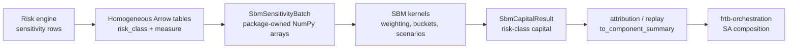

# frtb-sbm

`frtb-sbm` is the Standardised Approach sensitivities-based method package.

## Package Status

- Package directory: `packages/frtb-sbm`
- Import name: `frtb_sbm`
- Implementation status: partial runtime — BASEL_MAR21 delta, vega, and
  curvature paths implemented under audit across all seven SBM risk classes,
  plus `US_NPR_2_0` GIRR delta, GIRR vega, GIRR curvature, FX delta, vega,
  curvature, equity delta, and commodity delta and
  `PRA_UK_CRR` GIRR delta comparison slices
- Validation status: deterministic fixture, audit, replay, and public API tests available

The package is importable and exposes `calculate_sbm_capital` for supported
Basel MAR21 delta, vega, and curvature canonical inputs and for the cited
`US_NPR_2_0` GIRR delta, GIRR vega, GIRR curvature, FX delta,
FX vega and FX curvature, equity delta, and commodity delta, and
`PRA_UK_CRR` GIRR delta comparison slices. Row-wise, package-owned batch, and Arrow batch
paths are available for the supported matrix. All other U.S. NPR 2.0 cells, all
EU CRR3 cells, all PRA UK CRR cells outside GIRR delta, and unmapped
sub-features fail closed. PRA UK CRR GIRR delta uses PS1/26 Appendix 1 /
PRA2026/1 Articles 325c, 325h, and 325ae-325ag with 2027-01-01 effective-date
metadata.

## Boundary Flow

## Integration journey

End-to-end client flow (Arrow handoff, portfolio batch capital, attribution,
`to_component_summary`, and SA orchestration boundaries) is documented in
[`packages/frtb-sbm/docs/PACKAGE_JOURNEY.md`](../../../packages/frtb-sbm/docs/PACKAGE_JOURNEY.md).

## Package-Local Documentation

- [Regulatory traceability](../../../packages/frtb-sbm/docs/REGULATORY_TRACEABILITY.md)
- [ADR 0048: SBM comparison-profile runtime maturity](../../decisions/0048-sbm-comparison-profile-runtime-maturity.md)
- [Regulatory assumptions](../../../packages/frtb-sbm/docs/REGULATORY_ASSUMPTIONS.md)
- [Regulatory sources manifest](../../../packages/frtb-sbm/docs/regulatory_sources.yml)
- [Requirement registry](../../../packages/frtb-sbm/docs/requirements/BASEL_FRTB_SBM.yml)
- [Dataset contract](../../../packages/frtb-sbm/docs/DATASET_CONTRACT.md)
- [Package README](../../../packages/frtb-sbm/README.md)

## Planning Documents

- [Product requirements](PRD.md)
- [Regulatory requirements](REGULATORY_REQUIREMENTS.md)
- [Detailed requirements](DETAILED_REQUIREMENTS.md)
- [Non-Basel profile design](NON_BASEL_PROFILE_DESIGN.md) — AUDIT-IMP-003 / #501
- [Non-Basel profile requirements](NON_BASEL_PROFILE_REQUIREMENTS.md) — `SBM-NBP-*`
- [U.S. NPR CSR mapping](US_NPR_CSR_MAPPING.md) — #1034 source map before any CSR runtime gate opens
- [Architecture and data design](ARCHITECTURE_AND_DATA_DESIGN.md)
- [Decisions and plan](DECISIONS_AND_PLAN.md)
- [Issue breakdown](ISSUE_BREAKDOWN.md)
- [Workable requirements](../../../packages/frtb-sbm/docs/requirements/BASEL_FRTB_SBM.yml)

## Phase-1 Issue Tracker

Parent: [#151](https://github.com/tomanizer/frtb-capital/issues/151)

1. #152 — model documentation and traceability skeleton
2. #153 — canonical data models and validation gates
3. #154 — cited rule profile and GIRR delta reference data
4. #155 — GIRR delta weighted sensitivities
5. #156 — shared intra-bucket aggregation
6. #157 — inter-bucket aggregation and scenario selection
7. #158 — public GIRR delta capital API
8. #159 — audit/replay records and synthetic GIRR fixtures

Follow-on issues #160, #161, #166, #169, #226, #244, and the later
vectorisation sprint are reconciled in the support matrix and closed-issue audit
inside
[`packages/frtb-sbm/docs/REGULATORY_TRACEABILITY.md`](../../../packages/frtb-sbm/docs/REGULATORY_TRACEABILITY.md).
