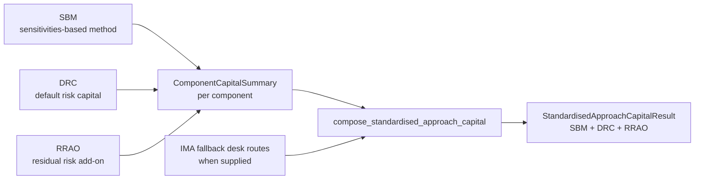

# Standardised Approach Composition

The Standardised Approach is a regulatory composition, not a standalone
workspace package.

Basel MAR20.4 defines market-risk Standardised Approach capital as the sum of:

- sensitivities-based method capital;
- default risk capital; and
- residual risk add-on.

The suite therefore represents SA through three component packages:

| SA component | Package | Documentation |
| --- | --- | --- |
| Sensitivities-based method | `frtb-sbm` | [frtb-sbm](frtb-sbm/REGULATORY_REQUIREMENTS.md) |
| Default risk charge | `frtb-drc` | [frtb-drc](frtb-drc/REGULATORY_REQUIREMENTS.md) |
| Residual risk add-on | `frtb-rrao` | [frtb-rrao](frtb-rrao/REGULATORY_REQUIREMENTS.md) |

`frtb-orchestration` owns the composed SA total:

```text
SA capital = SBM capital + DRC capital + RRAO capital
```



Current orchestration validates supplied SBM, DRC, and RRAO
`frtb_common.ComponentCapitalSummary` records for component slot,
jurisdiction-family, calculation-date, and base-currency consistency, then
returns the composed additive SA result with component subtotals, citations,
warnings, and any IMA fallback desk routes.

The same component stack is also the fallback route when a desk is not
IMA-eligible. The component packages own their own calculations and audit
records; orchestration owns routing, aggregation, and cross-component
reconciliation. When fallback routes are supplied, every component summary must
carry matching `CalculationScope` evidence. A single desk fallback may use a
`DESK` scope. Multi-desk or aggregate fallback evidence must use a broader
scope with `metadata["fallback_desk_ids"]` listing the routed desk IDs.

## Implementation Boundaries

There is no `frtb-sa` package. Shared SA concepts belong in one of three
places:

- `frtb-common`: package-neutral status metadata, explicit unsupported-feature
  errors, Arrow/CRIF handoff mechanics, JSON serialization helpers, regulatory
  citation test helpers, and the `ComponentCapitalSummary` /
  `StandardisedComponent` contract used by SA component projection adapters.
- Component packages: `frtb-sbm`, `frtb-drc`, and `frtb-rrao` own their
  canonical inputs, calculation kernels, fixtures, and component audit records.
- `frtb-orchestration`: composed SA total, IMA fallback routing, run manifests,
  reporting adapters, and cross-component reconciliation.

Fallback is explicit. If `frtb-ima` emits a non-eligible desk signal,
orchestration routes that desk to the SA component stack. If a component cannot
calculate an input or regulatory feature, it raises an explicit unsupported
feature error or returns a typed fallback-required status; it must not emit zero
capital or an empty successful result silently.

Current delivery should keep the component boundaries visible:

1. Keep `frtb-common` neutral and extract only cross-component mechanics that
   have an ADR-backed contract.
2. Keep SBM, DRC, and RRAO canonical inputs, kernels, fixtures, and audit
   records inside their owning packages.
3. Project each SA component result to `frtb_common.ComponentCapitalSummary`
   through package-owned `to_component_summary` adapters.
4. Let `frtb-orchestration` consume only those neutral handoffs when composing
   SA capital and routing IMA fallback.
5. Treat IMA fallback desk routing as fail-closed unless the SBM, DRC, and RRAO
   summaries preserve identical scope evidence covering the fallback desks.

Rule-profile semantics, sign conventions, audit-record schemas, calendars, and
regulatory parameters remain in the owning package until a separate
cross-cutting ADR moves a package-neutral contract into `frtb-common`.

This taxonomy is recorded in
[ADR 0010](../decisions/0010-standardised-approach-component-taxonomy.md).
