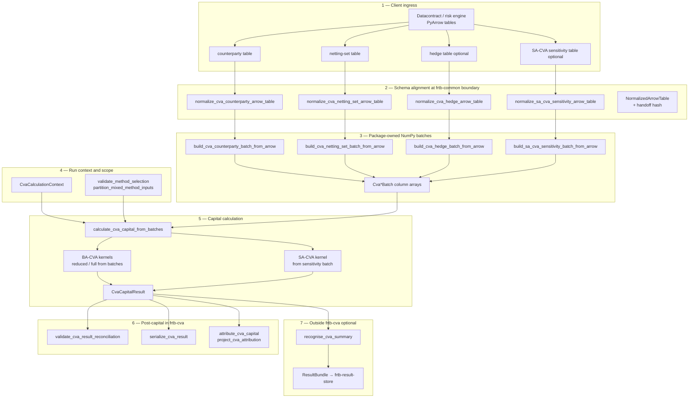
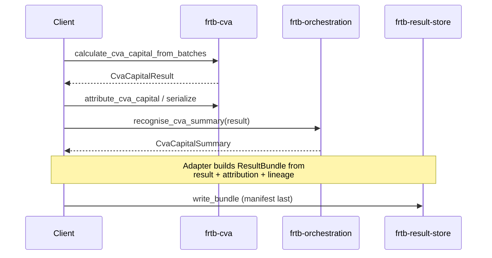
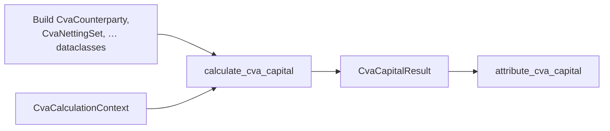

# frtb-cva integration journey

This document describes how a **CVA capital run** works in `frtb-cva` as implemented
today. Use it as the reference layout for examples, notebooks, and client integration guides.

Outputs are **engineering and validation evidence**, not final regulatory capital.
See [`REGULATORY_TRACEABILITY.md`](REGULATORY_TRACEABILITY.md) for citations and
scope boundaries.

Related references:

- Stable API surface: [`docs/modules/frtb-cva/PUBLIC_API.md`](../../../docs/modules/frtb-cva/PUBLIC_API.md)
- Arrow/batch design: [`docs/performance/frtb-cva-arrow-batch-triage.md`](../../../docs/performance/frtb-cva-arrow-batch-triage.md)
- Attribution policy: [ADR 0012](../../../docs/decisions/0012-capital-impact-attribution.md)
- Arrow handoff boundary: [ADR 0023](../../../docs/decisions/0023-arrow-tabular-handoff-boundary.md)

---

## What counts as one “CVA run”

A **CVA run** is a single method-selected calculation keyed by
`CvaCalculationContext`, producing a frozen **`CvaCapitalResult`**.

Optional steps on the same result (same package):

- reconciliation and serialization (`audit`)
- analytical attribution (`attribution`)
- impact assessment (`impact`)

Steps **outside** `frtb-cva` (integration layer):

- suite summary projection (`frtb-orchestration.recognise_cva_summary`)
- durable evidence persistence (`frtb-result-store` adapters)

The package does **not** import orchestration or the result store. Callers wire
those steps after capital is computed.

---

## Integration tiers

| Tier | Typical client input | Entry path | Best for |
| --- | --- | --- | --- |
| **1 — Arrow / Parquet** | PyArrow tables aligned to column specs | `normalize_*` → `build_*_batch_from_arrow` → `calculate_cva_capital_from_batches` | Production volume, datacontract-driven pipelines |
| **2 — CRIF / vendor rows** | Iterable mapping records | `adapt_cva_records` → row or batch path | Legacy CRIF-shaped feeds |
| **3 — Canonical rows** | `CvaCounterparty`, `CvaNettingSet`, … dataclasses | `calculate_cva_capital` | Tests, small books, notebooks |

Tier 1 is the recommended production journey below. Tiers 2 and 3 share the same
capital semantics once inputs are validated.

---

## Method selects the engines (not “BA then SA always”)

`context.method` (after scope validation) decides which kernels run in one call.
You do **not** always execute BA-CVA and then SA-CVA.

| `CvaMethod` | Required tables / inputs | Engines invoked |
| --- | --- | --- |
| `BA_CVA_REDUCED` | Counterparties + netting sets | Reduced BA-CVA portfolio |
| `BA_CVA_FULL` | Counterparties + netting sets + hedges | Full BA-CVA (hedge recognition + reduced core) |
| `SA_CVA` | SA-CVA sensitivities (+ hedges when tag is `HDG`) | SA-CVA risk-class capital only |
| `MIXED_CARVE_OUT` | Sensitivities + BA carve-out netting sets + SA slice evidence | SA-CVA on evidenced non-carved slice **plus** reduced BA-CVA on carved-out netting sets |

Unsupported methods, unmapped future profiles, MAR50.9 materiality-threshold
election, and analogous CCR-substitution alternatives fail closed with
`CvaInputError` or `UnsupportedRegulatoryFeatureError`. The delivered
`US_NPR20_VB`, `EU_CRR3_CVA`, and `UK_PRA_CVA` comparison profiles are
capital-producing under audit with profile-owned citations and hashes.

---

## End-to-end journey (Tier 1 — Arrow)



### Step 1 — Client ingress

The risk engine (or datacontract export) supplies **one or more Arrow tables**.
Column names may differ from the package spec when aliases are declared in
`CVA_*_ARROW_COLUMN_SPECS` (for example `counterpartyId` → `counterparty_id`).

Required tables depend on method — see
[PUBLIC_API.md — Client integration](../../../docs/modules/frtb-cva/PUBLIC_API.md#client-integration).

### Step 2 — Normalize

Each table passes through a `normalize_cva_*_arrow_table` helper. This uses
`frtb_common.normalize_arrow_table` with package `ColumnSpec` definitions:

- coerce logical types (string, numeric, date, …)
- enforce null policies
- collect adapter diagnostics

Output is a **`NormalizedArrowTable`**, still on the Arrow handoff boundary (ADR
0023). Kernels do not import PyArrow.

### Step 3 — Build batches

`build_*_batch_from_arrow` reads normalized columns into **immutable NumPy batch
objects** (`CvaCounterpartyBatch`, `CvaNettingSetBatch`, `CvaHedgeBatch`,
`SaCvaSensitivityBatch`).

The production path **does not** materialize per-row `CvaCounterparty` /
`CvaNettingSet` dataclasses during calculation. Audit outputs remain structured
dataclasses (`CvaCapitalResult`, stand-alone lines, hedge recognition lines, …).

### Step 4 — Run context and scope

`CvaCalculationContext` carries run identity and controls, for example:

- `run_id`, `calculation_date`, `base_currency`
- `profile` (`CvaRegulatoryProfile`, resolved via `get_cva_rule_profile`)
- `method`, `sa_cva_approved`, `carve_out_netting_set_ids`, and
  `sa_cva_sensitivity_scope_evidence_id` (mixed carve-out)

Scope helpers fail closed when method and supplied tables disagree (for example
SA-CVA must not receive counterparty or netting-set batches).

### Step 5 — Calculate capital

**Single entry (batch):** `calculate_cva_capital_from_batches`

**Single entry (row):** `calculate_cva_capital`

Both paths:

1. validate context, inputs, and profile
2. run only the BA and/or SA branches required by method
3. assemble `CvaCapitalResult` (totals, component breakdowns, citations, warnings,
   `input_hash`, `profile_hash`)
4. call `validate_cva_result_reconciliation` before returning

For `MIXED_CARVE_OUT`, SA-CVA runs on an evidenced sensitivity batch for the
non-carved slice; reduced BA-CVA runs on the partitioned carve-out
counterparty/netting-set subset; totals sum both components
(`method_components` records each part). Mixed runs fail closed when SA-CVA
sensitivities are supplied without `sa_cva_sensitivity_scope_evidence_id`.

### Step 6 — Post-capital (same package)

| Step | Symbol | Role |
| --- | --- | --- |
| Reconciliation | `validate_cva_result_reconciliation` | Internal consistency checks on the result object |
| Replay / evidence | `serialize_cva_result`, `input_hash` | Deterministic serialization and input fingerprinting |
| Attribution | `attribute_cva_capital` → `project_cva_attribution` | Standalone explain rows plus unsupported/residual shared projection |
| Impact | `assess_cva_capital_impact` | Scenario-style impact where supported |

**Attribution is not a backward pass through the calculator.** Capital is fixed
first; attribution decomposes **already computed** standalone lines and bucket
allocations. Portfolio-level square-root branches (reduced BA portfolio,
hedged full BA, SA risk-class sqrt) and beta floor behavior are listed in
`unsupported_branches` when they cannot be allocated exactly. Shared projection
emits `UNSUPPORTED` markers and a `RESIDUAL` row so the projected records still
reconcile to total CVA capital. See ADR 0012.

### Step 7 — Suite and storage (callers)



`frtb-orchestration` consumes a public `CvaCapitalResult` via duck-typed
`recognise_cva_summary` for top-of-house aggregation. It does **not** write
storage artifacts.

`frtb-result-store` persists **calculation evidence** after engines finish
(manifest-gated, append-only). Capital packages must not import the store; an
integration adapter maps `CvaCapitalResult`, contributions, hashes, and lineage
into `ResultBundle` rows and artifacts.

---

## Tier 3 journey (notebook / small book)



Same semantics as the batch path; useful for unit tests and teaching examples in
`packages/frtb-cva/tests/`.

---

## Minimal code sketch (batch path)

Illustrative only — see tests and `PUBLIC_API.md` for complete fixtures.

```python
from datetime import date

from frtb_cva import (
    CvaCalculationContext,
    CvaMethod,
    CvaRegulatoryProfile,
    attribute_cva_capital,
    build_cva_counterparty_batch_from_arrow,
    build_cva_netting_set_batch_from_arrow,
    calculate_cva_capital_from_batches,
    normalize_cva_counterparty_arrow_table,
    normalize_cva_netting_set_arrow_table,
)

context = CvaCalculationContext(
    run_id="demo-run-001",
    calculation_date=date(2026, 6, 1),
    base_currency="USD",
    profile=CvaRegulatoryProfile.BASEL_MAR50_2020,
    method=CvaMethod.BA_CVA_REDUCED,
)

cp_handoff = normalize_cva_counterparty_arrow_table(counterparty_table)
ns_handoff = normalize_cva_netting_set_arrow_table(netting_set_table)

calc = calculate_cva_capital_from_batches(
    context,
    build_cva_counterparty_batch_from_arrow(cp_handoff),
    build_cva_netting_set_batch_from_arrow(ns_handoff),
)
result = calc.result

attribution = attribute_cva_capital(result)
# project_cva_attribution(attribution, result) → suite CapitalContribution rows
```

---

## Notebook / example chapter outline

Use this outline when authoring `examples/` or package notebooks:

1. **Run identity** — `run_id`, date, profile, method, carve-out ids.
2. **Load tables** — synthetic Parquet or datacontract-aligned Arrow.
3. **Normalize and batch** — show diagnostics and handoff hashes.
4. **Calculate** — inspect `method_components`, BA lines, SA risk-class totals.
5. **Reconcile** — `validate_cva_result_reconciliation`.
6. **Attribute** — contributions, `unsupported_branches`, residual.
7. **Suite hook (optional)** — `recognise_cva_summary` + `calculate_suite_capital`.
8. **Persist (optional)** — sketch `ResultBundle` mapping; link to result-store tests.

Keep **persistence** and **full desk orchestration** in separate chapters so
package boundaries stay clear.

---

## Boundaries to preserve in examples

- Do not imply BA-CVA and SA-CVA always run sequentially; show one method per run
  unless demonstrating `MIXED_CARVE_OUT`.
- Do not describe attribution as reverse-mode AD through BA/SA formulas; it is
  post-hoc analytical decomposition with documented non-linear gaps.
- Do not import `frtb-result-store` from package examples without an explicit
  adapter layer in the integration notebook.
- Do not label engineering evidence as final regulatory capital.

---

## See also

| Document | Purpose |
| --- | --- |
| [`PUBLIC_API.md`](../../../docs/modules/frtb-cva/PUBLIC_API.md) | Symbol-level client contract |
| [`REGULATORY_TRACEABILITY.md`](REGULATORY_TRACEABILITY.md) | MAR50 paragraph mapping |
| [`docs/modules/frtb-orchestration/README.md`](../../../docs/modules/frtb-orchestration/README.md) | CVA handoff into suite capital |
| [`docs/modules/frtb-result-store/STORAGE_CONTRACT.md`](../../../docs/modules/frtb-result-store/STORAGE_CONTRACT.md) | Persisting run evidence |
