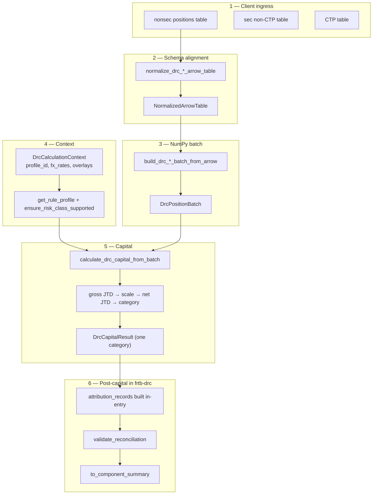
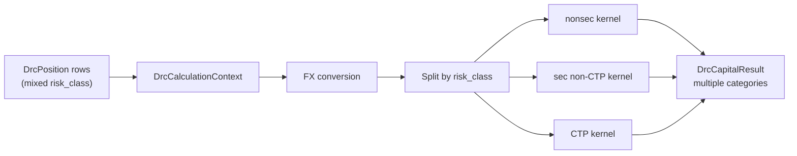
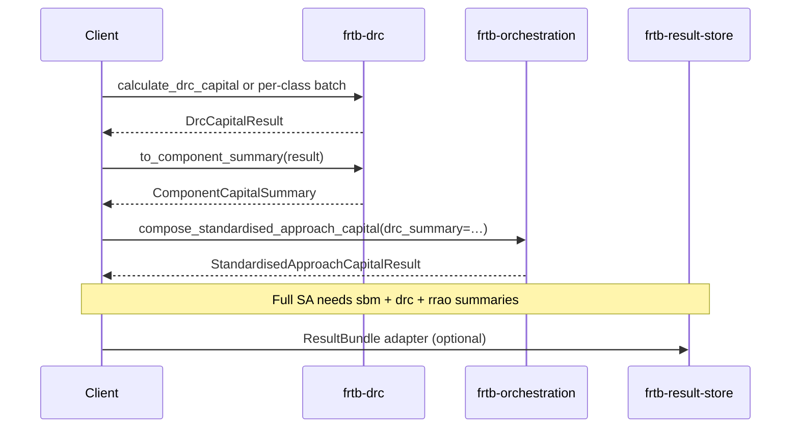

# frtb-drc integration journey

This document describes how a **DRC capital run** works in `frtb-drc` as implemented
today. It is grounded in the runtime entrypoints in `scaffold.py`, `batch.py`,
`regimes.py`, and `attribution.py`, not planning-only module text.

Outputs are **engineering and validation evidence**, not final regulatory capital.
Profile and risk-class support are enforced in code via `ensure_risk_class_supported`
and `drc_profile_support_matrix()`; see
[`docs/modules/frtb-drc/PROFILE_SUPPORT_MATRIX.md`](../../../docs/modules/frtb-drc/PROFILE_SUPPORT_MATRIX.md).

Related references:

- Stable API surface: [`docs/modules/frtb-drc/PUBLIC_API.md`](../../../docs/modules/frtb-drc/PUBLIC_API.md)
- Arrow/batch performance: [`docs/performance/frtb-drc-arrow-batch-triage.md`](../../../docs/performance/frtb-drc-arrow-batch-triage.md)
- Run-scoped overlays: [`docs/CLIENT_REFERENCE_DATA.md`](../../../docs/CLIENT_REFERENCE_DATA.md)
- Attribution policy: [ADR 0012](../../../docs/decisions/0012-capital-impact-attribution.md), [ADR 0031](../../../docs/decisions/0031-drc-attribution-method-contract.md)
- Arrow handoff boundary: [ADR 0023](../../../docs/decisions/0023-arrow-tabular-handoff-boundary.md)
- SA composition vocabulary: [ADR 0033](../../../docs/decisions/0033-arrow-batch-and-component-summary-vocabulary.md)

---

## What counts as one “DRC run”

A **DRC run** is keyed by `DrcCalculationContext` and produces a frozen
**`DrcCapitalResult`** with one or more **`CategoryDrc`** records (non-securitisation,
securitisation non-CTP, correlation trading portfolio) and `total_drc` equal to the
sum of category capital.

| Entry | Multi-class in one call | Typical result shape |
| --- | --- | --- |
| **`calculate_drc_capital`** (row) | **Yes** — positions may mix `risk_class` values; the public API splits by class, runs each supported kernel, and sums categories | Full audit expansion: `input_positions`, `gross_jtds`, `maturity_scaled_jtds`, `net_jtds`, overlay evidence, **`attribution_records`** |
| **`calculate_drc_capital_from_batch`** (Arrow) | **No** — each batch must be **homogeneous** (`_batch_risk_class` fails closed on mixed classes) | One category per call; fast path keeps `accepted_row_dataclasses_materialized` at zero; **`gross_jtds` / `maturity_scaled_jtds` / `input_positions` are empty** on the result; `net_jtds` and attribution still populated |

There is **no** package-level portfolio dispatcher that accepts three class-specific
Arrow tables in one function (unlike `frtb-sbm` portfolio helpers). Production
books with all three DRC classes either use the **row API** in one call or run
**three batch pipelines** and merge totals (and evidence) in the integration layer
before `to_component_summary`.

Optional steps on the same result (same package):

- reconciliation (`validate_reconciliation`) — always called before return
- attribution (`calculate_drc_attribution`) — **already invoked** inside both capital
  entrypoints; the standalone symbol is for tests or custom replay with supplied
  risk-weight maps
- SA handoff (`to_component_summary`)

Steps **outside** `frtb-drc`:

- composed Standardised Approach capital (`frtb-orchestration.compose_standardised_approach_capital`)
- top-of-house suite aggregation (`calculate_suite_capital`)
- durable evidence persistence (`frtb-result-store` adapters)

The package does **not** import orchestration, SBM, RRAO, or the result store.

---

## Integration tiers

| Tier | Typical client input | Entry path | Best for |
| --- | --- | --- | --- |
| **1 — Arrow / Parquet** | One **class-specific** table per DRC risk class | `normalize_drc_*_arrow_table` → `build_drc_*_batch_from_arrow` → `calculate_drc_capital_from_batch` | Production volume per class (three tables for a full desk) |
| **2 — Vendor / ETL rows** | Client maps vendor rows to the DRC Arrow contract | Tier 1 after client-side normalization | **No** package-neutral CRIF adapter is exposed for DRC (unlike RRAO/SBM) |
| **3 — Canonical rows** | `tuple[DrcPosition, ...]` | `calculate_drc_capital` | Multi-class books, tests, notebooks, suite demos |

Tier 1 is the recommended **per-class** production path. Tier 3 is the recommended path
when **multiple DRC risk classes** must be capitalised in **one** audited result object.

---

## Profile and risk-class routing

`DrcCalculationContext.profile_id` selects rule metadata via `get_rule_profile`.
Each position’s `risk_class` selects the kernel. Unsupported `(profile, risk_class)`
pairs fail closed through `ensure_risk_class_supported` before capital is returned.

Runtime matrix (code-owned): `drc_profile_support_matrix()`. Summary as of the
implemented `regimes.py` contracts:

| Profile | `NON_SECURITISATION` | `SECURITISATION_NON_CTP` | `CORRELATION_TRADING_PORTFOLIO` |
| --- | --- | --- | --- |
| `US_NPR_2_0` | Supported (row + batch) | Supported; legacy `securitisation_non_ctp_risk_weights` float map **or** typed `DrcRiskWeightEvidence` | Supported; legacy `ctp_risk_weights` **or** typed evidence; offset groups via `ctp_offset_groups` |
| `BASEL_MAR22` | Supported (row + batch) | Supported; **typed** `DrcRiskWeightEvidence` required (float map alone is not sufficient) | Supported; **typed** MAR22.42 `DrcRiskWeightEvidence` required (float map alone is not sufficient) |
| `EU_CRR3` | Fail closed | Fail closed | Fail closed |
| `PRA_UK_CRR` | Fail closed | Fail closed | Fail closed |

`citation_policy` must be **`strict`** (validated on row and batch paths).

---

## Risk-class routing (same context, different kernels)

All classes share **FX conversion** (`context.fx_rates` — missing rates fail closed),
**maturity scaling**, and **category/bucket capital** aggregation patterns. Mechanics
diverge at gross JTD, netting, and context overlays.

### Shared pipeline stages

| Stage | Shared behaviour |
| --- | --- |
| Validate | `validate_positions` / batch invariants; optional `desk_id` / `legal_entity` scope on context must match every position when set |
| FX | `convert_positions_to_base_currency` (row) or `_convert_batch_to_base_currency` (batch) |
| Maturity | `scale_gross_jtds` / `_scaled_jtd_array` using profile maturity policy |
| Capital | `calculate_category_drc` or class-specific category helpers → `CategoryDrc` |
| Attribution | `calculate_drc_attribution` on the assembled result (analytical Euler where valid; `UNSUPPORTED` / `RESIDUAL` on floors and branch shapes per ADR 0031) |
| Reconcile | `validate_reconciliation` |

### Per risk class (code paths)

| Risk class | Gross JTD | Netting / offsets | Context overlays |
| --- | --- | --- | --- |
| **`NON_SECURITISATION`** | LGD × notional + cumulative P&L (`calculate_gross_jtds`) | Seniority-aware netting (`calculate_net_jtds`) | Bucket keys, credit quality, optional `lgd_override`; **no** run-scoped risk-weight map |
| **`SECURITISATION_NON_CTP`** | Market-value-based gross JTD; optional **fair-value cap** before scaling (`DrcFairValueCapEvidence`) | Same-tranche and replication-group netting (`calculate_securitisation_non_ctp_net_jtds`) | **Required** effective risk weights per position (`effective_risk_weights`); optional `securitisation_non_ctp_offset_groups` |
| **`CORRELATION_TRADING_PORTFOLIO`** | Market value as gross JTD (`_market_value_gross_jtd_array` on batch) | CTP replication-group netting (`calculate_ctp_net_jtds`) | **Required** CTP risk weights; optional `ctp_offset_groups` |

Securitisation and CTP paths validate context up front (`validate_securitisation_non_ctp_context`,
`validate_ctp_context`) so missing weights, stale evidence, or incomplete decomposition
fail closed rather than silently zeroing capital.

---

## End-to-end journey (Tier 1 — one DRC class, Arrow)

Run this flow **once per risk class** (three times for a full non-sec + sec + CTP desk).



### Class-specific symbols

| DRC class | Column spec | Normalizer | Builder |
| --- | --- | --- | --- |
| Non-securitisation | `DRC_NONSEC_ARROW_COLUMN_SPECS` | `normalize_drc_nonsec_arrow_table` | `build_drc_nonsec_batch_from_arrow` |
| Securitisation non-CTP | `DRC_SECURITISATION_NON_CTP_ARROW_COLUMN_SPECS` | `normalize_drc_securitisation_non_ctp_arrow_table` | `build_drc_securitisation_non_ctp_batch_from_arrow` |
| CTP | `DRC_CTP_ARROW_COLUMN_SPECS` | `normalize_drc_ctp_arrow_table` | `build_drc_ctp_batch_from_arrow` |

Schema artifact (non-sec example):
[`docs/schemas/input_table/frtb_drc.nonsec.schema.json`](../../../docs/schemas/input_table/frtb_drc.nonsec.schema.json).

### Batch result audit boundary (do not assume row parity)

On the batch fast path, `DrcCapitalResult` intentionally omits row-expanded
`input_positions`, `gross_jtds`, and `maturity_scaled_jtds` (empty tuples in
`calculate_drc_capital_from_batch`). Clients needing full JTD lineage on large books
should use the **row API** or persist batch diagnostics from `DrcBatchCapitalCalculation`
wrapper arrays (`gross_jtd`, `scaled_jtd`, `maturity_weights`).

---

## End-to-end journey (Tier 3 — multi-class row book)

When the desk population mixes risk classes, use **one** `calculate_drc_capital` call.



The public API:

1. validates context and positions
2. converts to base currency
3. runs only the kernels for classes present in the input
4. sets `total_drc` to the sum of category capital
5. attaches overlay evidence and **automatic** `attribution_records`
6. calls `validate_reconciliation`

This is what `frtb-orchestration` suite tests use for a single-class DRC slice; the
same entrypoint supports multiple categories when positions include multiple classes.

---

## Reference overlays (`DrcCalculationContext`)

Overlays are **run-scoped maps on the context**, not columns in the position table
(except position keys they join on):

| Field | Used by | Notes |
| --- | --- | --- |
| `fx_rates` | All classes | Required for non-`base_currency` rows |
| `securitisation_non_ctp_risk_weights` / `securitisation_non_ctp_risk_weight_evidence` | Sec non-CTP | `US_NPR_2_0`: float map allowed for compatibility; `BASEL_MAR22`: typed evidence required |
| `securitisation_non_ctp_fair_value_cap_evidence` | Sec non-CTP | Profile-gated; missing evidence → no-cap branch, not silent zero capital |
| `securitisation_non_ctp_offset_groups` | Sec non-CTP | Replication / same-tranche grouping |
| `ctp_risk_weights` / `ctp_risk_weight_evidence` | CTP | Mandatory weights per position for supported profiles |
| `ctp_offset_groups` | CTP | Replication-group netting |
| `desk_id` / `legal_entity` | All | Optional scope filters — mismatch fails closed |

Used evidence is echoed on `DrcCapitalResult.risk_weight_evidence` and
`fair_value_cap_evidence` and folded into `input_hash`.

---

## Post-capital (same package)

| Step | Symbol | Role |
| --- | --- | --- |
| Reconciliation | `validate_reconciliation` | Totals vs categories/buckets (called automatically) |
| Replay | `serialize_result`, `result_json`, `input_snapshot_hash`, `rule_profile_hash` | Deterministic evidence |
| Attribution | `attribution_records` on result; `calculate_drc_attribution`, `validate_attribution_reconciliation` | Post-hoc analytical decomposition; **not** a backward pass through netting formulas |
| SA handoff | `to_component_summary` | `ComponentCapitalSummary` for `compose_standardised_approach_capital(drc_summary=…)` |

There is **no** `frtb_drc.impact` module in the public surface; baseline-vs-candidate
DRC impact remains an integration-layer concern.

---

## SA composition and storage (callers)



`compose_standardised_approach_capital` expects **one** `drc_summary` per SA run.
If you capitalise three batch classes separately, merge `total_drc` (and metadata)
in the integration layer before calling `to_component_summary`, or use the row API
for a single combined result.

---

## Minimal code sketches

### Multi-class row path (one result)

```python
from datetime import date

from frtb_drc import (
    BASEL_MAR22_PROFILE_ID,
    DrcCalculationContext,
    DrcPosition,
    calculate_drc_capital,
    to_component_summary,
)

# positions = (...,)  # tuple of DrcPosition across NON_SEC, SEC_NON_CTP, CTP as needed
context = DrcCalculationContext(
    run_id="demo-run-001",
    calculation_date=date(2026, 6, 4),
    base_currency="USD",
    profile_id=BASEL_MAR22_PROFILE_ID,
    # fx_rates={...}, securitisation_non_ctp_risk_weight_evidence={...}, etc.
)
result = calculate_drc_capital(positions, context=context)
drc_summary = to_component_summary(result)
```

### Single-class Arrow path

```python
from frtb_drc import (
    build_drc_nonsec_batch_from_arrow,
    calculate_drc_capital_from_batch,
    normalize_drc_nonsec_arrow_table,
)

# nonsec_table = ...  # pyarrow.Table aligned to DRC_NONSEC_ARROW_COLUMN_SPECS
handoff = normalize_drc_nonsec_arrow_table(nonsec_table)
batch = build_drc_nonsec_batch_from_arrow(handoff)
calc = calculate_drc_capital_from_batch(batch, context=context)
result = calc.result  # one CategoryDrc; see batch audit boundaries above
```

---

## Documentation alignment notes (code vs older prose)

When reviewing module READMEs or planning docs against this journey:

| Topic | Code truth | Common doc drift |
| --- | --- | --- |
| Mixed risk classes | Row API **allows**; batch API **rejects** | Text that implies one Arrow table may contain all DRC classes for `calculate_drc_capital_from_batch` |
| Attribution | Always computed in both capital entrypoints | Wording that sounds like a separate backward pass through the calculator |
| Batch audit payload | Empty `gross_jtds` / `input_positions` on batch results | Assuming batch and row results carry identical evidence depth |
| Vendor ingress | Client ETL → Arrow contract only | Expecting a package `adapt_crif_records` helper |
| EU / PRA profiles | Known IDs, **fail closed** for all classes | Any prose implying comparison-profile capital is already produced |
| Basel CTP | Supported on `BASEL_MAR22` with typed MAR22.42 risk-weight evidence | Tables that list CTP as unsupported under Basel |

---

## Boundaries to preserve in examples

- Split mixed-class Arrow tables before batch calculation, or use the row API.
- Supply run-scoped risk weights and offset maps on `DrcCalculationContext` for
  securitisation and CTP; do not expect embedded weights in position rows alone.
- Do not describe attribution as reverse-mode AD through HBR or netting formulas.
- Do not label engineering evidence as final regulatory capital.
- Check `drc_profile_support_matrix()` before demoing EU, PRA, or Basel CTP paths.

---

## See also

| Document | Purpose |
| --- | --- |
| [`PUBLIC_API.md`](../../../docs/modules/frtb-drc/PUBLIC_API.md) | Stable symbols and column families |
| [`PROFILE_SUPPORT_MATRIX.md`](../../../docs/modules/frtb-drc/PROFILE_SUPPORT_MATRIX.md) | Profile × risk-class status |
| [`docs/modules/frtb-orchestration/README.md`](../../../docs/modules/frtb-orchestration/README.md) | SA composition |
| [`docs/modules/frtb-result-store/STORAGE_CONTRACT.md`](../../../docs/modules/frtb-result-store/STORAGE_CONTRACT.md) | Persisting run evidence |
