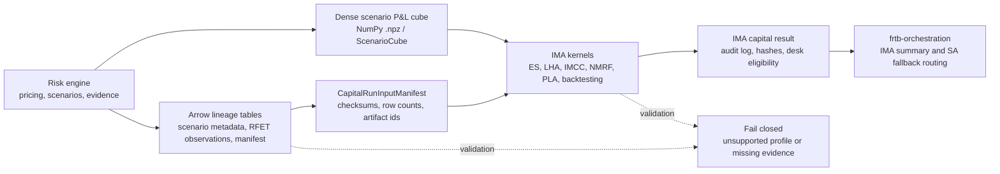

# frtb-ima integration journey

This document is the package-local journey front door for IMA users and
reviewers. The detailed client delivery contract remains canonical in
[`docs/modules/frtb-ima/CLIENT_DELIVERY.md`](../../../docs/modules/frtb-ima/CLIENT_DELIVERY.md);
this page keeps the same flow discoverable beside the package-local regulatory,
dataset, and validation evidence.

Outputs are synthetic engineering and validation evidence, not final regulatory
capital. Supervisory approval, independent model validation, market-data
sourcing, pricing, and regulatory submissions remain outside this package.

## What counts as one IMA run

An IMA run is a desk-level capital calculation over dense scenario P&L vectors
plus tabular evidence for scenario metadata, RFET observations, NMRF evidence,
PLA/backtesting vectors, and the capital-run input manifest. The package owns
IMA calculation and audit records; suite aggregation and SA fallback routing are
owned by `frtb-orchestration` after IMA produces a result and desk eligibility
signal.

## Integration tiers

| Tier | Client input | Entry path | Best for |
| --- | --- | --- | --- |
| Scenario cube | Dense NumPy artifacts and `ScenarioCube` arrays | ES, LHA, IMCC, NMRF, PLA, and backtesting kernels | Capital calculations and deterministic fixture replay |
| Tabular handoff | Arrow tables matching IMA handoff specs | `normalize_ima_*_arrow_table` -> batch or manifest builders | Scenario metadata, RFET observation evidence, and manifest lineage |
| Fixture / notebook rows | Committed synthetic fixture files and public dataclasses | `capital_run_v1` loader, notebooks, and examples | Teaching, regression evidence, and validation-pack review |

IMA is intentionally not an all-Arrow package. Scenario vectors stay
NumPy-native for numerical kernels; Arrow is used where the evidence is tabular
and lineage-heavy.

## Step-by-step path

1. The upstream risk engine produces dense scenario P&L vectors and supporting
   tabular evidence.
2. Tabular evidence is normalized through IMA Arrow handoff specs for scenario
   metadata, RFET observations, and input manifests. Shared PLA, backtesting,
   and stress-period observation-window validation lives under
   `frtb_ima.validation.observation_windows`.
3. The manifest records artifact ids, checksums, row counts, vector counts, and
   validation status for replay.
4. IMA kernels compute expected shortfall, liquidity-horizon adjustment, IMCC,
   NMRF/SES, PLA, backtesting metrics, and capital assembly from validated
   inputs.
5. The result records audit evidence, input hashes, policy metadata, and desk
   eligibility.
6. `frtb-orchestration` consumes only the final IMA result or summary signal for
   top-of-house aggregation and SA fallback routing.

## References

- [Client delivery guide](../../../docs/modules/frtb-ima/CLIENT_DELIVERY.md)
- [IMA public API](../../../docs/modules/frtb-ima/PUBLIC_API.md)
- [Dataset contract](DATASET_CONTRACT.md)
- [Validation pack](VALIDATION_PACK.md)
- [Regulatory traceability](REGULATORY_TRACEABILITY.md)
- [Capital attribution](../ATTRIBUTION.md)
