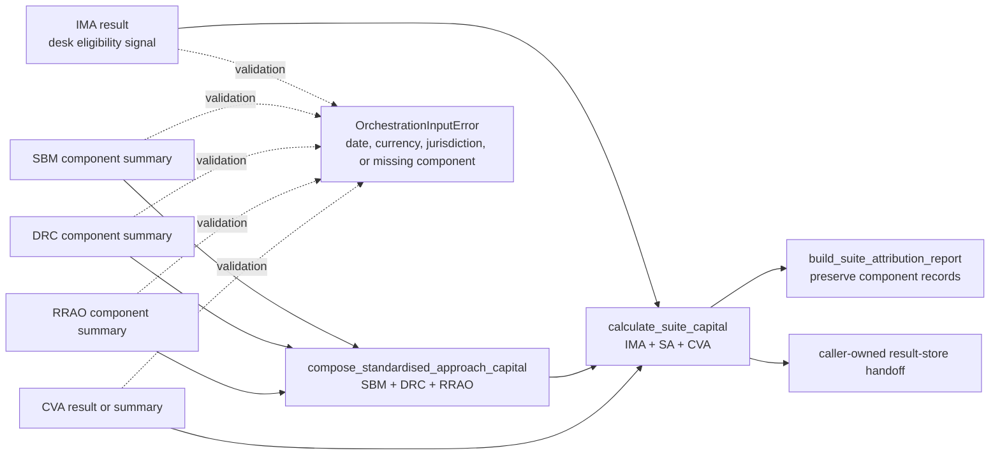

# frtb-orchestration integration journey

This document is the package-local journey front door for suite aggregation.
The module front door remains canonical in
[`docs/modules/frtb-orchestration/README.md`](../../../docs/modules/frtb-orchestration/README.md),
and the public API contract remains canonical in
[`docs/modules/frtb-orchestration/PUBLIC_API.md`](../../../docs/modules/frtb-orchestration/PUBLIC_API.md).

Outputs are synthetic engineering and validation evidence, not final regulatory
capital. Orchestration aggregates audited component results; it does not source
market data, price trades, calculate component kernels, or decide regulatory
submission status.

## What counts as one orchestration run

An orchestration run consumes completed component handoffs and produces either a
Standardised Approach result or a top-of-house suite result. Component packages
own raw input validation, regulatory method selection, and capital kernels before
handoff. Orchestration owns cross-component consistency checks, SA arithmetic,
IMA/CVA summary recognition, suite aggregation, and attribution bundle assembly.



## Integration tiers

| Tier | Input | Entry path | Best for |
| --- | --- | --- | --- |
| Component summaries | `ComponentCapitalSummary`, `ImaCapitalSummary`, `CvaCapitalSummary` | `compose_standardised_approach_capital`, `calculate_suite_capital` | Top-of-house aggregation from completed component runs |
| Manifest-driven SA | `CapitalRunManifest` with explicit input-table routes | `validate_capital_run_manifest`, `run_standardised_approach_from_manifest` | Client validation and partial SA routing from Arrow input tables |
| Teaching fixtures | Synthetic summaries in examples and notebooks | `examples/run_demo.py`, `notebooks/00_suite_aggregation.ipynb` | User onboarding and regression evidence |

## Step-by-step path

1. Component packages calculate audited capital results and project public
   summaries or result shapes.
2. Orchestration validates calculation date, base currency, regulatory
   jurisdiction family, and component presence.
3. `compose_standardised_approach_capital` sums SBM, DRC, and RRAO component
   summaries into a `StandardisedApproachCapitalResult`.
4. `calculate_suite_capital` aggregates IMA, SA, and CVA into a
   `SuiteCapitalResult`.
5. Suite attribution preserves component-provided contribution, residual,
   unsupported, and impact records; orchestration only adds explicit suite-level
   records needed for reconciliation.
6. Callers hand completed suite results to `frtb-result-store` adapters; the
   orchestration package does not write storage artifacts directly.

## Error and fallback path

```mermaid
sequenceDiagram
    participant Caller
    participant Orch as frtb-orchestration
    participant Components as Component summaries
    participant Store as Result-store caller

    Caller->>Orch: Submit IMA, SA component, and CVA summaries
    Orch->>Components: Validate date, currency, jurisdiction family, and required components
    alt Inputs consistent
        Orch-->>Caller: SuiteCapitalResult and attribution-ready metadata
        Caller->>Store: Persist completed result bundle
    else Missing or incompatible input
        Orch-->>Caller: OrchestrationInputError; no capital is emitted
    end
```

## References

- [Module README](../../../docs/modules/frtb-orchestration/README.md)
- [Public API](../../../docs/modules/frtb-orchestration/PUBLIC_API.md)
- [Package README](../README.md)
- [Attribution aggregation](../ATTRIBUTION.md)
- [ADR 0039: suite capital aggregation](../../../docs/decisions/0039-orchestration-suite-capital-aggregation.md)
- [ADR 0032: SA arithmetic and fallback routing](../../../docs/decisions/0032-orchestration-sa-arithmetic-and-fallback-routing.md)
- [ADR 0022: jurisdiction-family consistency guard](../../../docs/decisions/0022-sa-jurisdiction-profile-consistency-guard.md)
