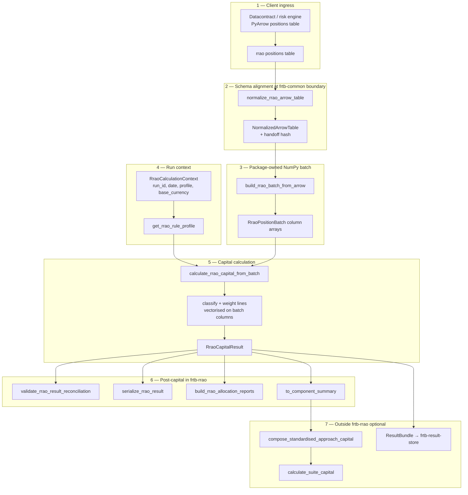
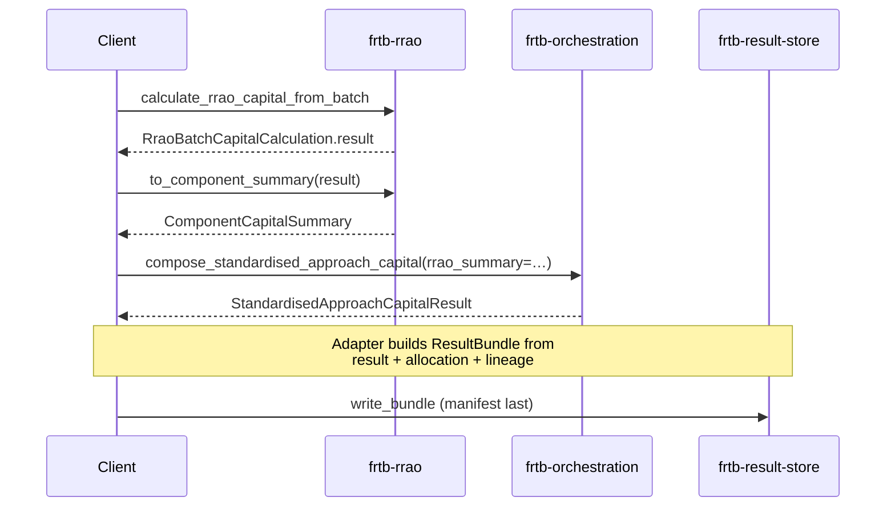
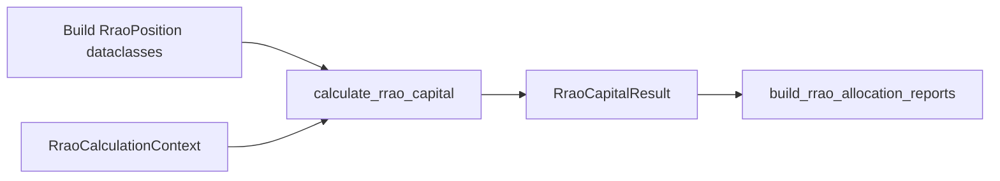
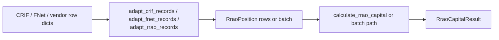

# frtb-rrao integration journey

This document describes how an **RRAO capital run** works in `frtb-rrao` as implemented
today. Use it as the reference layout for examples, notebooks, and client integration guides.

Outputs are **engineering and validation evidence**, not final regulatory capital.
See [`REGULATORY_TRACEABILITY.md`](REGULATORY_TRACEABILITY.md) for citations, the
support matrix, and scope boundaries.

Related references:

- Stable API surface: [`docs/modules/frtb-rrao/PUBLIC_API.md`](../../../docs/modules/frtb-rrao/PUBLIC_API.md)
- Arrow/batch performance: [`docs/performance/frtb-rrao-arrow-batch-triage.md`](../../../docs/performance/frtb-rrao-arrow-batch-triage.md)
- Allocation explain views: [`ALLOCATION.md`](ALLOCATION.md)
- Attribution policy (suite-level): [ADR 0012](../../../docs/decisions/0012-capital-impact-attribution.md)
- Arrow handoff boundary: [ADR 0023](../../../docs/decisions/0023-arrow-tabular-handoff-boundary.md)
- SA composition vocabulary: [ADR 0033](../../../docs/decisions/0033-arrow-batch-and-component-summary-vocabulary.md)

---

## What counts as one “RRAO run”

An **RRAO run** is a single calculation keyed by `RraoCalculationContext` over one
population of canonical **positions**, producing a frozen **`RraoCapitalResult`**.

Each position carries classification evidence (type, labels, optional exclusions,
investment-fund descriptors, back-to-back match ids). The engine classifies each line,
applies cited **1.0% exotic** and **0.1% other residual-risk** add-ons where included,
and records **zero-capital excluded lines** in audit output rather than dropping them.

Optional steps on the same result (same package):

- reconciliation and serialization (`audit`)
- additive allocation reports (`allocation`)
- SA orchestration handoff (`to_component_summary`)

Steps **outside** `frtb-rrao` (integration layer):

- composed Standardised Approach capital (`frtb-orchestration.compose_standardised_approach_capital`)
- top-of-house suite aggregation (`calculate_suite_capital` with IMA + SA + CVA)
- durable evidence persistence (`frtb-result-store` adapters)

The package does **not** import orchestration, SBM, DRC, or the result store.
Callers wire those steps after RRAO capital is computed.

---

## Integration tiers

| Tier | Typical client input | Entry path | Best for |
| --- | --- | --- | --- |
| **1 — Arrow / Parquet** | One positions table matching `RRAO_ARROW_COLUMN_SPECS` | `normalize_rrao_arrow_table` → `build_rrao_batch_from_arrow` → `calculate_rrao_capital_from_batch` | Production volume, datacontract-driven pipelines |
| **2 — CRIF / FNet / vendor rows** | Iterable mapping records | `adapt_crif_records`, `adapt_fnet_records`, or `adapt_rrao_records` → row or batch path | Legacy vendor-shaped feeds |
| **3 — Canonical rows** | `tuple[RraoPosition, ...]` | `calculate_rrao_capital` → `build_rrao_batch_from_positions` → `calculate_rrao_capital_from_batch` | Tests, small books, notebooks |

Tier 1 is the recommended production journey below. Tiers 2 and 3 share the same
capital semantics once inputs are validated.

---

## Profile selects the rule tables (not “run every regime”)

`RraoCalculationContext.profile` (resolved via `get_rrao_rule_profile`) selects
which cited classification tables, weights, exclusions, and investment-fund inclusion
rules apply in one call. You do **not** execute Basel, U.S., and EU mechanics in a
single run unless you intentionally run three contexts.

| `RraoRegulatoryProfile` | Regulatory anchor (summary) | Runtime boundary |
| --- | --- | --- |
| `BASEL_MAR23` | Basel MAR23 residual-risk add-on | Supported canonical-input slice |
| `US_NPR_2_0` | Proposed section `__.211` (91 FR 14952) | Supported proposed-rule slice; investment-fund inclusion when `__.205(e)(3)(iii)` evidence is supplied |
| `EU_CRR3` | Article 325u and Delegated Regulation (EU) 2022/2328 | Supported comparison-profile slice; Article 3 non-presumptive cases as zero-capital lines |
| `PRA_UK_CRR` | UK CRR Article 325u and UK retained DR 2022/2328 | Supported UK slice; investment-fund paths fail closed |

Unsupported profile identifiers and unmapped evidence paths fail closed with
`RraoInputError` or `UnsupportedRegulatoryFeatureError`. The package must not emit
zero or silent capital for unsupported scope.

---

## Evidence routing (same journey, different classification kernels)

Integration is **identical** across profiles: one positions table (or row tuple),
normalize → batch → calculate, then optional allocation and `to_component_summary`.
What changes is the **profile-specific rule tables** applied after validation.

### Shared pipeline (all supported profiles)

| Stage | Shared behaviour |
| --- | --- |
| Ingress / normalize | `frtb_common.normalize_arrow_table` + `RRAO_ARROW_COLUMN_SPECS`; identity, notional, evidence, lineage columns per [`PUBLIC_API.md`](../../../docs/modules/frtb-rrao/PUBLIC_API.md#rrao-input_table-column-summary) |
| Validate | `frtb_rrao.validation.position.validate_rrao_positions` (row) or batch invariants (finite non-negative `gross_effective_notional`, lineage, duplicate ids); `frtb_rrao.validation` remains the compatibility import path |
| Batch | `RraoPositionBatch` NumPy columns; fast path keeps `accepted_row_dataclasses_materialized` at zero |
| Classify | `classify_rrao_position` / vectorised batch classification from `evidence_type`, flags, and profile tables |
| Capital | Additive line add-ons (`EXOTIC` 1.0%, `OTHER_RESIDUAL_RISK` 0.1%, supervisor-directed where cited); exclusions and EU Article 3 cases as **zero-capital audit lines** |
| Result shape | `RraoCapitalResult` with `lines`, `excluded_lines`, `subtotals`, `total_rrao`, citations, warnings |
| Explain | `build_rrao_allocation_report(s)` — additive buckets only; no Euler pass through the calculator |

Callers supply **evidence types, exclusion reasons, and investment-fund descriptors**
upstream. The package does not infer exotic underlyings from raw trade terms without
the canonical evidence columns (or adapter mapping).

### How evidence paths differ (mechanical summary)

| Path | Typical `evidence_type` / inputs | Outcome |
| --- | --- | --- |
| **Exotic residual risk** | `EXOTIC_UNDERLYING`, path-dependent / multi-underlying option flags, EU Annex mappings | `EXOTIC` classification → 1.0% × gross effective notional line add-on |
| **Other residual risk** | `GAP_RISK`, `CORRELATION_RISK`, `BEHAVIOURAL_RISK`, optionality gaps, CTP ≥3 underlyings, etc. | `OTHER_RESIDUAL_RISK` → 0.1% line add-on |
| **Explicit exclusion** | `exclusion_reason` + evidence ids (listed, CCP-clearable, exact back-to-back, EU Article 3 presets, …) | `EXCLUDED` → zero-capital line in `excluded_lines` |
| **Supervisor-directed** | `SUPERVISOR_DIRECTIVE` + `supervisor_directive_id` | Cited supervisor-directed add-on where profile supports it |
| **U.S. investment fund** | `INVESTMENT_FUND_EXPOSURE` + `__.205(e)(3)(iii)` method and mandate evidence (`US_NPR_2_0` only) | Inclusion under proposed `__.211(a)(3)` when descriptor is complete; otherwise fail closed |
| **EU / PRA investment fund** | Fund exposure flags on `EU_CRR3` or `PRA_UK_CRR` | EU comparison mapping where cited; **PRA fund inclusion fail closed** |
| **Unsupported / nested payload** | `classification_hint=UNSUPPORTED`, `unsupported_nested_payload` | Fail closed before capital is returned |

Exact third-party back-to-back exclusions require deterministic two-transaction match
evidence (`back_to_back_match_group_id`, `back_to_back_matched_position_id`). Partial
matches remain visible as zero-capital audit lines rather than silent drops.

For regulatory thresholds and citation ids per cell, use
[`REGULATORY_TRACEABILITY.md`](REGULATORY_TRACEABILITY.md) and
[`REGULATORY_ASSUMPTIONS.md`](REGULATORY_ASSUMPTIONS.md).

---

## End-to-end journey (Tier 1 — Arrow)

Production desks usually run **one homogeneous positions table** per RRAO run
(same `profile` on every row). Unlike SBM, there is no portfolio dispatcher across
multiple `(risk_class, risk_measure)` tables — residual-risk scope is position-centric.



### Step 1 — Client ingress

The risk engine (or datacontract export) supplies a **PyArrow table** of residual-risk
positions. Column names may differ from the package spec when aliases are declared on
`RRAO_ARROW_COLUMN_SPECS` (for example `positionId` → `position_id`).

Machine-readable contract:
[`docs/schemas/input_table/frtb_rrao.positions.schema.json`](../../../docs/schemas/input_table/frtb_rrao.positions.schema.json).

### Step 2 — Normalize

`normalize_rrao_arrow_table` uses `frtb_common.normalize_arrow_table` with package
`ColumnSpec` definitions:

- coerce logical types (string, numeric, boolean, date, …)
- enforce null policies per column
- reject nested descriptors that must be flattened (`unsupported_nested_payload`)

Output is a **`NormalizedArrowTable`** on the Arrow handoff boundary (ADR 0023).
Calculation kernels do not import PyArrow.

### Step 3 — Build batch

`build_rrao_batch_from_arrow` reads normalized columns into **`RraoPositionBatch`**
(immutable NumPy column arrays).

The fast path **does not** materialize accepted `RraoPosition` dataclasses per row
during calculation (`accepted_row_dataclasses_materialized` stays zero). Audit outputs
remain structured dataclasses (`RraoCapitalResult`, `RraoCapitalLine`, subtotals, …).

### Step 4 — Run context

`RraoCalculationContext` carries run identity, for example:

- `run_id`, `calculation_date`, `base_currency`
- `profile` (`RraoRegulatoryProfile`, resolved via `get_rrao_rule_profile`)

Profile guards fail closed when the profile does not implement a requested evidence or
investment-fund cell.

### Step 5 — Calculate capital

| Entry | When to use |
| --- | --- |
| `calculate_rrao_capital_from_batch` | Normalized Arrow batch (Tier 1) |
| `calculate_rrao_capital` | Tier 3 row dataclasses; adapter over the same batch kernel |

Both paths use `calculate_rrao_capital_from_batch` for capital assembly. The row
entrypoint first builds `RraoPositionBatch` with `build_rrao_batch_from_positions`.
The shared kernel then:

1. validate context and positions (or batch invariants)
2. classify each position under the selected profile tables
3. build additive capital lines and excluded zero-capital lines
4. assemble `RraoCapitalResult` with subtotals, `total_rrao`, citations, warnings,
   `input_hash`, and `profile_hash`
5. call `validate_rrao_result_reconciliation` before returning

Return type for the batch helper is **`RraoBatchCapitalCalculation`**; use `.result`
for the `RraoCapitalResult` and optional batch diagnostics arrays on the wrapper.

### Step 6 — Post-capital (same package)

| Step | Symbol | Role |
| --- | --- | --- |
| Reconciliation | `validate_rrao_result_reconciliation` | Line/subtotal/total consistency checks |
| Replay / evidence | `serialize_rrao_result`, `input_hash_for_positions`, `input_hash_for_rrao_batch` | Deterministic serialization and fingerprints |
| Classification preview | `classify_rrao_positions` | Inspect decisions without running capital (row inputs) |
| Allocation | `build_rrao_allocation_report`, `build_rrao_allocation_reports` | Additive explain by line, desk, legal entity, or evidence type |
| SA handoff | `to_component_summary` | Project to `frtb_common.ComponentCapitalSummary` for orchestration |

**Allocation is not a backward pass through the calculator.** Capital is fixed first;
allocation reports sum **existing line add-ons** into buckets and reconcile to
`total_rrao`. Euler-style or classification-dimension allocation is intentionally
unsupported in v1 — see [`ALLOCATION.md`](ALLOCATION.md) and ADR 0012.

There is **no** `frtb_rrao.attribution` module in the v1 public surface. Capital impact
between two RRAO results is an integration-layer concern unless a future ADR adds it.

### Step 7 — SA composition and storage (callers)



`frtb-orchestration` composes **SA = SBM + DRC + RRAO** from
`ComponentCapitalSummary` inputs (`sbm_summary`, `drc_summary`, `rrao_summary`).
It does not re-run RRAO kernels and does not write storage artifacts.

`frtb-result-store` persists **calculation evidence** after engines finish.
Capital packages must not import the store; an integration adapter maps
`RraoCapitalResult`, allocation reports, hashes, and lineage into `ResultBundle` rows.

---

## Tier 3 journey (notebook / small book)



Optional preview: `classify_rrao_positions` before capital when tuning evidence mapping.

Same semantics as the batch path for supported inputs; useful for unit tests,
`packages/frtb-rrao/tests/`, and notebooks.

---

## Tier 2 journey (CRIF / FNet-shaped rows)



Rejected adapter rows are returned explicitly in `RraoAdapterResult` — they are not
silently dropped.

---

## Minimal code sketch (Arrow path)

Illustrative only — see tests, fixtures, and `PUBLIC_API.md` for complete examples.

```python
from datetime import date

from frtb_rrao import (
    RraoCalculationContext,
    RraoRegulatoryProfile,
    build_rrao_allocation_reports,
    build_rrao_batch_from_arrow,
    calculate_rrao_capital_from_batch,
    normalize_rrao_arrow_table,
    to_component_summary,
)

context = RraoCalculationContext(
    run_id="demo-run-001",
    calculation_date=date(2026, 6, 4),
    base_currency="USD",
    profile=RraoRegulatoryProfile.BASEL_MAR23,
)

# positions_table = ...  # pyarrow.Table aligned to RRAO_ARROW_COLUMN_SPECS
handoff = normalize_rrao_arrow_table(positions_table)
batch = build_rrao_batch_from_arrow(handoff)
calc = calculate_rrao_capital_from_batch(batch, context=context)
result = calc.result

reports = build_rrao_allocation_reports(result)
rrao_summary = to_component_summary(result)
# compose_standardised_approach_capital(sbm_summary=..., drc_summary=..., rrao_summary=rrao_summary)
```

---

## Notebook / example chapter outline

Use this outline when authoring `examples/` or package notebooks:

1. **Run identity** — `run_id`, date, `profile`, base currency.
2. **Load positions** — synthetic Parquet or datacontract-aligned Arrow.
3. **Normalize** — diagnostics and handoff hash; validate with `validate_client_input_table.py` when needed.
4. **Calculate** — included vs excluded lines, subtotals, investment-fund edge cases.
5. **Reconcile** — `validate_rrao_result_reconciliation`.
6. **Allocate** — desk / legal-entity / evidence-type reports; zero-capital excluded buckets.
7. **SA hook (optional)** — `to_component_summary` + `compose_standardised_approach_capital`.
8. **Suite hook (optional)** — `calculate_suite_capital` with IMA + SA + CVA summaries.
9. **Persist (optional)** — sketch `ResultBundle` mapping; link to result-store tests.

Keep **SBM/DRC ingestion**, **full desk orchestration**, and **persistence** in
separate chapters so package boundaries stay clear.

---

## Boundaries to preserve in examples

- Do not flatten multiple regulatory profiles into one `RraoCalculationContext`; run
  separate contexts per profile comparison.
- Do not describe allocation as reverse-mode AD through classification formulas; it is
  post-hoc additive bucketing over fixed line add-ons.
- Do not import `frtb-orchestration` or `frtb-result-store` from package examples
  without an explicit integration layer in the caller notebook.
- Do not label engineering evidence as final regulatory capital.
- Do not imply full production model approval; check `REGULATORY_TRACEABILITY.md` for
  the current support matrix and fail-closed cells.

---

## See also

| Document | Purpose |
| --- | --- |
| [`PUBLIC_API.md`](../../../docs/modules/frtb-rrao/PUBLIC_API.md) | Symbol-level client contract and input_table columns |
| [`REGULATORY_TRACEABILITY.md`](REGULATORY_TRACEABILITY.md) | MAR23 / NPR / EU / PRA paragraph mapping and support status |
| [`ALLOCATION.md`](ALLOCATION.md) | Additive allocation dimensions and unsupported paths |
| [`docs/modules/frtb-orchestration/README.md`](../../../docs/modules/frtb-orchestration/README.md) | SA composition and suite capital |
| [`docs/modules/frtb-result-store/STORAGE_CONTRACT.md`](../../../docs/modules/frtb-result-store/STORAGE_CONTRACT.md) | Persisting run evidence |
