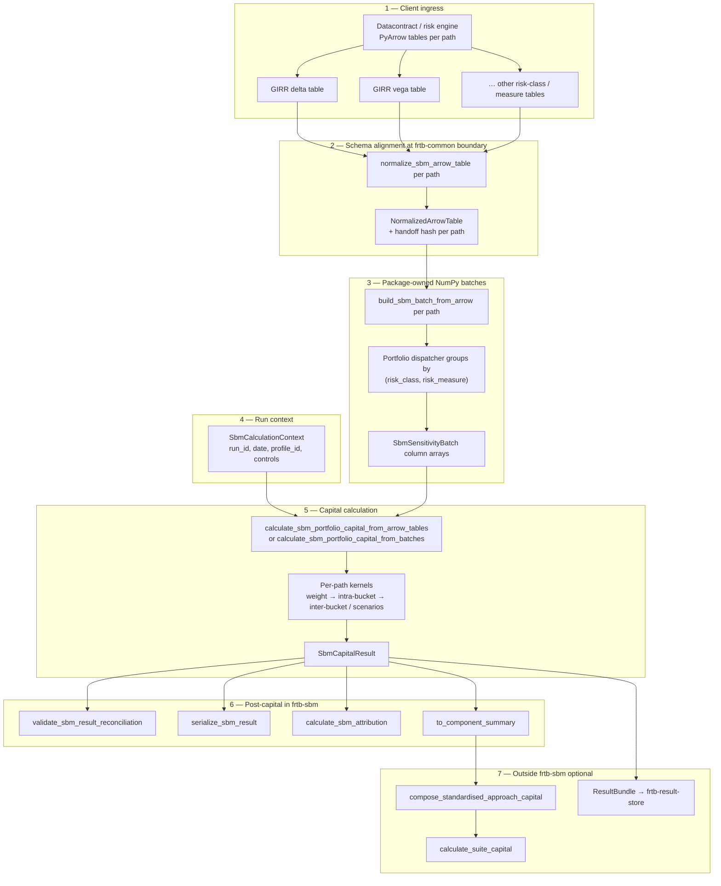
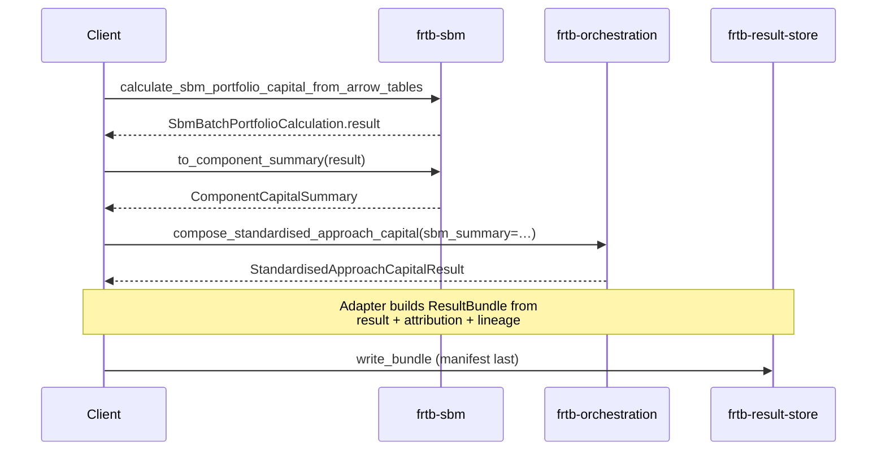
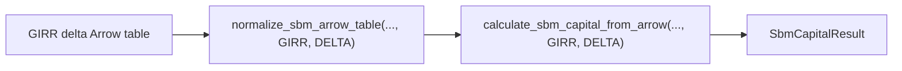
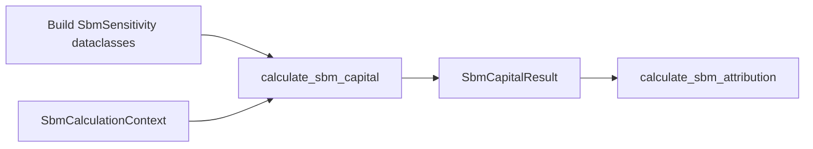
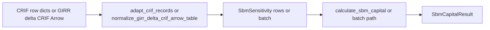

# frtb-sbm integration journey

This document describes how an **SBM capital run** works in `frtb-sbm` as implemented
today. Use it as the reference layout for examples, notebooks, and client integration guides.

Outputs are **engineering and validation evidence**, not final regulatory capital.
See [`REGULATORY_TRACEABILITY.md`](REGULATORY_TRACEABILITY.md) for citations, the
phase-1 support matrix, and scope boundaries.

Related references:

- Stable API surface: [`docs/modules/frtb-sbm/PUBLIC_API.md`](../../../docs/modules/frtb-sbm/PUBLIC_API.md)
- Arrow/batch performance: [`docs/performance/frtb-sbm-batch-arrow-report.md`](../../../docs/performance/frtb-sbm-batch-arrow-report.md)
- Attribution policy: [ADR 0012](../../../docs/decisions/0012-capital-impact-attribution.md)
- Arrow handoff boundary: [ADR 0023](../../../docs/decisions/0023-arrow-tabular-handoff-boundary.md)
- SA composition vocabulary: [ADR 0033](../../../docs/decisions/0033-arrow-batch-and-component-summary-vocabulary.md)

---

## What counts as one “SBM run”

An **SBM run** is a single calculation keyed by `SbmCalculationContext` over one
or more homogeneous sensitivity populations, producing a frozen **`SbmCapitalResult`**.

The result aggregates **risk-class capital** records (GIRR, FX, equity, commodity,
CSR non-sec, CSR sec non-CTP, CSR sec CTP × delta, vega, curvature where supported).
Portfolio totals sum implemented paths; unsupported profile/cell combinations fail
closed before a capital number is returned.

Optional steps on the same result (same package):

- reconciliation and serialization (`audit`)
- analytical attribution (`frtb_sbm.attribution`)
- capital impact between two results (`frtb_sbm.impact`)
- component summary for SA orchestration (`to_component_summary`)

Steps **outside** `frtb-sbm` (integration layer):

- composed Standardised Approach capital (`frtb-orchestration.compose_standardised_approach_capital`)
- top-of-house suite aggregation (`calculate_suite_capital` with IMA + SA + CVA)
- durable evidence persistence (`frtb-result-store` adapters)

The package does **not** import orchestration, DRC, RRAO, or the result store.
Callers wire those steps after SBM capital is computed.

---

## Integration tiers

| Tier | Typical client input | Entry path | Best for |
| --- | --- | --- | --- |
| **1 — Arrow / Parquet** | One table per homogeneous `(risk_class, risk_measure)` path | `normalize_sbm_arrow_table(..., risk_class, measure)` → `build_sbm_batch_from_arrow(..., risk_class, measure)` → generic capital helper, or portfolio dispatcher | Production volume, datacontract-driven pipelines |
| **2 — CRIF / vendor rows** | Iterable mapping records or GIRR delta CRIF Arrow | `adapt_crif_records` / `normalize_girr_delta_crif_arrow_table` → row or batch path | Legacy CRIF-shaped feeds |
| **3 — Canonical rows** | `tuple[SbmSensitivity, ...]` | `calculate_sbm_capital` | Tests, small books, notebooks |

Tier 1 is the recommended production journey below. Tiers 2 and 3 share the same
capital semantics once inputs are validated.

---

## Profile and path matrix (not “all risk classes in one table”)

`SbmCalculationContext.profile_id` selects the regulatory rule profile. Supported
runtime paths are enforced before calculation:

| Profile | Implemented paths (summary) |
| --- | --- |
| `BASEL_MAR21` | Delta, vega, and curvature across all seven SBM risk classes (see support matrix) |
| `US_NPR_2_0` | GIRR delta only |
| Other comparison profiles | Fail closed with `UnsupportedRegulatoryFeatureError` |

Each Arrow table handed to the portfolio dispatcher must be **homogeneous**: every
row shares the same `risk_class` and `risk_measure`. Mixed GIRR delta + FX vega in
one table is rejected; supply separate tables (or use the row API for tiny books).

The full normalizer → builder → capital-entry mapping lives in
[PUBLIC_API.md — InputTable specs](../../../docs/modules/frtb-sbm/PUBLIC_API.md#inputtable-specs-and-normalizers).

---

## Risk-class routing (same journey, different kernels)

Integration is **identical** across asset classes: one homogeneous table per path,
the generic enum-driven normalize/build/calculate helpers, then portfolio grouping by
`(risk_class, risk_measure)`. What changes is the **regulatory kernel** invoked
after the batch is built — weights, buckets, correlations, and required input
columns differ by class and measure. GIRR delta and vega batch kernels live in
`frtb_sbm.risk_classes.girr`; GIRR weighting formulas live in
`frtb_sbm.risk_classes.girr_weighting`; non-GIRR vega weighting lives in
`frtb_sbm.risk_classes.vega_weighting`; FX, equity, and commodity delta
weighting live in matching risk-class weighting modules; `frtb_sbm.capital`
remains the public dispatcher.

### Shared pipeline (all seven risk classes)

| Stage | Shared behaviour |
| --- | --- |
| Ingress / normalize | `frtb_common.normalize_arrow_table` + path `ColumnSpec`; identity, classification, amount, lineage columns per [`PUBLIC_API.md`](../../../docs/modules/frtb-sbm/PUBLIC_API.md#inputtable-column-summary) |
| Batch | `SbmSensitivityBatch` NumPy columns; no per-row `SbmSensitivity` on the fast path |
| Aggregation pattern | Weight sensitivities → intra-bucket `Kb` with correlation scenarios → inter-bucket / risk-class total (delta and vega); curvature uses MAR21.5 branch engine with up/down shocks. Shared aggregation implementation lives under focused `frtb_sbm.kernel.*_aggregation` modules; curvature input, factor, correlation, bucket-scenario, inter-bucket, and bucket-record helpers live under focused `frtb_sbm.curvature_*` modules; and `frtb_sbm.kernel.aggregation` / `frtb_sbm.aggregation` remain compatibility import paths. |
| Reference data | Profile citations, GIRR/FX/vega/curvature lookups, and profile hash payload assembly live in focused `frtb_sbm.*_reference_data`, `frtb_sbm.reference_profiles`, and `frtb_sbm.reference_payload` modules; `frtb_sbm.reference_data` remains the compatibility import path. |
| Result shape | One `RiskClassCapital` per path in `SbmCapitalResult.risk_classes`; portfolio `total_capital` sums implemented paths |
| Attribution | Delta and vega: analytical Euler on weighted lines; curvature: `UNSUPPORTED` for every class (CVR floor) |

Callers supply **bucket, qualifier, risk factor, and path-specific axes** (tenor,
option tenor, curvature up/down, mapping citation ids). The package does not
infer buckets from raw instruments — upstream systems or CRIF adapters assign
canonical classification before capital runs.

### How classes differ (mechanical summary)

| Risk class | Delta (distinct mechanics) | Vega | Curvature (distinct mechanics) |
| --- | --- | --- | --- |
| **GIRR** | Cited tenor grid; factor netting via `net_girr_delta_sensitivity_batch`; MAR21.4–MAR21.7 scenario selection | GIRR vega tenor/bucket correlations (MAR21.90+) | MAR21.5 + MAR21.96–MAR21.101 branch engine; up/down shock columns |
| **FX** | MAR21.86–MAR21.89 buckets; `CNH` may map to `CNY` bucket per MAR21.88 | FX vega buckets/correlations | Optional MAR21.98 **1.5× scalar** for non-reporting-currency pairs: set `FX_CURVATURE_SCALAR_1_5_FLAG` in `mapping_citation_ids` and a two-currency `qualifier` (e.g. `EUR/GBP`) |
| **Equity** | MAR21.71–MAR21.75 bucket weights | Equity vega | Supported curvature; **equity repo** vega/curvature sub-features fail closed |
| **Commodity** | MAR21.76–MAR21.80 delivery/non-delivery buckets | Commodity vega | Curvature on same batch/Arrow boundary as delta/vega |
| **CSR non-sec** | MAR21.51–MAR21.57 credit-quality buckets | Shared non-GIRR vega engine | CSR curvature on cited MAR21.51–MAR21.57 / shared curvature mechanics |
| **CSR sec non-CTP** | MAR21.71 senior-IG vs non-senior / HY multipliers on Table weights | CSR sec non-CTP vega | Same curvature boundary as other CSR paths |
| **CSR sec CTP** | MAR21.59 Table 6 buckets 1–16; decomposition evidence checks fail closed when required | CSR sec CTP vega | CTP-specific delta/vega/curvature paths |

**US NPR 2.0:** only **GIRR delta** is implemented; all other NPR cells fail closed
even if Basel paths would succeed under `BASEL_MAR21`.

**PRA UK CRR:** only **GIRR delta** is implemented, using PRA PS1/26 Appendix 1 /
PRA2026/1 Articles 325c, 325h, and 325ae-325ag with `girr_delta_pra_uk_crr_v1`;
all other PRA cells fail closed even if Basel paths would succeed under
`BASEL_MAR21`.

### Choosing the right path in client code

1. Tag each sensitivity row with `risk_class` and `risk_measure` before export.
2. Split Arrow exports so each table is homogeneous (see profile section above).
3. Call `normalize_sbm_arrow_table(..., risk_class, measure)` and either
   `build_sbm_batch_from_arrow(..., risk_class, measure)` plus batch capital, or
   `calculate_sbm_capital_from_arrow(..., risk_class, measure)`. For multi-path
   runs, pass normalized tables to `calculate_sbm_portfolio_capital_from_arrow_tables`.
4. For regulatory thresholds, weights, and citation ids per cell, use
   [`REGULATORY_TRACEABILITY.md`](REGULATORY_TRACEABILITY.md) (support matrix) and
   [`REGULATORY_ASSUMPTIONS.md`](REGULATORY_ASSUMPTIONS.md) (boundary assumptions).

---

## End-to-end journey (Tier 1 — multi-path portfolio)

Production desks usually run **many SBM paths in one run** (for example GIRR delta,
GIRR vega, FX delta, …). The portfolio dispatcher owns grouping and correlation scope.



### Step 1 — Client ingress

The risk engine (or datacontract export) supplies **one PyArrow table per
homogeneous path**. Column names may differ from the package spec when aliases are
declared on the path’s `*_ARROW_COLUMN_SPECS` (for example `sensitivityId` →
`sensitivity_id`).

### Step 2 — Normalize

Each table passes through `normalize_sbm_arrow_table` with explicit
`SbmRiskClass` and `SbmRiskMeasure` values. The helper delegates to
`frtb_common.normalize_arrow_table` and the package `ColumnSpec` definitions:

- coerce logical types (string, numeric, date, …)
- enforce null policies
- collect adapter diagnostics

Output is a **`NormalizedArrowTable`** on the Arrow handoff boundary (ADR 0023).
The implementation lives in `frtb_sbm.adapters.arrow`; `frtb_sbm.arrow_batch`
remains a compatibility import path.
Calculation kernels do not import PyArrow.

### Step 3 — Build batches

`build_sbm_batch_from_arrow` reads normalized columns into
**`SbmSensitivityBatch`** objects (immutable NumPy column arrays per path).
Batch ingress builders physically live under `frtb_sbm.adapters.sensitivities`;
`frtb_sbm.batch` remains the compatibility and public import path.
Portfolio dispatch physically lives under `frtb_sbm.kernel.portfolio`;
`frtb_sbm.capital` remains the compatibility and public import path.
Input, batch, and profile hash payload assembly physically lives under
`frtb_sbm.assembly.hashes`; public callers continue to use the stable hash
helpers from `frtb_sbm` and `frtb_sbm.batch`.
Validation helpers physically live under the `frtb_sbm.validation` package, including
`batch`, `batch_arrays`, `batch_lineage`, `coercion`, `context`,
`risk_class_fields`, and `sensitivity`;
`frtb_sbm.validation` remains the compatibility and public import path.

The portfolio path **does not** materialize accepted `SbmSensitivity` dataclasses
per row during calculation (`accepted_row_dataclasses_materialized` stays zero on
the fast path). Audit outputs remain structured dataclasses (`SbmCapitalResult`,
`RiskClassCapital`, bucket/scenario evidence, …).

### Step 4 — Run context

`SbmCalculationContext` carries run identity and controls, for example:

- `run_id`, `calculation_date`, `base_currency`, `desk_id`
- `profile_id` (`SbmRegulatoryProfile`, resolved via `get_sbm_rule_profile`)
- `pairwise_evidence_mode`, correlation-scenario options where applicable

`ensure_sbm_run_supported` and path guards fail closed when the profile does not
implement a requested `(risk_class, risk_measure)` cell.

### Step 5 — Calculate capital

| Entry | When to use |
| --- | --- |
| `calculate_sbm_portfolio_capital_from_arrow_tables` | Several normalized tables in one call |
| `calculate_sbm_portfolio_capital_from_batches` | Callers already built `SbmSensitivityBatch` objects |
| `calculate_sbm_capital_from_arrow` | Single-path enum-driven Arrow convenience |
| `calculate_sbm_capital` | Tier 3 row dataclasses |

Portfolio dispatcher behaviour:

1. group batches by `(risk_class, risk_measure)`
2. concatenate split batches for the same path before aggregation
3. run path-specific weighting and MAR21 aggregation (delta/vega/curvature kernels)
4. assemble `SbmCapitalResult` with `risk_classes`, totals, citations, warnings,
   `input_hash`, `profile_hash`, and `run_context`
5. call `validate_sbm_result_reconciliation` before returning

Return type for portfolio helpers is **`SbmBatchPortfolioCalculation`**; use
`.result` for the `SbmCapitalResult` and `.path_diagnostics` for per-path fast-path
metadata.

### Step 6 — Post-capital (same package)

| Step | Symbol | Role |
| --- | --- | --- |
| Reconciliation | `validate_sbm_result_reconciliation` | Internal consistency checks on totals and risk-class breakdown |
| Replay / evidence | `serialize_sbm_result`, `input_hash_for_sensitivities` | Deterministic serialization and input fingerprinting |
| Attribution | `calculate_sbm_attribution` (`frtb_sbm.attribution`) | Analytical Euler contributions for **delta and vega** paths |
| Impact | `calculate_sbm_capital_impact` (`frtb_sbm.impact`) | Compare baseline vs candidate `SbmCapitalResult` where supported |
| SA handoff | `to_component_summary` | Project to `frtb_common.ComponentCapitalSummary` for orchestration |

**Attribution is not a backward pass through the calculator.** Capital is fixed
first; attribution decomposes **already computed** weighted sensitivities and
bucket allocations. **Curvature** paths return `UNSUPPORTED` attribution records
because the CVR `max(⋅, 0)` floor prevents exact Euler decomposition (Basel MAR21.5).
See ADR 0012 and ADR 0038.

### Step 7 — SA composition and storage (callers)



`frtb-orchestration` composes **SA = SBM + DRC + RRAO** from
`ComponentCapitalSummary` inputs (`sbm_summary`, `drc_summary`, `rrao_summary`).
It does not re-run SBM kernels and does not write storage artifacts.

`frtb-result-store` persists **calculation evidence** after engines finish.
Capital packages must not import the store; an integration adapter maps
`SbmCapitalResult`, contributions, hashes, and lineage into `ResultBundle` rows.

---

## Single-path journey (one risk class / measure)

When only one path is needed (for example GIRR delta only), skip the portfolio
dispatcher and call the one-shot Arrow helper with the path enums:



Equivalent explicit steps: `normalize_sbm_arrow_table` →
`build_sbm_batch_from_arrow` → `calculate_sbm_capital_from_batch`.

---

## Tier 3 journey (notebook / small book)



Same semantics as the batch path for supported inputs; useful for unit tests,
`packages/frtb-sbm/tests/`, and notebooks under `packages/frtb-sbm/notebooks/`.

---

## Tier 2 journey (CRIF-shaped rows)



Rejected CRIF rows are returned explicitly in adapter diagnostics — they are not
silently dropped.

---

## Minimal code sketch (portfolio Arrow path)

Illustrative only — see tests, notebooks, and `PUBLIC_API.md` for complete fixtures.

```python
from datetime import date

from frtb_sbm import (
    SbmRiskClass,
    SbmRiskMeasure,
    SbmCalculationContext,
    calculate_sbm_portfolio_capital_from_arrow_tables,
    normalize_sbm_arrow_table,
    to_component_summary,
)
from frtb_sbm.attribution import calculate_sbm_attribution

context = SbmCalculationContext(
    run_id="demo-run-001",
    calculation_date=date(2026, 6, 4),
    base_currency="USD",
    profile_id="BASEL_MAR21",
    desk_id="rates-desk",
)

handoffs = (
    normalize_sbm_arrow_table(girr_delta_table, SbmRiskClass.GIRR, SbmRiskMeasure.DELTA),
    normalize_sbm_arrow_table(girr_vega_table, SbmRiskClass.GIRR, SbmRiskMeasure.VEGA),
)

calc = calculate_sbm_portfolio_capital_from_arrow_tables(handoffs, context=context)
result = calc.result

attribution = calculate_sbm_attribution(result)
sbm_summary = to_component_summary(result)
# compose_standardised_approach_capital(sbm_summary=sbm_summary, drc_summary=..., rrao_summary=...)
```

---

## Notebook / example chapter outline

Use this outline when authoring `examples/` or package notebooks:

1. **Run identity** — `run_id`, date, `profile_id`, desk, pairwise evidence mode.
2. **Load tables** — synthetic Parquet or datacontract-aligned Arrow per path.
3. **Normalize** — per-path diagnostics and handoff hashes.
4. **Portfolio calculate** — `path_diagnostics`, risk-class totals, scenario selection.
5. **Reconcile** — `validate_sbm_result_reconciliation`.
6. **Attribute** — delta/vega contributions; curvature `UNSUPPORTED` records.
7. **SA hook (optional)** — `to_component_summary` + `compose_standardised_approach_capital`.
8. **Suite hook (optional)** — `calculate_suite_capital` with IMA + SA + CVA summaries.
9. **Persist (optional)** — sketch `ResultBundle` mapping; link to result-store tests.

Keep **DRC/RRAO ingestion**, **full desk orchestration**, and **persistence** in
separate chapters so package boundaries stay clear.

---

## Boundaries to preserve in examples

- Do not put multiple `(risk_class, risk_measure)` paths in one Arrow table for the
  portfolio dispatcher; split tables or use the row API.
- Do not describe attribution as reverse-mode AD through correlation/scenario formulas;
  it is post-hoc analytical decomposition with documented curvature gaps.
- Do not import `frtb-orchestration` or `frtb-result-store` from package examples
  without an explicit integration layer in the caller notebook.
- Do not label engineering evidence as final regulatory capital.
- Do not imply EU CRR3 or full U.S. NPR 2.0 SBM coverage; check
  `REGULATORY_TRACEABILITY.md` for the current matrix.

---

## See also

| Document | Purpose |
| --- | --- |
| [`PUBLIC_API.md`](../../../docs/modules/frtb-sbm/PUBLIC_API.md) | Symbol-level client contract and InputTable matrix |
| [`REGULATORY_TRACEABILITY.md`](REGULATORY_TRACEABILITY.md) | MAR21 paragraph mapping and support status |
| [`docs/modules/frtb-orchestration/README.md`](../../../docs/modules/frtb-orchestration/README.md) | SA composition and suite capital |
| [`docs/modules/frtb-result-store/STORAGE_CONTRACT.md`](../../../docs/modules/frtb-result-store/STORAGE_CONTRACT.md) | Persisting run evidence |
